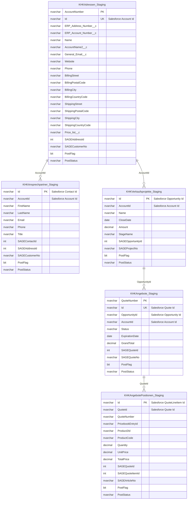
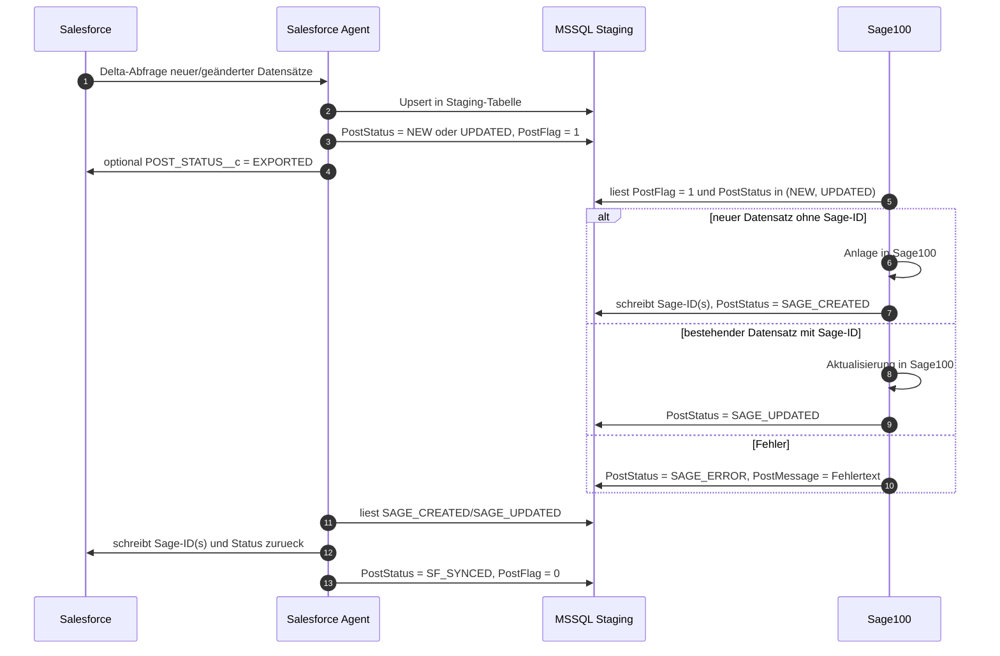
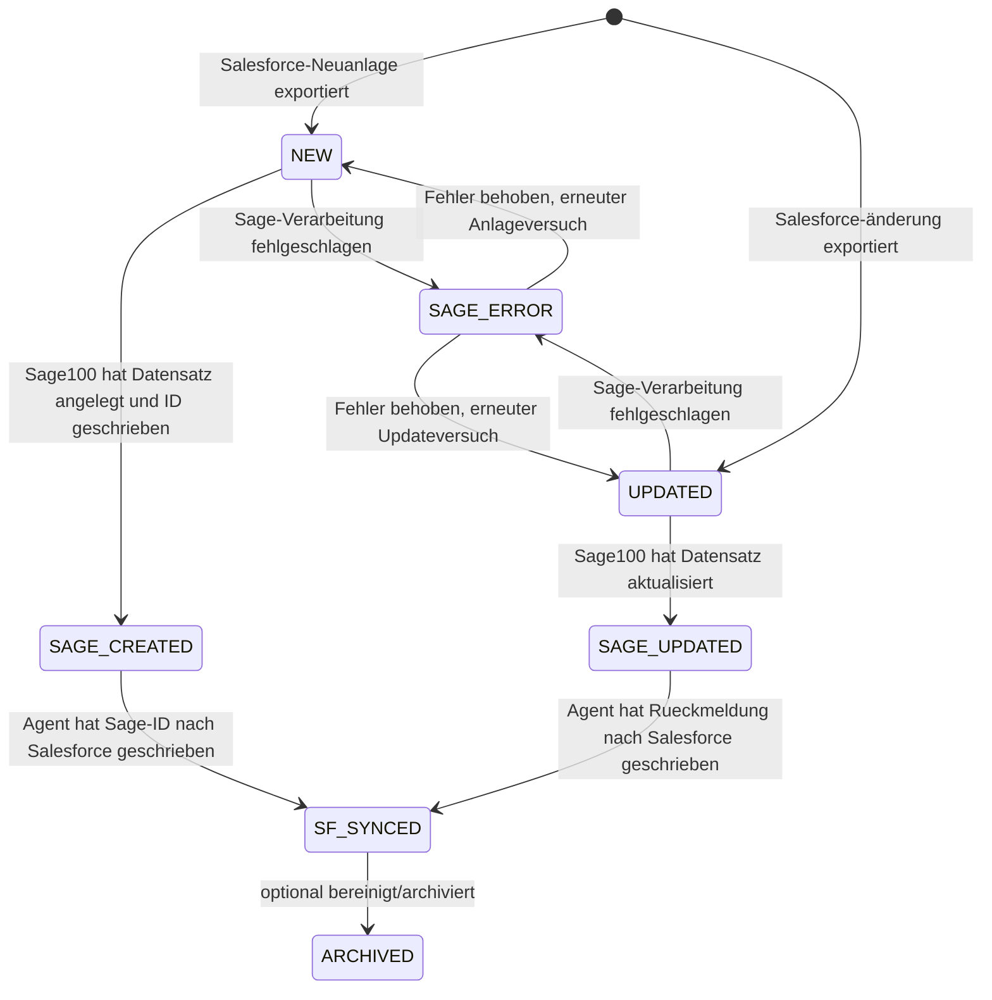
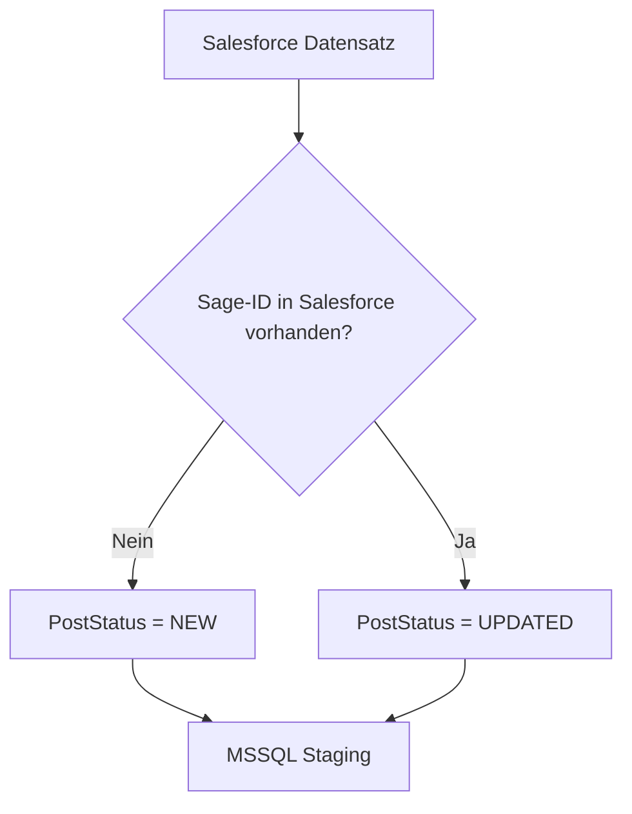
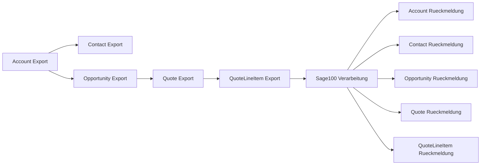

# Annaburger Salesforce -> MSSQL -> Sage100 Prozess

Stand: 2026-06-16  
Basis: Live-Abfrage AnnaburgerPROD1 und MSSQL-Struktur `scripts/mssql/create-annaburger-sage100-export-tables.sql`

## Zielbild

Salesforce ist das fuehrende System fuer geänderte oder neu angelegte Accounts, Kontakte, Verkaufschancen, Angebote und Angebotspositionen. Der Salesforce Agent exportiert diese Datensätze in MSSQL-Staging-Tabellen. Sage100 verarbeitet diese Queue, schreibt bei Neuanlagen die erzeugten Sage-IDs zurueck und setzt einen eindeutigen Verarbeitungsstatus. Danach liest der Salesforce Agent die Rueckmeldungen aus MSSQL und schreibt die Sage-IDs sowie den finalen Status nach Salesforce zurueck.

## Datenbankübersicht



Die Beziehungen sind fachlich zu verstehen. Im Staging sollten keine harten Foreign Keys verwendet werden, damit ein Scheduler-Lauf nicht blockiert, wenn Child-Datensätze vor Parent-Datensätzen eintreffen.

## Prozessablauf



## Statusmodell



Empfohlene MSSQL-Statuswerte:

| Status | Bedeutung | Verantwortlich |
| --- | --- | --- |
| `NEW` | Salesforce-Datensatz ist neu fuer Sage100 und benoetigt Sage-ID-Rueckmeldung. | Agent |
| `UPDATED` | Salesforce-Datensatz wurde geändert und soll in Sage100 aktualisiert werden. | Agent |
| `SAGE_CREATED` | Sage100 hat den Datensatz neu angelegt und die Sage-ID geschrieben. | Sage100 |
| `SAGE_UPDATED` | Sage100 hat den bestehenden Datensatz aktualisiert. | Sage100 |
| `SAGE_ERROR` | Sage100 konnte den Datensatz nicht verarbeiten; Details in `PostMessage`. | Sage100 |
| `SF_SYNCED` | Agent hat Rueckmeldung/Sage-ID nach Salesforce geschrieben. | Agent |
| `ARCHIVED` | Datensatz wurde optional historisiert oder ist nicht mehr queue-relevant. | SQL Job/Agent |

Empfohlene Salesforce-Statuswerte fuer ein Feld wie `POST_STATUS__c`:

| Status | Bedeutung |
| --- | --- |
| `PENDING_EXPORT` | Datensatz soll exportiert werden. |
| `EXPORTED` | Datensatz wurde in MSSQL geschrieben. |
| `SAGE_CREATED` | Sage100-ID wurde zurueckgemeldet. |
| `SAGE_UPDATED` | Sage100-Update wurde bestätigt. |
| `SYNCED` | Vollständiger Kreis abgeschlossen. |
| `ERROR` | Fehlerhafte Verarbeitung, Details in einem Fehlerfeld oder Log. |

## Agent-Konfiguration

### 1. Salesforce -> MSSQL Export

Pro Objekt wird ein Scheduler benoetigt. In PROD existieren bereits:

| Scheduler | Objekt | MSSQL-Tabelle | Upsert-Key |
| --- | --- | --- | --- |
| `SCH-0033` | Account | `sf.KHKAdressen_Staging` | `AccountNumber` |
| `SCH-0034` | Contact | `sf.KHKAnsprechpartner_Staging` | `Id` |
| `SCH-0035` | Opportunity | `sf.KHKVerkaufsprojekte_Staging` | `Id` |
| `SCH-0036` | Quote | `sf.KHKAngebote_Staging` | `QuoteNumber` |
| neu | QuoteLineItem | `sf.KHKAngebotePositionen_Staging` | `Id` |

Beispiel `targetDefinition` fuer Account:

```json
{
  "upsertKey": "AccountNumber"
}
```

Beispiel Account-Quelle, erweitert um relevante Oberflächenfelder:

```json
{
  "queryText": "SELECT Id, AccountNumber, Name, AccountName2__c, Type, Type__c, Description, Phone, Mobile__c, General_Email__c, Website, BillingStreet, BillingPostalCode, BillingCity, BillingCountry, BillingCountryCode, ShippingStreet, ShippingPostalCode, ShippingCity, ShippingCountry, ShippingCountryCode, ERP_Address_Number__c, ERP_Account_Number__c, Customer_MatchCode__c, Customer_Group__c, Price_list__c, Last_Dunning_Date__c, last_sale_Date__c, LastModifiedDate, LastModifiedBy.Username FROM Account WHERE LastModifiedBy.Username NOT IN ('<API_USERNAME_1>', '<API_USERNAME_2>')",
  "delta": {
    "strategy": "datetime",
    "field": "LastModifiedDate"
  },
  "afterExport": {
    "POST_STATUS__c": "EXPORTED"
  }
}
```

Das Mapping muss alle Zielspalten enthalten, die in MSSQL befuellt werden sollen, z. B.:

```text
Id;string=Id;NONE
AccountNumber;string=AccountNumber;TRIM
Name;string=Name;TRIM
AccountName2__c;string=AccountName2__c;TRIM
Phone;string=Phone;TRIM
Mobile__c;string=Mobile__c;TRIM
General_Email__c;string=General_Email__c;TRIM
Website;string=Website;TRIM
BillingStreet;string=BillingStreet;TRIM
BillingPostalCode;string=BillingPostalCode;TRIM
BillingCity;string=BillingCity;TRIM
BillingCountryCode;string=BillingCountryCode;TRIM
ShippingStreet;string=ShippingStreet;TRIM
ShippingPostalCode;string=ShippingPostalCode;TRIM
ShippingCity;string=ShippingCity;TRIM
ShippingCountryCode;string=ShippingCountryCode;TRIM
ERP_Address_Number__c;string=ERP_Address_Number__c;TRIM
ERP_Account_Number__c;string=ERP_Account_Number__c;TRIM
Customer_MatchCode__c;string=Customer_MatchCode__c;TRIM
Customer_Group__c;string=Customer_Group__c;TRIM
Price_list__c;string=Price_list__c;TRIM
LastModifiedDate;datetime=LastModifiedDate;NONE
LastModifiedByUsername;string=LastModifiedBy.Username;TRIM
```

Fuer `NEW` vs. `UPDATED` braucht der Export eine Entscheidung:



Diese Entscheidung kann aktuell nicht rein durch statisches Mapping im Agenten gesetzt werden. Moegliche Umsetzung:

1. Salesforce-Formelfeld `SAGE_PostStatusForExport__c`, das anhand vorhandener Sage-ID `NEW` oder `UPDATED` liefert.
2. Scheduler mappt dieses Feld nach `PostStatus`.
3. Alternativ: MSSQL-Trigger setzt `PostStatus` beim Insert/Update anhand der vorhandenen Sage-ID-Spalten.

### 2. Sage100 -> MSSQL Rueckmeldung

Sage100 verarbeitet nur Queue-Datensätze:

```sql
WHERE PostFlag = 1
  AND PostStatus IN (N'NEW', N'UPDATED')
```

Bei erfolgreicher Neuanlage schreibt Sage100:

```sql
UPDATE sf.KHKAdressen_Staging
   SET SAGEAddressId = @SageAddressId,
       SAGECustomerNo = @SageCustomerNo,
       PostStatus = N'SAGE_CREATED',
       PostMessage = NULL,
       PostedAt = sysdatetime()
 WHERE AccountNumber = @AccountNumber;
```

Bei erfolgreicher Aktualisierung:

```sql
UPDATE sf.KHKAdressen_Staging
   SET PostStatus = N'SAGE_UPDATED',
       PostMessage = NULL,
       PostedAt = sysdatetime()
 WHERE AccountNumber = @AccountNumber;
```

Bei Fehler:

```sql
UPDATE sf.KHKAdressen_Staging
   SET PostStatus = N'SAGE_ERROR',
       PostMessage = @ErrorMessage,
       PostTryCount = PostTryCount + 1,
       LastPostAttemptAt = sysdatetime()
 WHERE AccountNumber = @AccountNumber;
```

### 3. MSSQL -> Salesforce Rueckmeldung

Pro Objekt wird ein Rueckmelde-Scheduler benoetigt:

| Quelle | Ziel | Zweck |
| --- | --- | --- |
| `sf.KHKAdressen_Staging` | Account | `SAGEAddressId`, `SAGECustomerNo`, `POST_STATUS__c` schreiben |
| `sf.KHKAnsprechpartner_Staging` | Contact | `SAGEContactId`, `SAGEAddressId`, `POST_STATUS__c` schreiben |
| `sf.KHKVerkaufsprojekte_Staging` | Opportunity | `SAGEOpportunityId`, `SAGEProjectNo`, `POST_STATUS__c` schreiben |
| `sf.KHKAngebote_Staging` | Quote | `SAGEQuoteId`, `SAGEQuoteNo`, `POST_STATUS__c` schreiben |
| `sf.KHKAngebotePositionen_Staging` | QuoteLineItem | `SAGEQuoteItemId`, `SAGEArticleNo`, `POST_STATUS__c` schreiben |

Beispiel Account-Rueckmeldung:

```json
{
  "queryText": "SELECT Id, SAGEAddressId, SAGECustomerNo, PostStatus, PostMessage, UpdatedAt FROM sf.KHKAdressen_Staging WHERE PostFlag = 1 AND PostStatus IN ('SAGE_CREATED', 'SAGE_UPDATED', 'SAGE_ERROR')",
  "delta": {
    "strategy": "datetime",
    "field": "UpdatedAt"
  }
}
```

Mapping nach Salesforce:

```text
Id;string=Id;NONE
SAGE_Address_ID__c;number=SAGEAddressId;NONE
SAGE_Customer_No__c;string=SAGECustomerNo;TRIM
POST_STATUS__c;string=PostStatus;TRIM
POST_MESSAGE__c;string=PostMessage;TRIM
```

`targetDefinition`:

```json
{
  "objectApiName": "Account",
  "operation": "update"
}
```

Die konkreten Salesforce-Zielfelder muessen vorab existieren oder im Mapping auf vorhandene Felder angepasst werden.

## Was noch ergänzt werden muss

1. `SCH-0033` erweitern: SOQL und Mapping muessen die Account-Oberflächenfelder enthalten, sonst bleiben die neuen MSSQL-Spalten leer.
2. QuoteLineItem-Export-Scheduler anlegen: Quelle `QuoteLineItem`, Ziel `sf.KHKAngebotePositionen_Staging`, Upsert-Key `Id`.
3. Salesforce-Felder fuer Sage-Rueckmeldung pruefen/anlegen:
   `SAGE_Address_ID__c`, `SAGE_Customer_No__c`, `SAGE_Contact_ID__c`, `SAGE_Opportunity_ID__c`, `SAGE_Project_No__c`, `SAGE_Quote_ID__c`, `SAGE_Quote_No__c`, `SAGE_Quote_Item_ID__c`, `SAGE_Article_No__c`, `POST_STATUS__c`, `POST_MESSAGE__c`.
4. Rueckmelde-Scheduler MSSQL -> Salesforce fuer Account, Contact, Opportunity, Quote und QuoteLineItem anlegen.
5. Agent-Erweiterung fuer MSSQL-After-Export einbauen: Nach erfolgreicher Rueckmeldung nach Salesforce muss der Agent die gelesenen MSSQL-Zeilen auf `PostStatus = 'SF_SYNCED'`, `PostFlag = 0` setzen. Der aktuelle Agent kann `afterExport` nur fuer Salesforce-Quellen, nicht fuer MSSQL-Quellen.
6. Optionales Loeschkonzept festlegen: physisches Loeschen aus MSSQL, `ARCHIVED`-Status oder Beibehaltung als Audit-Historie. Empfohlen ist `PostStatus = 'SF_SYNCED'`, `PostFlag = 0` plus periodischer Archivierungsjob.
7. Fehlerprozess definieren: `SAGE_ERROR` und Salesforce `ERROR` muessen in Monitoring/Run-Logs sichtbar sein; erneute Verarbeitung erfolgt durch manuelles Zuruecksetzen auf `NEW` oder `UPDATED`.

## Empfohlene Scheduler-Reihenfolge



Die technische Reihenfolge darf abweichen, wenn die Sage100-Verarbeitung mit fehlenden Parent-Datensätzen umgehen kann. Fachlich ist diese Reihenfolge am stabilsten.
