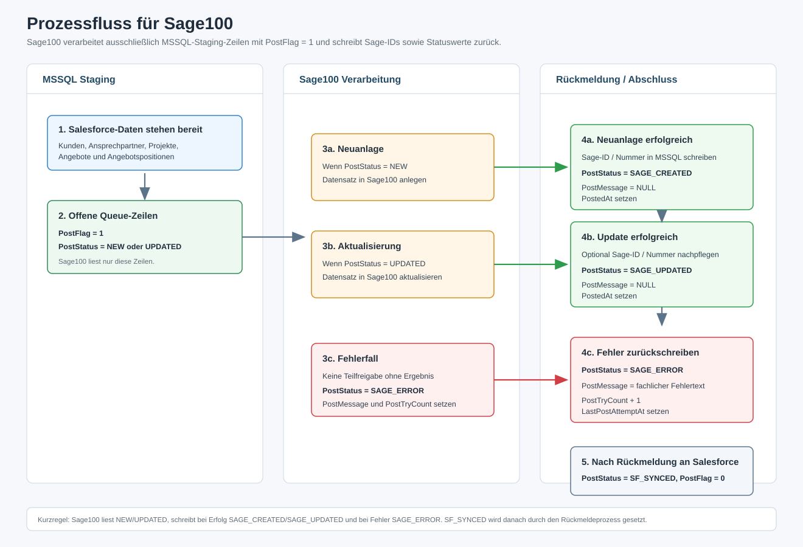
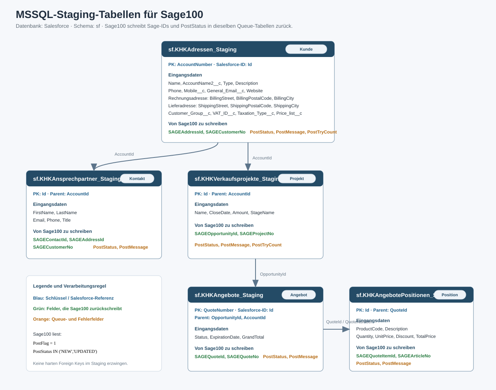

# Annaburger Salesforce -> MSSQL -> Sage100 Prozess

Stand: 2026-06-16  
Zielgruppe: Sage100 Administrator / Sage100 Schnittstellenbetreuung  
Datenbank: `Salesforce` auf MSSQL  
Schema: `sf`

Dieses Dokument beschreibt die MSSQL-Staging-Schnittstelle, die Sage100 verarbeiten soll. Die Salesforce- und Agent-Konfiguration ist hier bewusst nicht beschrieben. Für Sage100 ist nur relevant:

- welche Tabellen in MSSQL gelesen werden,
- welche Statuswerte eine Zeile verarbeitbar machen,
- welche Sage100-IDs zurückgeschrieben werden müssen,
- welcher `PostStatus` nach erfolgreicher oder fehlerhafter Verarbeitung zu setzen ist.

## Prozessgrafik



## Tabellenübersicht



Die Tabellen liegen im Schema `sf`. Es sind Staging-/Queue-Tabellen, keine produktiven Sage100-Tabellen. Zwischen den Tabellen sollten keine harten Foreign Keys erzwungen werden, damit eintreffende Child-Datensätze die Queue nicht blockieren.

## Grundregel für Sage100

Sage100 liest ausschließlich offene Queue-Zeilen:

```sql
WHERE PostFlag = 1
  AND PostStatus IN (N'NEW', N'UPDATED')
```

Nach der Verarbeitung schreibt Sage100 die erzeugten bzw. bekannten Sage100-IDs zurück und setzt genau einen Ergebnisstatus:

- `SAGE_CREATED`, wenn Sage100 einen neuen Datensatz angelegt hat.
- `SAGE_UPDATED`, wenn Sage100 einen bestehenden Datensatz aktualisiert hat.
- `SAGE_ERROR`, wenn Sage100 die Zeile nicht verarbeiten konnte.

Nach erfolgreicher Rückmeldung an Salesforce wird die Zeile später auf `SF_SYNCED` und `PostFlag = 0` gesetzt. Diese Statusänderung muss Sage100 nicht setzen.

## Statuswerte

| Status | Wird gesetzt von | Bedeutung für Sage100 |
| --- | --- | --- |
| `NEW` | Staging-Export | Neuer Datensatz aus Salesforce. Sage100 soll anlegen und eine Sage-ID zurückschreiben. |
| `UPDATED` | Staging-Export | Geänderter Datensatz aus Salesforce. Sage100 soll bestehenden Datensatz aktualisieren. |
| `SAGE_CREATED` | Sage100 | Neuanlage in Sage100 erfolgreich; Sage-ID wurde in MSSQL eingetragen. |
| `SAGE_UPDATED` | Sage100 | Update in Sage100 erfolgreich; ggf. Sage-ID/Nummer aktualisiert. |
| `SAGE_ERROR` | Sage100 | Verarbeitung fehlgeschlagen; Fehlertext steht in `PostMessage`. |
| `SF_SYNCED` | Rückmeldeprozess | Sage100-Rückmeldung wurde nach Salesforce übernommen; Queue-Zeile ist abgeschlossen. |
| `ARCHIVED` | optionaler SQL-Job | Optionaler Archivstatus, falls alte Queue-Zeilen historisiert werden. |

## Queue-Felder in allen Tabellen

Jede Staging-Tabelle enthält diese Felder:

| Feld | Bedeutung |
| --- | --- |
| `PostFlag` | `1` = offen für Verarbeitung oder Rückmeldung; `0` = nicht mehr queue-relevant. |
| `PostStatus` | Aktueller Verarbeitungsstatus, siehe Statuswerte. |
| `PostMessage` | Fehlertext oder fachliche Rückmeldung. Bei Erfolg auf `NULL` setzen. |
| `PostTryCount` | Zähler für Verarbeitungsversuche. Im Fehlerfall erhöhen. |
| `LastPostAttemptAt` | Zeitpunkt des letzten Sage100-Verarbeitungsversuchs. |
| `PostedAt` | Zeitpunkt der erfolgreichen Sage100-Verarbeitung. |
| `CreatedAt` | Technischer Insert-Zeitpunkt in MSSQL. |
| `UpdatedAt` | Technischer Update-Zeitpunkt in MSSQL. |

## Zu verarbeitende Tabellen

### 1. Kunden / Adressen

Tabelle: `sf.KHKAdressen_Staging`  
Primärschlüssel: `AccountNumber`  
Salesforce-ID: `Id`

Wichtige Eingangsfelder:

| Feld | Bedeutung |
| --- | --- |
| `AccountNumber` | Kundennummer / Schlüssel aus Salesforce, Primärschlüssel der Staging-Tabelle. |
| `Id` | Salesforce Account ID. Nicht verändern. |
| `Name`, `AccountName2__c` | Name / Zusatzname. |
| `Phone`, `Mobile__c`, `General_Email__c`, `Website` | Kommunikationsdaten. |
| `BillingStreet`, `BillingPostalCode`, `BillingCity`, `BillingCountryCode` | Rechnungsadresse. |
| `ShippingStreet`, `ShippingPostalCode`, `ShippingCity`, `ShippingCountryCode` | Lieferadresse. |
| `ERP_Address_Number__c`, `ERP_Account_Number__c` | Vorhandene ERP-/Sage-Referenzen aus Salesforce, falls vorhanden. |
| `Customer_Group__c`, `VAT_ID__c`, `Taxation_Type__c`, `Price_list__c` | Kaufmännische Steuerungsfelder. |

Von Sage100 zu schreiben:

| Feld | Pflicht bei Neuanlage | Bedeutung |
| --- | --- | --- |
| `SAGEAddressId` | Ja | Interne Sage100 Adress-ID. |
| `SAGECustomerNo` | Ja | Sage100 Kundennummer / Debitorennummer. |
| `PostStatus` | Ja | `SAGE_CREATED`, `SAGE_UPDATED` oder `SAGE_ERROR`. |
| `PostMessage` | Bei Fehler ja | Fehlertext bei `SAGE_ERROR`, sonst `NULL`. |

### 2. Ansprechpartner

Tabelle: `sf.KHKAnsprechpartner_Staging`  
Primärschlüssel: `Id`  
Salesforce-ID: `Id`

Wichtige Eingangsfelder:

| Feld | Bedeutung |
| --- | --- |
| `Id` | Salesforce Contact ID. |
| `AccountId` | Salesforce Account ID zur fachlichen Zuordnung zur Adresse. |
| `FirstName`, `LastName` | Name des Ansprechpartners. |
| `Email`, `Phone`, `Title` | Kommunikations- und Rolleninformationen. |

Von Sage100 zu schreiben:

| Feld | Pflicht bei Neuanlage | Bedeutung |
| --- | --- | --- |
| `SAGEContactId` | Ja | Interne Sage100 Ansprechpartner-ID. |
| `SAGEAddressId` | Empfohlen | Zugehörige Sage100 Adress-ID. |
| `SAGECustomerNo` | Empfohlen | Zugehörige Sage100 Kundennummer. |
| `PostStatus` | Ja | `SAGE_CREATED`, `SAGE_UPDATED` oder `SAGE_ERROR`. |
| `PostMessage` | Bei Fehler ja | Fehlertext bei `SAGE_ERROR`, sonst `NULL`. |

### 3. Verkaufsprojekte / Opportunities

Tabelle: `sf.KHKVerkaufsprojekte_Staging`  
Primärschlüssel: `Id`  
Salesforce-ID: `Id`

Wichtige Eingangsfelder:

| Feld | Bedeutung |
| --- | --- |
| `Id` | Salesforce Opportunity ID. |
| `AccountId` | Salesforce Account ID zur fachlichen Kundenzuordnung. |
| `Name` | Projekt-/Opportunity-Bezeichnung. |
| `CloseDate` | Abschlussdatum. |
| `Amount` | Betrag. |
| `StageName` | Salesforce Phase. |

Von Sage100 zu schreiben:

| Feld | Pflicht bei Neuanlage | Bedeutung |
| --- | --- | --- |
| `SAGEOpportunityId` | Ja, falls Sage eine interne ID führt | Interne Sage100 Projekt-ID. |
| `SAGEProjectNo` | Ja, falls Sage eine Projektnummer führt | Sage100 Projektnummer. |
| `PostStatus` | Ja | `SAGE_CREATED`, `SAGE_UPDATED` oder `SAGE_ERROR`. |
| `PostMessage` | Bei Fehler ja | Fehlertext bei `SAGE_ERROR`, sonst `NULL`. |

### 4. Angebote

Tabelle: `sf.KHKAngebote_Staging`  
Primärschlüssel: `QuoteNumber`  
Salesforce-ID: `Id`

Wichtige Eingangsfelder:

| Feld | Bedeutung |
| --- | --- |
| `QuoteNumber` | Angebotsnummer aus Salesforce, Primärschlüssel der Staging-Tabelle. |
| `Id` | Salesforce Quote ID. |
| `OpportunityId` | Salesforce Opportunity ID; verbindet Angebot mit Verkaufsprojekt. |
| `AccountId` | Salesforce Account ID. |
| `Status` | Angebotsstatus. |
| `ExpirationDate` | Gültig bis. |
| `GrandTotal` | Angebotsgesamtbetrag. |

Von Sage100 zu schreiben:

| Feld | Pflicht bei Neuanlage | Bedeutung |
| --- | --- | --- |
| `SAGEQuoteId` | Ja | Interne Sage100 Angebots-ID. |
| `SAGEQuoteNo` | Ja | Sage100 Angebotsnummer. |
| `PostStatus` | Ja | `SAGE_CREATED`, `SAGE_UPDATED` oder `SAGE_ERROR`. |
| `PostMessage` | Bei Fehler ja | Fehlertext bei `SAGE_ERROR`, sonst `NULL`. |

### 5. Angebotspositionen

Tabelle: `sf.KHKAngebotePositionen_Staging`  
Primärschlüssel: `Id`  
Salesforce-ID: `Id`

Wichtige Eingangsfelder:

| Feld | Bedeutung |
| --- | --- |
| `Id` | Salesforce QuoteLineItem ID. |
| `QuoteId` | Salesforce Quote ID zur Angebotszuordnung. |
| `QuoteNumber` | Salesforce Angebotsnummer. |
| `Product2Id`, `ProductCode` | Salesforce Produktreferenz / Artikelnummer. |
| `Description` | Positionstext. |
| `Quantity`, `UnitPrice`, `ListPrice`, `Discount`, `TotalPrice` | Mengen- und Preisfelder. |

Von Sage100 zu schreiben:

| Feld | Pflicht bei Neuanlage | Bedeutung |
| --- | --- | --- |
| `SAGEQuoteId` | Empfohlen | Zugehörige Sage100 Angebots-ID. |
| `SAGEQuoteItemId` | Ja | Interne Sage100 Positions-ID. |
| `SAGEArticleNo` | Empfohlen | In Sage100 verwendete Artikelnummer. |
| `PostStatus` | Ja | `SAGE_CREATED`, `SAGE_UPDATED` oder `SAGE_ERROR`. |
| `PostMessage` | Bei Fehler ja | Fehlertext bei `SAGE_ERROR`, sonst `NULL`. |

## Empfohlene Verarbeitungsreihenfolge

Sage100 sollte die offenen Zeilen fachlich in dieser Reihenfolge verarbeiten:

1. `sf.KHKAdressen_Staging`
2. `sf.KHKAnsprechpartner_Staging`
3. `sf.KHKVerkaufsprojekte_Staging`
4. `sf.KHKAngebote_Staging`
5. `sf.KHKAngebotePositionen_Staging`

Begründung:

- Ansprechpartner benötigen eine vorhandene Adresse.
- Verkaufsprojekte benötigen eine Kundenzuordnung.
- Angebote benötigen Opportunity/Kunde.
- Angebotspositionen benötigen ein Angebot.

Wenn Sage100 technisch mit fehlenden Parent-Daten umgehen kann, darf die Reihenfolge abweichen. Fachlich ist die oben genannte Reihenfolge am stabilsten.

## Beispiel: offene Zeilen lesen

Beispiel für Kunden/Adressen:

```sql
SELECT *
FROM sf.KHKAdressen_Staging
WHERE PostFlag = 1
  AND PostStatus IN (N'NEW', N'UPDATED')
ORDER BY UpdatedAt ASC;
```

Beispiel für Angebote:

```sql
SELECT *
FROM sf.KHKAngebote_Staging
WHERE PostFlag = 1
  AND PostStatus IN (N'NEW', N'UPDATED')
ORDER BY UpdatedAt ASC;
```

## Beispiel: erfolgreiche Neuanlage

Kunde wurde in Sage100 neu angelegt:

```sql
UPDATE sf.KHKAdressen_Staging
   SET SAGEAddressId = @SAGEAddressId,
       SAGECustomerNo = @SAGECustomerNo,
       PostStatus = N'SAGE_CREATED',
       PostMessage = NULL,
       LastPostAttemptAt = sysdatetime(),
       PostedAt = sysdatetime()
 WHERE AccountNumber = @AccountNumber
   AND PostFlag = 1;
```

Angebot wurde in Sage100 neu angelegt:

```sql
UPDATE sf.KHKAngebote_Staging
   SET SAGEQuoteId = @SAGEQuoteId,
       SAGEQuoteNo = @SAGEQuoteNo,
       PostStatus = N'SAGE_CREATED',
       PostMessage = NULL,
       LastPostAttemptAt = sysdatetime(),
       PostedAt = sysdatetime()
 WHERE QuoteNumber = @QuoteNumber
   AND PostFlag = 1;
```

## Beispiel: erfolgreiche Aktualisierung

```sql
UPDATE sf.KHKAdressen_Staging
   SET PostStatus = N'SAGE_UPDATED',
       PostMessage = NULL,
       LastPostAttemptAt = sysdatetime(),
       PostedAt = sysdatetime()
 WHERE AccountNumber = @AccountNumber
   AND PostFlag = 1;
```

Falls Sage100 bei einem Update eine Sage-ID nachpflegen oder korrigieren muss, darf diese im gleichen Statement mitgeschrieben werden.

## Beispiel: Fehlerfall

```sql
UPDATE sf.KHKAdressen_Staging
   SET PostStatus = N'SAGE_ERROR',
       PostMessage = @ErrorMessage,
       PostTryCount = PostTryCount + 1,
       LastPostAttemptAt = sysdatetime()
 WHERE AccountNumber = @AccountNumber
   AND PostFlag = 1;
```

Empfehlung für `PostMessage`:

- Kurz und fachlich auswertbar.
- Keine Stacktraces.
- Keine Passwörter, Tokens oder personenbezogene Zusatzdaten, die nicht für die Fehlerbehebung benötigt werden.

Beispiele:

- `Kundengruppe in Sage100 nicht gefunden: <Wert>`
- `Artikelnummer nicht gefunden: <ProductCode>`
- `Angebot kann nicht angelegt werden, da Sage-Projekt fehlt`

## Wiederholung nach Fehler

Eine Zeile mit `SAGE_ERROR` wird nicht automatisch erneut durch Sage100 verarbeitet, solange die normale Queue-Abfrage nur `NEW` und `UPDATED` liest.

Nach fachlicher Korrektur kann die Zeile manuell wieder freigegeben werden:

```sql
UPDATE sf.KHKAdressen_Staging
   SET PostStatus = N'UPDATED',
       PostMessage = NULL,
       PostFlag = 1
 WHERE AccountNumber = @AccountNumber
   AND PostStatus = N'SAGE_ERROR';
```

Bei einer tatsächlichen Neuanlage ohne Sage-ID kann statt `UPDATED` auch `NEW` gesetzt werden.

## Abschluss und Archivierung

Nach erfolgreicher Rückmeldung an Salesforce steht die Zeile auf:

```text
PostStatus = SF_SYNCED
PostFlag   = 0
```

Diese Zeilen sind für Sage100 abgeschlossen. Empfohlen ist:

- `SF_SYNCED`-Zeilen nicht erneut zu verarbeiten.
- Alte `SF_SYNCED`-Zeilen per SQL-Job zu archivieren oder nach definierter Aufbewahrungszeit zu bereinigen.
- `SAGE_ERROR`-Zeilen sichtbar zu monitoren und nicht automatisch zu löschen.

## Mindestprüfung für den Sage100 Job

Vor Produktivbetrieb sollte der Sage100 Administrator prüfen:

| Prüfung | Erwartung |
| --- | --- |
| Verbindung zur Datenbank `Salesforce` | Sage100 kann lesen und schreiben. |
| Schema `sf` vorhanden | Alle fünf Staging-Tabellen sind sichtbar. |
| Leserechte | Sage100 kann offene Queue-Zeilen selektieren. |
| Schreibrechte | Sage100 kann Sage-ID-Felder, `PostStatus`, `PostMessage`, `PostTryCount`, `LastPostAttemptAt`, `PostedAt` aktualisieren. |
| Statusfilter | Sage100 verarbeitet nur `PostFlag = 1` und `PostStatus IN ('NEW','UPDATED')`. |
| Fehlerverhalten | Fehler setzen `SAGE_ERROR` und einen aussagekräftigen `PostMessage`-Text. |
| Erfolgsverhalten | Neuanlage setzt `SAGE_CREATED`; Update setzt `SAGE_UPDATED`. |
| Keine Fremdlöschungen | Sage100 löscht keine Staging-Zeilen. |

## Kurzreferenz für Sage100

| Eingang | Sage100-Aktion | Ergebnisstatus |
| --- | --- | --- |
| `PostStatus = NEW` | Datensatz in Sage100 anlegen, Sage-ID schreiben. | `SAGE_CREATED` |
| `PostStatus = UPDATED` | Datensatz in Sage100 aktualisieren. | `SAGE_UPDATED` |
| Verarbeitungsfehler | Keine fachlich unvollständige Teilfreigabe. Fehlertext schreiben. | `SAGE_ERROR` |
| `PostStatus = SF_SYNCED` | Nicht verarbeiten. | unverändert lassen |

Die vollständige DDL-Struktur liegt in:

```text
scripts/mssql/create-annaburger-sage100-export-tables.sql
```
