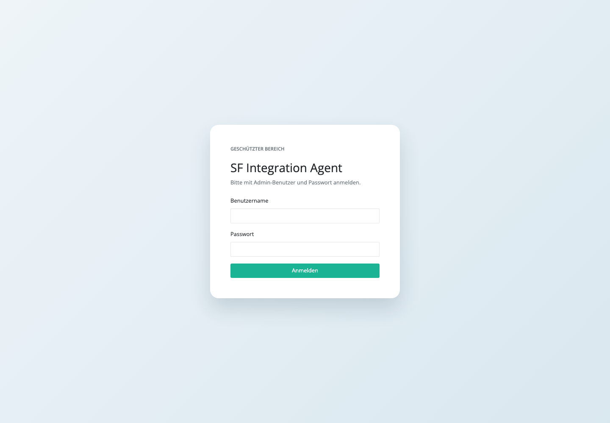
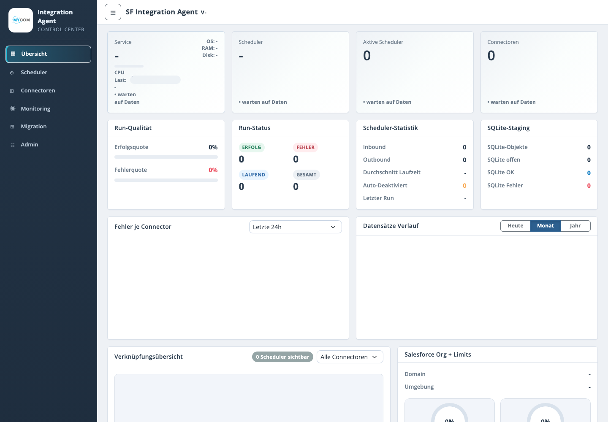
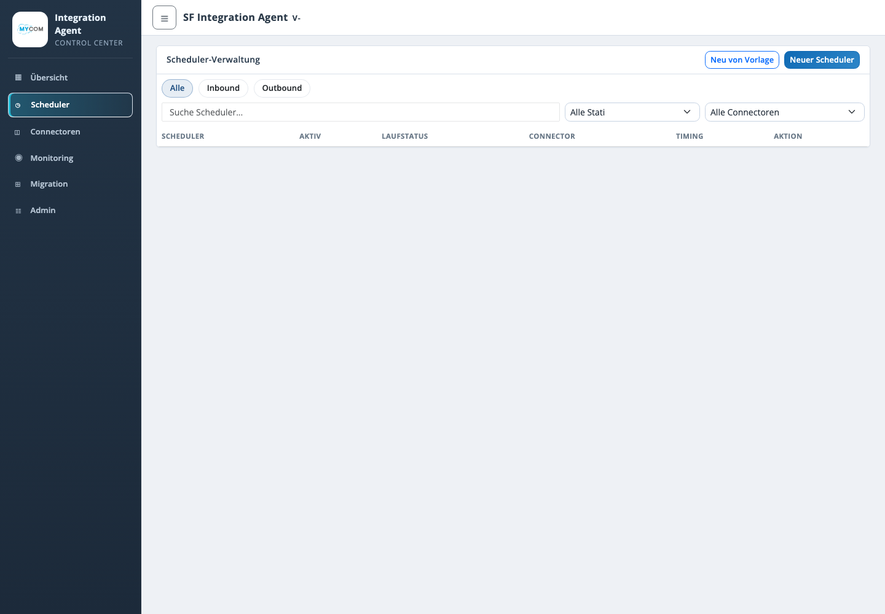
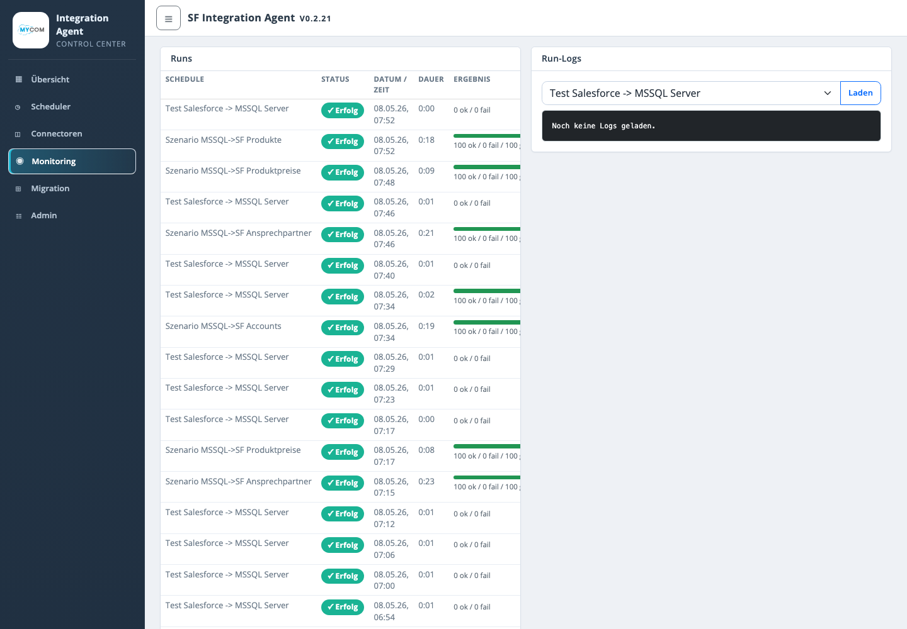
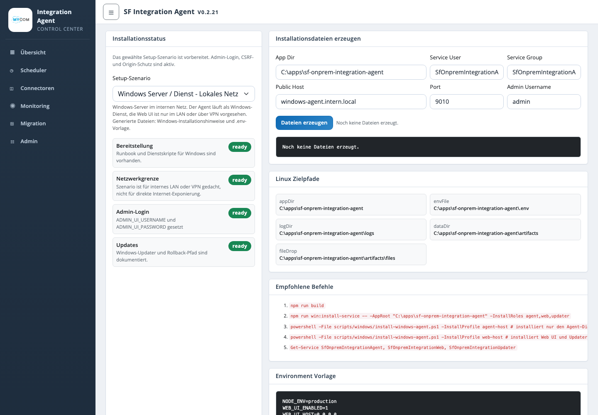

# SF On-Prem Integration Agent - Projektdokumentation

> Confluence-Hinweis: Diese Seite ist als Vorlage fuer die Atlassian-Seite gedacht. Die Bilder aus `docs/screenshots/` sowie `docs/systemdiagramm-netzwerk.svg` sollten als Anlagen auf die Confluence-Seite hochgeladen und danach an den markierten Stellen eingefuegt werden.

## 1. Allgemeine Beschreibung

Der SF On-Prem Integration Agent ist eine Node.js-/TypeScript-Anwendung zur Salesforce-gesteuerten Integration lokaler Kundensysteme. Salesforce dient als Steuerungsebene fuer Scheduler, Connector-Konfigurationen, Laufprotokolle und Checkpoints. Der Agent laeuft im Kundennetz, liest Daten aus lokalen oder angebundenen Quellsystemen, transformiert sie ueber Mapping-Regeln und schreibt sie in Zielsysteme wie Salesforce-Objekte, Salesforce-Picklists, MSSQL oder Dateien.

Typische Einsatzszenarien:

- Import lokaler ERP-/SAGE100-/MSSQL-Daten nach Salesforce.
- Export von Salesforce-Daten in lokale Datenbanken oder Dateien.
- Dateiimport und Dateiexport ueber CSV, XLSX oder JSON.
- REST-basierte Anbindung externer Systeme.
- Betriebsueberwachung ueber Web UI, Dashboard, Logs, Scheduler-Status und Update-Status.
- Kundeninstallation als Windows-Dienst oder Linux/systemd-Dienst.

Zentrale Ziele:

- Keine direkte eingehende Verbindung von Salesforce in das Kundennetz.
- Steuerung und Monitoring zentral in Salesforce.
- Lokale Datenzugriffe bleiben im Kundennetz.
- Reproduzierbare Installation, Update-Faehigkeit und Rollback.
- Erweiterbare Connector-Architektur fuer neue Quellen und Ziele.

## 2. Technische Beschreibung

### 2.1 Architekturueberblick

Die Zielarchitektur besteht aus drei getrennten Betriebsrollen:

| Rolle | Aufgabe |
| --- | --- |
| Agent-Dienst | Fuehrt Scheduler, Datenimporte, Exporte, Mapping und Connector-Ausfuehrung aus. |
| WebServer-Dienst | Stellt Web UI, Admin-API, Dashboard, Installer-UI und Betriebsansichten bereit. |
| AutoUpdater-Dienst | Prueft Releases, fuehrt Updates aus und unterstuetzt Backup/Rollback. |

Die Dienste koennen gemeinsam auf einem Host oder verteilt betrieben werden. Bei getrennten Hosts kommuniziert die Web UI ueber die Agent API mit dem Agent-Host.

### 2.2 Netzwerkdiagramm

Anlage einfuegen: `systemdiagramm-netzwerk.svg`


### 2.3 Netzwerkverbindungen

| Verbindung | Richtung | Protokoll / Port | Zweck |
| --- | --- | --- | --- |
| Agent -> Salesforce | ausgehend | HTTPS 443 | OAuth, Lesen von Schedules und Connector-Konfiguration, Schreiben von Runs, Logs, Checkpoints und Salesforce-Zieldaten |
| Web UI -> Agent API | intern | HTTP 8090 oder HTTPS via Reverse Proxy | Health, Update-Status, Update-Anforderung, Instanz-Synchronisierung |
| Browser -> Web UI | eingehend | HTTPS extern, intern `WEB_UI_PORT` 8080/9010 | Admin UI, Dashboard, Installer- und Betriebsansichten |
| Web UI -> Salesforce OIDC | ausgehend | HTTPS 443 | Optionaler Admin-Login ueber Salesforce als Identity Provider |
| Agent -> MSSQL | intern | TCP 1433 | Lesen oder Schreiben ueber MSSQL-Connector |
| Agent -> Dateiablage | intern | Filesystem, Share oder SFTP | CSV/XLSX/JSON Import und Export |
| Agent -> REST-System | intern oder ausgehend | HTTP(S) | REST-Quellen oder Zielsysteme |

### 2.4 Salesforce-Komponenten

Die Salesforce-Seite enthaelt Metadaten fuer Steuerung und Laufzeitprotokollierung:

- `MSD_Schedule__c`: Scheduler- und Importprofildefinition.
- `MSD_Connector__c`: Connector-Konfiguration und technische Parameter.
- `MSD_Run__c`: Laufstatus, Start-/Endzeit, Ergebniszaehler und Fehler.
- `MSD_Log__c`: technische und fachliche Laufmeldungen.
- `MSD_Checkpoint__c`: Delta-/Checkpoint-Informationen.
- `MSD_ObjectMapping__mdt` und `MSD_FieldMapping__mdt`: Mapping-Metadaten.
- Berechtigungssatz `MSD_Integration_Agent`.

### 2.5 Datenfluss

1. Der Agent authentifiziert sich per OAuth gegen Salesforce.
2. Der Agent liest aktive Scheduler und Connector-Konfigurationen.
3. Der Scheduler prueft Zeitfenster, Intervall, Aktivstatus und Overlap-Schutz.
4. Ein faelliger Lauf erzeugt einen `MSD_Run__c`-Datensatz.
5. Die Connector Registry waehlt den passenden Source- und Target-Adapter.
6. Der Job Runner liest Quelldaten, fuehrt Mapping aus und schreibt Zieldaten.
7. Ergebnisse werden als Run, Logs und Checkpoints nach Salesforce zurueckgeschrieben.
8. Die Web UI liest lokale und Salesforce-nahe Betriebsinformationen fuer Dashboard und Admin-Funktionen.

## 3. Installationsbeschreibung

### 3.1 Voraussetzungen

Allgemein:

- Node.js 22 oder hoeher.
- Zugriff auf Salesforce Login-/Instance-URL.
- Salesforce Connected App mit benoetigtem OAuth-Flow.
- Zugriff auf lokale Ziel-/Quellsysteme, z. B. MSSQL, Dateiablage oder REST-Endpunkte.
- Admin-Zugang fuer die Web UI.

Wichtige Environment-Variablen:

| Variable | Zweck |
| --- | --- |
| `SF_LOGIN_URL` | Salesforce Login-URL, z. B. `https://login.salesforce.com` oder Sandbox-URL |
| `SF_CLIENT_ID` | Connected-App Consumer Key |
| `SF_CLIENT_SECRET` | Connected-App Consumer Secret |
| `WEB_UI_PORT` | Port der lokalen Web UI |
| `AGENT_API_ENABLED` | Aktiviert die Agent API |
| `AGENT_API_PORT` | Port der Agent API, Standard `8090` |
| `AGENT_API_TOKEN` | Bearer Token fuer Remote-Zugriff |
| `ADMIN_UI_USERS_FILE` | Lokale Benutzerdatei fuer Web-Login |
| `ADMIN_AUTH_MODE` | `local` oder `salesforce_oidc` |

### 3.2 Build

```bash
npm ci
npm run build
```

### 3.3 Windows-Installation

Zielbild:

- App-Verzeichnis: `C:\apps\sf-onprem-integration-agent`
- Windows-Dienste fuer Agent, Web und Updater
- Optionales Kundenpaket inklusive `node_modules`
- Auto-Update ueber Release-Manifest

Kurzablauf:

1. Kundenpaket entpacken.
2. `.env` konfigurieren oder interaktive Installation starten.
3. Salesforce- und MSSQL-/SAGE100-Zugangsdaten erfassen.
4. Dienste installieren.
5. Web UI oeffnen und Scheduler/Connectoren pruefen.

Beispiel:

```powershell
cd C:\apps\sf-onprem-integration-agent
npm run build
npm run win:install -- -AppRoot "C:\apps\sf-onprem-integration-agent"
```

Getrennte Rollen:

```powershell
powershell -File scripts/windows/install-windows-agent.ps1 -InstallProfile agent-host
powershell -File scripts/windows/install-windows-agent.ps1 -InstallProfile web-host
```

Service-Pruefung:

```powershell
Get-Service SfOnpremIntegrationAgent, SfOnpremIntegrationWeb, SfOnpremIntegrationUpdater
```

### 3.4 Linux-Installation

Zielbild:

- App: `/opt/sf-integration-agent`
- Config: `/etc/sf-integration-agent/agent.env`
- Logs: `/var/log/sf-integration-agent`
- Runtime-Daten: `/var/lib/sf-integration-agent`
- systemd-Dienste und optional nginx-Reverse-Proxy mit TLS

Beispiel:

```bash
cd /opt/sf-integration-agent
npm ci
npm run build

sudo bash scripts/linux/install-linux-agent.sh \
  --app-dir /opt/sf-integration-agent \
  --service-user sfagent \
  --service-group sfagent \
  --port 9010 \
  --public-host agent.example.com
```

Nachkontrolle:

```bash
sudo systemctl daemon-reload
sudo systemctl enable --now sf-integration-agent.service
sudo systemctl status sf-integration-agent.service
sudo nginx -t
sudo systemctl reload nginx
```

### 3.5 Salesforce-Metadaten

Deployment:

```bash
npm run sf:deploy-metadata
```

Noetige Variablen:

- `SF_LOGIN_URL`
- `SF_CLIENT_ID`
- `SF_CLIENT_SECRET`
- `SF_USERNAME`
- `SF_PASSWORD`

### 3.6 Update und Rollback

Der AutoUpdater prueft ein Release-Manifest, laedt neue Artefakte, erstellt ein Backup und fuehrt bei Fehlern einen Rollback aus. Unter Windows kann die Update-Pruefung ueber die Web UI oder per Skript erfolgen.

```powershell
cd C:\apps\sf-onprem-integration-agent
npm run win:update-now
```

## 4. Funktionsdokumentation

### 4.1 Login

Anlage einfuegen: `01-login.png`



Die Web UI ist durch einen Admin-Login geschuetzt. Unterstuetzt werden lokale Benutzer aus der Admin-Benutzerdatei sowie optional Salesforce OIDC. Rollen und Rechte steuern, ob Benutzer nur lesen oder auch Konfigurationen aendern duerfen.

### 4.2 Dashboard / Uebersicht

Anlage einfuegen: `02-dashboard.png`



Die Uebersicht zeigt:

- Service- und Systemstatus.
- Scheduler-Status und Anzahl aktiver Scheduler.
- Connector-Uebersicht.
- Run-Qualitaet, Fehlerquote und Erfolgsquote.
- Laufstatistiken und SQLite-Staging.
- Fehler je Connector und Datensatzverlauf.
- Verknuepfungsuebersicht zwischen Schedulern und Connectoren.
- Salesforce-Org- und Limitinformationen, sofern verfuegbar.

### 4.3 Scheduler-Verwaltung

Anlage einfuegen: `03-scheduler.png`



Die Scheduler-Verwaltung dient zur Pflege und Kontrolle der Import-/Exportprofile. Wichtige Funktionen:

- Aktivieren und Deaktivieren von Schedules.
- Filter nach Richtung, Aktivstatus und Connector.
- Zeitfenster und Intervalle.
- Manuelle Ausfuehrung einzelner Scheduler.
- Verknuepfung zu Connector, Quelle, Ziel und Mapping.
- Schutz vor parallelen Laeufen ueber laufende Run-Datensaetze.

### 4.4 Connectoren

Anlage einfuegen: `04-connectoren.png`


Connectoren beschreiben technische Endpunkte und Zugriffsdaten. Unterstuetzte Typen:

- MSSQL fuer lokale SQL-Datenbanken.
- REST API fuer HTTP(S)-basierte Systeme.
- Datei-Connectoren fuer CSV, XLSX und JSON.
- Salesforce Adapter fuer Salesforce-Quellen und -Ziele.

Funktionen:

- Connectoren anlegen und bearbeiten.
- Verbindung testen.
- Secret-Key-basierte Konfiguration.
- Anzeige zugeordneter Scheduler.
- Benachrichtigungseinstellungen fuer Fehlerklassen.

### 4.5 Monitoring

Anlage einfuegen: `05-monitoring.png`



Das Monitoring unterstuetzt den Betrieb durch:

- Anzeige aktueller und vergangener Runs.
- Fehler- und Log-Auswertung.
- Erkennung fehlgeschlagener oder lang laufender Schedules.
- Health-Informationen des Agenten.
- Betriebsnahe Analyse von Laufzeiten, Datensatzmengen und Fehlerraten.

### 4.6 Installation

Anlage einfuegen: `06-installation.png`



Der Installationstab erzeugt passende Installationsartefakte fuer die Zielumgebung. Unterstuetzt werden:

- Windows Server / Dienst im lokalen Netz.
- Linux/Ubuntu im lokalen Netz.
- Oeffentlicher Linux Server mit Reverse Proxy und TLS.

Der Tab zeigt Statuschecks, Zielpfade, empfohlene Befehle und eine Environment-Vorlage. Aus den Eingaben koennen Installer-Dateien und ZIP-Pakete generiert werden.

### 4.7 Migration

Anlage einfuegen: `07-migration.png`


Das Migrationsmodul unterstuetzt Datei- und Salesforce-Migrationen. Es bietet:

- Import von CSV/XLSX/JSON-Dateien.
- Migrationsentwuerfe und Objektplanung.
- Salesforce-Login je Migration.
- Preflight-Pruefungen.
- Ausfuehrung mit Fortschritt und Ergebnisprotokoll.
- Behandlung fehlerhafter Datensaetze.

## 5. Betriebs- und Sicherheitsaspekte

- Secrets werden ueber Environment-Variablen oder lokale Konfigurationsdateien referenziert und sollten nicht in Screenshots oder Dokumentation aufgenommen werden.
- Die Web UI muss in produktiven Umgebungen per Login geschuetzt sein.
- Mutierende Web-Requests sind durch CSRF-Token und Origin-Pruefung abgesichert.
- Externe Erreichbarkeit sollte ueber HTTPS und Reverse Proxy erfolgen.
- Die Agent API benoetigt ein Bearer Token und sollte nur intern erreichbar sein.
- MSSQL-Verbindungen nutzen sichere Defaults mit `encrypt=true` und `trustServerCertificate=false`.
- Updates sollten ueber definierte Release-Pakete und Manifest erfolgen.

## 6. Anlagen

Folgende Dateien gehoeren zur Confluence-Seite:

| Datei | Zweck |
| --- | --- |
| `systemdiagramm-netzwerk.svg` | Technisches Netzwerkdiagramm |
| `01-login.png` | Login-Screenshot |
| `02-dashboard.png` | Dashboard-Screenshot |
| `03-scheduler.png` | Scheduler-Screenshot |
| `04-connectoren.png` | Connectoren-Screenshot |
| `05-monitoring.png` | Monitoring-Screenshot |
| `06-installation.png` | Installations-Screenshot |
| `07-migration.png` | Migrations-Screenshot |

## 7. Pflegehinweise

Screenshots aktualisieren:

```bash
WEB_UI_PORT=18081 ADMIN_UI_USERS_FILE=artifacts/admin-users.json ADMIN_AUTH_MODE=local node dist/web-main.js
node scripts/capture-doc-screenshots.js
```

Netzwerkdiagramm aktualisieren:

- Quelldatei: `docs/systemdiagramm-netzwerk.svg`
- Einbettung in diese Dokumentation: Abschnitt 2.2
