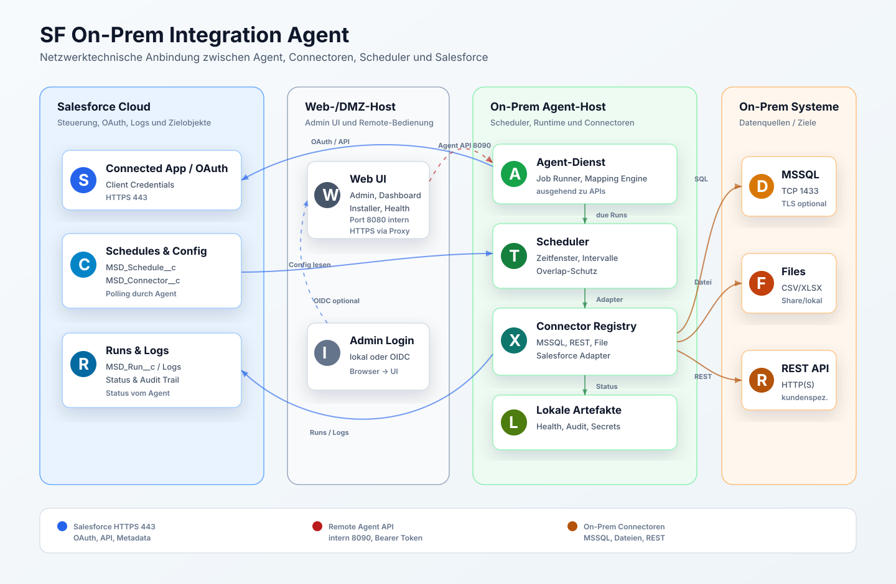

# Technische Beschreibung

## Architekturueberblick

Die Zielarchitektur besteht aus drei getrennten Betriebsrollen:

| Rolle | Aufgabe |
| --- | --- |
| Agent-Dienst | Fuehrt Scheduler, Datenimporte, Exporte, Mapping und Connector-Ausfuehrung aus. |
| WebServer-Dienst | Stellt Web UI, Admin-API, Dashboard, Installer-UI und Betriebsansichten bereit. |
| AutoUpdater-Dienst | Prueft Releases, fuehrt Updates aus und unterstuetzt Backup/Rollback. |

Die Dienste koennen gemeinsam auf einem Host oder verteilt betrieben werden. Bei getrennten Hosts kommuniziert die Web UI ueber die Agent API mit dem Agent-Host.

## Web-UI-Modulstruktur

Die Web UI besteht aus einem schlanken HTTP-Einstieg und mehreren dedizierten Modulen:

| Bereich | Modul |
| --- | --- |
| Modulregistrierung und Navigation | `src/server/app-modules.ts` |
| Statische Assets | `src/server/asset-server.ts` |
| HTML-Dokumentrahmen | `src/server/ui-template.ts` |
| Admin-UI-Script | `src/server/admin-ui-script.ts` |
| Admin-Datenservice | `src/server/admin-data-service.ts` |
| Audit-Historie | `src/server/audit-history-service.ts` |

Neue fachliche Erweiterungen sollen diese gemeinsame Basis nutzen. Businesslogik bleibt in Services, Runtime-Adaptern oder Agent-Modulen; UI-Module liefern nur Bedienoberflaeche, Navigation und API-Anbindung.

## Netzwerkdiagramm

## Netzwerkverbindungen

| Verbindung | Richtung | Protokoll / Port | Zweck |
| --- | --- | --- | --- |
| Agent -> Salesforce | ausgehend | HTTPS 443 | OAuth, Lesen von Schedules und Connector-Konfiguration, Schreiben von Runs, Logs, Checkpoints und Salesforce-Zieldaten |
| Web UI -> Agent API | intern | HTTP 8090 oder HTTPS via Reverse Proxy | Health, Update-Status, Update-Anforderung, Instanz-Synchronisierung |
| Browser -> Web UI | eingehend | HTTPS extern, intern `WEB_UI_PORT` 8080/9010 | Admin UI, Dashboard, Installer- und Betriebsansichten |
| Web UI -> Salesforce OIDC | ausgehend | HTTPS 443 | Optionaler Admin-Login ueber Salesforce als Identity Provider |
| Agent -> MSSQL | intern | TCP 1433 | Lesen oder Schreiben ueber MSSQL-Connector |
| Agent -> Dateiablage | intern | Filesystem, Share oder SFTP | CSV/XLSX/JSON Import und Export |
| Agent -> REST-System | intern oder ausgehend | HTTP(S) | REST-Quellen oder Zielsysteme |

## Salesforce-Komponenten

Die Salesforce-Seite enthaelt Metadaten fuer Steuerung und Laufzeitprotokollierung:

- `MSD_Schedule__c`: Scheduler- und Importprofildefinition.
- `MSD_Connector__c`: Connector-Konfiguration und technische Parameter.
- `MSD_Run__c`: Laufstatus, Start-/Endzeit, Ergebniszaehler und Fehler.
- `MSD_Log__c`: technische und fachliche Laufmeldungen.
- `MSD_Checkpoint__c`: Delta-/Checkpoint-Informationen.
- `MSD_ObjectMapping__mdt` und `MSD_FieldMapping__mdt`: Mapping-Metadaten.
- Berechtigungssatz `MSD_Integration_Agent`.

## Datenfluss

1. Der Agent authentifiziert sich per OAuth gegen Salesforce.
2. Der Agent liest aktive Scheduler und Connector-Konfigurationen.
3. Der Scheduler prueft Zeitfenster, Intervall, Aktivstatus und Overlap-Schutz.
4. Ein faelliger Lauf erzeugt einen `MSD_Run__c`-Datensatz.
5. Die Connector Registry waehlt den passenden Source- und Target-Adapter.
6. Der Job Runner liest Quelldaten, fuehrt Mapping aus und schreibt Zieldaten.
7. Ergebnisse werden als Run, Logs und Checkpoints nach Salesforce zurueckgeschrieben.
8. Die Web UI liest lokale und Salesforce-nahe Betriebsinformationen fuer Dashboard und Admin-Funktionen.

## Entfernte experimentelle PDF-Funktion

Das experimentelle PDF-Modul ist seit Release `0.2.23` nicht mehr Bestandteil des Produktstands. Eine spaetere PDF-Funktion wird als neues Modul ueber die gemeinsame Web-UI- und Service-Struktur angebunden.
