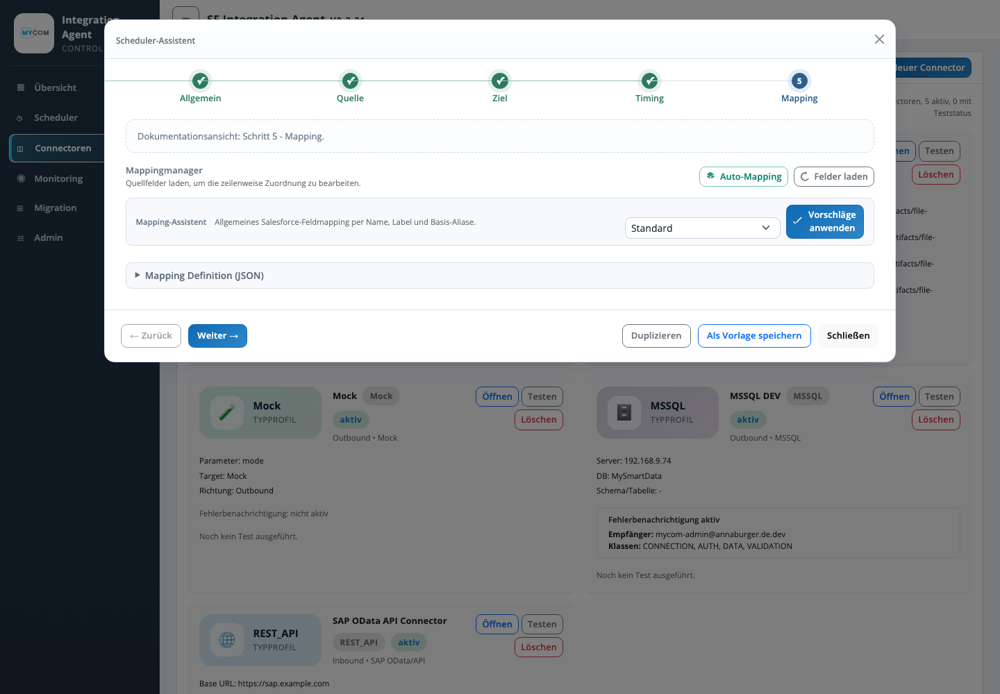
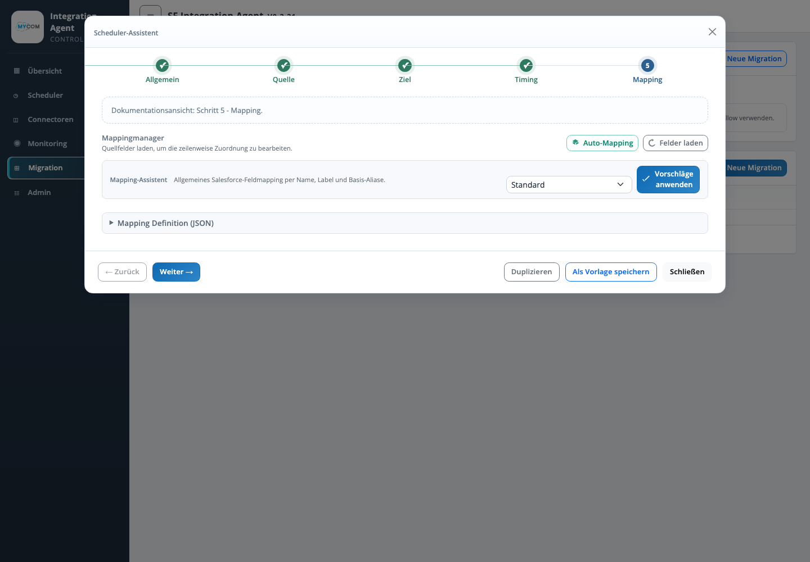

# Funktionsdokumentation

## Login

Die Web UI ist durch einen Admin-Login geschuetzt. Unterstuetzt werden lokale Benutzer aus der Admin-Benutzerdatei sowie optional Salesforce OIDC. Rollen und Rechte steuern, ob Benutzer nur lesen oder auch Konfigurationen aendern duerfen.

## Dashboard / Uebersicht

Die Uebersicht zeigt:

- Service- und Systemstatus.
- Scheduler-Status und Anzahl aktiver Scheduler.
- Connector-Uebersicht.
- Run-Qualitaet, Fehlerquote und Erfolgsquote.
- Laufstatistiken und SQLite-Staging.
- Fehler je Connector und Datensatzverlauf.
- Verknuepfungsuebersicht zwischen Schedulern und Connectoren.
- Salesforce-Org- und Limitinformationen, sofern verfuegbar.

## Scheduler-Verwaltung

Die Scheduler-Verwaltung dient zur Pflege und Kontrolle der Import-/Exportprofile. Wichtige Funktionen:

- Aktivieren und Deaktivieren von Schedules.
- Filter nach Richtung, Aktivstatus und Connector.
- Zeitfenster und Intervalle.
- Manuelle Ausfuehrung einzelner Scheduler.
- Verknuepfung zu Connector, Quelle, Ziel und Mapping.
- Schutz vor parallelen Laeufen ueber laufende Run-Datensaetze.

## Connectoren

Connectoren beschreiben technische Endpunkte und Zugriffsdaten. Unterstuetzte Typen:

- MSSQL fuer lokale SQL-Datenbanken.
- REST API fuer HTTP(S)-basierte Systeme.
- Datei-Connectoren fuer CSV, XLSX und JSON.
- Salesforce Adapter fuer Salesforce-Quellen und -Ziele.

Funktionen:

- Connectoren anlegen und bearbeiten.
- Verbindung testen.
- Secret-Key-basierte Konfiguration.
- Anzeige zugeordneter Scheduler.
- Benachrichtigungseinstellungen fuer Fehlerklassen.

## Monitoring

Das Monitoring unterstuetzt den Betrieb durch:

- Anzeige aktueller und vergangener Runs.
- Fehler- und Log-Auswertung.
- Erkennung fehlgeschlagener oder lang laufender Schedules.
- Health-Informationen des Agenten.
- Betriebsnahe Analyse von Laufzeiten, Datensatzmengen und Fehlerraten.

## Installation

Der Installationstab erzeugt passende Installationsartefakte fuer die Zielumgebung. Unterstuetzt werden Windows Server, Linux/Ubuntu und oeffentliche Linux-Server mit Reverse Proxy und TLS.

## Migration

Das Migrationsmodul unterstuetzt Datei- und Salesforce-Migrationen. Es bietet Import, Migrationsentwuerfe, Salesforce-Login je Migration, Preflight-Pruefungen, Ausfuehrung mit Fortschritt und Behandlung fehlerhafter Datensaetze.

## Assistenten

[Assistenten](./assistenten/assistenten.md) sind als eigenes Unterthema dieser Funktionsdokumentation gepflegt. Dort sind Connector-, Scheduler- und Migrations-Assistent mit eigenen Screenshots und Ablaufdiagrammen beschrieben.
