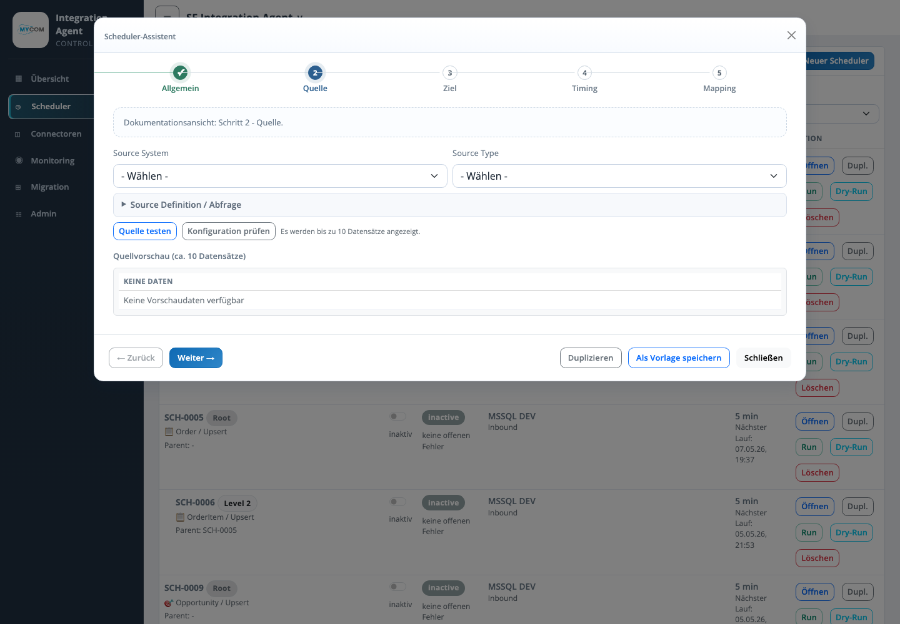

# Assistent Quelle

Der Schritt Quelle beschreibt, woher ein Scheduler seine Daten liest. Er legt Source System, Source Type, technische Abfrage oder Dateipfade sowie optionale Delta- und After-Export-Regeln fest.

## Eingaben

| Feld | Bedeutung |
| --- | --- |
| Source System | Fachliche Bezeichnung des Quellsystems, z. B. Salesforce, SAGE100, MSSQL oder Dateiablage. |
| Source Type | Technischer Quelltyp wie `SALESFORCE_SOQL`, `MSSQL_SQL`, `REST_API`, `FILE_CSV`, `FILE_EXCEL` oder `FILE_JSON`. |
| Source Definition | SOQL, SQL, REST-/Datei-Konfiguration oder JSON-Definition der Quelle. |
| Delta Modus | Optionaler Modus fuer inkrementelle Laeufe ueber Datum, Timestamp oder ID. |
| Delta Feld | Feld, dessen letzter Wert als Checkpoint gespeichert wird. |
| After Export Updates | Optionale Aktualisierung erfolgreicher Salesforce-Quellsatze nach einem Export. |

## Validierung

| Pruefung | Ergebnis |
| --- | --- |
| Quelle testen | Liest bis zu 10 Datensaetze und zeigt eine Quellvorschau. |
| Konfiguration pruefen | Validiert Pflichtfelder und technische Definition. |
| SQL Syntax-Preview | Zeigt die Abfrage lesbar an, sofern eine SQL-Quelle verwendet wird. |

## Betriebswirkung

Die Quellkonfiguration bestimmt, welche Datensaetze ein Lauf liest. Fehler in diesem Schritt fuehren typischerweise zu leeren Runs, Authentifizierungsfehlern, Parserfehlern oder fehlenden Quellfeldern im Mapping.
