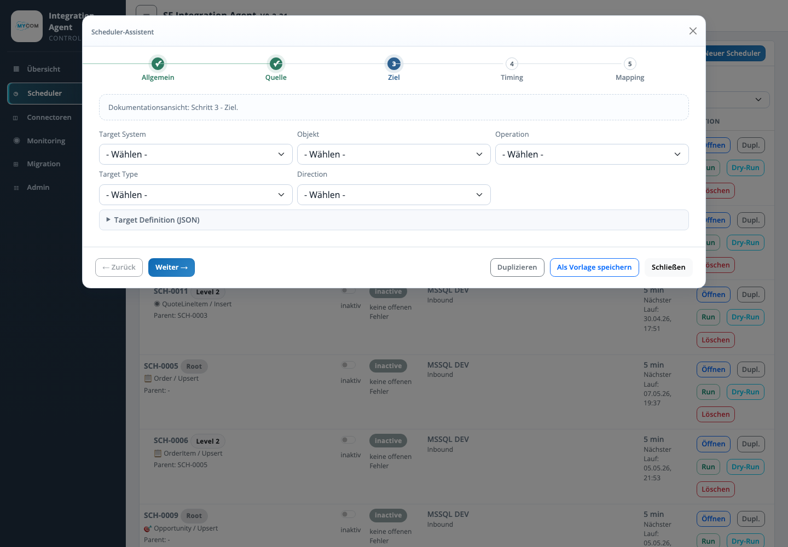

# Assistent Ziel

Der Schritt Ziel beschreibt, wohin die gelesenen und gemappten Datensaetze geschrieben werden. Er verbindet fachliches Zielsystem, Zielobjekt, Operation, Target Type und technische Target Definition.

## Eingaben

| Feld | Bedeutung |
| --- | --- |
| Target System | Fachliche Bezeichnung des Zielsystems, z. B. Salesforce, MSSQL oder Dateiablage. |
| Objekt | Zielobjekt oder Zielname, z. B. Salesforce-Objekt oder Tabellen-/Dateikontext. |
| Operation | Verarbeitung wie Insert, Update, Upsert oder Delete, sofern vom Zieltyp unterstuetzt. |
| Target Type | Technischer Zieltyp wie `SALESFORCE`, `SALESFORCE_GLOBAL_PICKLIST`, `MSSQL`, `FILE_CSV`, `FILE_EXCEL` oder `FILE_JSON`. |
| Direction | Richtung des Integrationslaufs, z. B. Inbound oder Outbound. |
| Upsert Feld | Externe ID oder Schluesselfeld fuer Upsert-Operationen. |
| Target Definition | JSON-Konfiguration fuer Zielfelder, Dateiausgabe, Tabellenziel oder Speziallogik. |

## Validierung

| Pruefung | Ergebnis |
| --- | --- |
| Zielobjekt vorhanden | Prueft, ob das konfigurierte Ziel erreichbar und fachlich plausibel ist. |
| Upsert-Feld gesetzt | Stellt sicher, dass Upsert-Laeufe ein eindeutiges Zielfeld besitzen. |
| Pflichtfelder abgedeckt | Vergleicht Zielpflichtfelder mit Mapping und festen Zielwerten. |
| Custom-Objekt erzeugen | Kann bei passenden Quellen ein Salesforce Custom-Objekt aus Quellfeldern vorbereiten. |

## Betriebswirkung

Die Zielkonfiguration bestimmt Schreibverhalten, Idempotenz und Fehlerklasse eines Laufs. Unvollstaendige Zieldefinitionen fuehren zu fehlgeschlagenen Upserts, Pflichtfeldfehlern oder nicht erzeugten Ausgabedateien.
