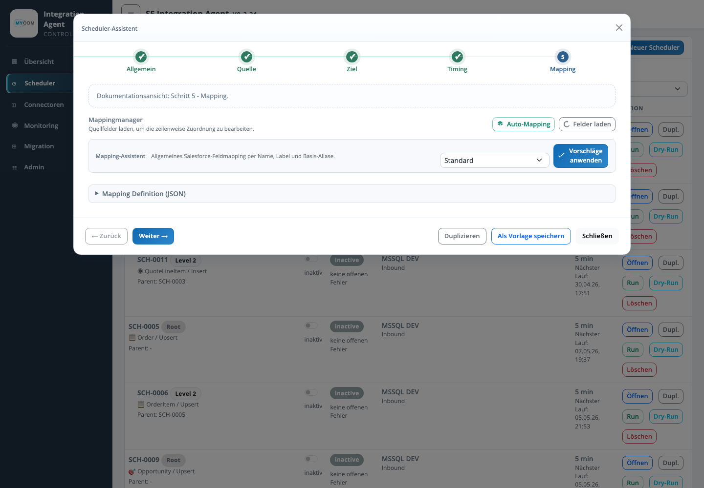

# Assistent Mapping

Der Schritt Mapping verbindet Quellfelder mit Zielfeldern. Er dokumentiert Feldzuordnungen, Datentypen, Transform-Funktionen, Lookups und Picklist-Mappings.

## Eingaben

| Bereich | Bedeutung |
| --- | --- |
| Quellfelder | Felder aus Quelle oder Quellvorschau, die als Mapping-Eingang verwendet werden. |
| Zielfelder | Felder des Zielsystems, z. B. Salesforce-Felder oder Dateispalten. |
| Transform | Optionale Umwandlung wie Trim, Datumsformat, Zahlkonvertierung oder statischer Wert. |
| Lookup | Aufloesung einer Fremdbeziehung, z. B. Account ueber externe Kundennummer. |
| Picklist-Mapping | Uebersetzung fachlicher Quellwerte auf gueltige Zielwerte. |
| Raw Mapping Definition | Technische JSON-/DSL-Darstellung der Mapping-Regeln. |

## Validierung

| Pruefung | Ergebnis |
| --- | --- |
| Quellfelder laden | Aktualisiert verfuegbare Quellfelder aus der Source Definition. |
| Zielfelder laden | Aktualisiert Zielmetadaten aus dem Target System. |
| Mapping-Vorschau | Wendet Mapping-Regeln auf Beispieldaten an. |
| Pflichtfeldpruefung | Markiert fehlende Zielpflichtfelder oder inkompatible Typen. |

## Betriebswirkung

Das Mapping bestimmt die fachliche Qualitaet der geschriebenen Datensaetze. Fehler in diesem Schritt fuehren zu fehlenden Zielwerten, falschen Datentypen, fehlgeschlagenen Lookups oder ungueltigen Picklist-Werten.
