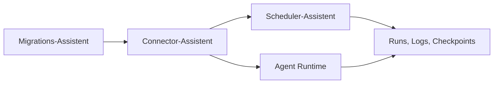

# Assistenten

Die Assistenten fuehren Administratoren durch zusammenhaengende Konfigurations- und Betriebsablaeufe. Sie reduzieren manuelle Einzelschritte und machen technische Abhaengigkeiten zwischen Connectoren, Schedulern und Migrationen sichtbar.

## Unterthemen

| Unterthema | Inhalt |
| --- | --- |
| [Connector-Assistent](./assistenten/01-connector.md) | Technische Endpunkte anlegen, testen und Schedulern zuordnen |
| [Scheduler-Assistent](./assistenten/02-scheduler.md) | Integrationsprofile zeitlich steuern und Laeufe kontrollieren |
| [Migrations-Assistent](./assistenten/03-migration.md) | Einmalige Datenuebernahmen vorbereiten, pruefen und ausfuehren |

## Zusammenspiel

Connectoren bilden die technischen Endpunkte. Scheduler nutzen diese Connectoren fuer wiederkehrende Integrationen. Migrationen dienen kontrollierten Einmaluebernahmen und koennen als Vorlage fuer spaetere Scheduler-Konfigurationen verwendet werden.
