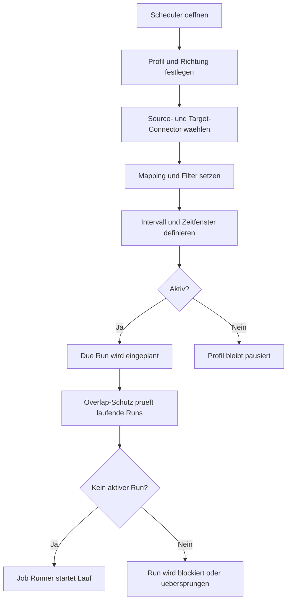

# Assistent Scheduler

Der Scheduler-Assistent verwaltet die zeitliche Ausfuehrung von Importen und Exporten. Er verbindet Zeitsteuerung, Richtung, Connectoren, Mapping und Laufkontrolle zu einem ausfuehrbaren Integrationsprofil.

## Ablauf

## Kernfunktionen

| Funktion | Beschreibung |
| --- | --- |
| Aktivstatus | Steuert, ob ein Scheduler automatisch ausgefuehrt wird. |
| Intervall | Definiert wiederkehrende Ausfuehrungen, z. B. alle 15 Minuten oder taeglich. |
| Zeitfenster | Begrenzt Ausfuehrungen auf fachlich freigegebene Zeitraeume. |
| Manuelle Ausfuehrung | Startet einen einzelnen Lauf ausserhalb des normalen Intervalls. |
| Overlap-Schutz | Verhindert parallele Laeufe desselben Profils. |
| Run-Protokoll | Schreibt Status, Zaehler, Fehler und Laufzeiten nach Salesforce. |

## Technische Wirkung

Ein aktiver Scheduler erzeugt faellige Runs, sobald Zeitfenster und Intervall passen. Die Runtime liest die zugeordneten Connectoren und Mapping-Regeln, startet den Job Runner und persistiert Ergebnisdaten als Runs, Logs und Checkpoints.
