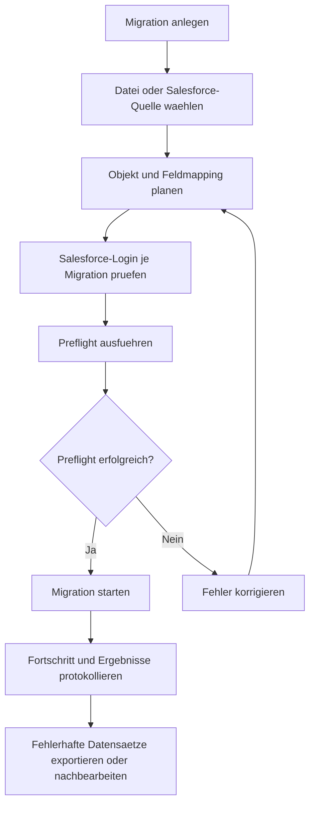

# Assistent Migration

Der Migrations-Assistent unterstuetzt einmalige oder vorbereitete Datenmigrationen. Er eignet sich fuer Dateiimporte, Salesforce-Zielobjekte und kontrollierte Uebernahmen mit Preflight-Pruefung und Ergebnisprotokoll.

## Ablauf

## Funktionsumfang

| Bereich | Beschreibung |
| --- | --- |
| Dateiupload | Import von CSV, XLSX und JSON fuer Migrationslaeufe. |
| Entwurf | Speicherung von Migrationsentwuerfen mit Objekt- und Feldplanung. |
| Salesforce-Login | Anmeldung je Migration, um Zielzugriff und Berechtigungen zu pruefen. |
| Preflight | Validierung von Datei, Pflichtfeldern, Mapping und Zielobjekt. |
| Ausfuehrung | Kontrollierter Import mit Fortschritt, Zaehlern und Ergebnisstatus. |
| Fehlerbehandlung | Dokumentation fehlerhafter Datensaetze zur Nachbearbeitung. |

## Abgrenzung zum Scheduler

Migrationen sind fuer kontrollierte Einzeluebernahmen ausgelegt. Wiederkehrende Integrationen werden ueber Scheduler und Connectoren betrieben. Nach einer erfolgreichen Migration kann aus den getesteten Parametern ein regulaeres Scheduler-Profil abgeleitet werden.
