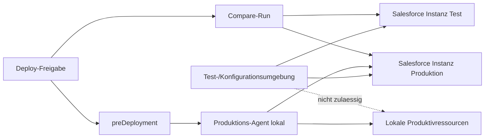
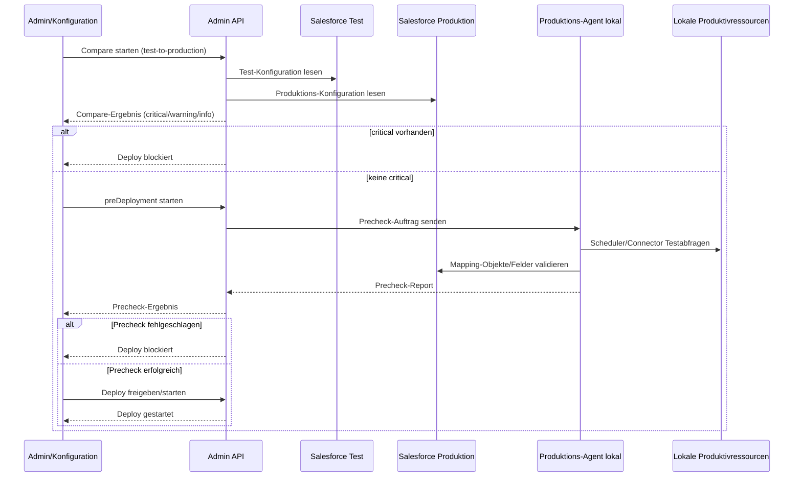

# Projekt-Ebene ueber bestehenden Salesforce-Instanzen

- Spec-ID: 2026-05-13-projekt-ebene-ueber-bestehenden-salesforce-instanzen
- Status: ready
- Owner: Projektteam SF OnPrem Integration Agent
- Reviewers: Produktverantwortung, Betrieb
- Verknuepfte Tickets: 

## Kontext

Im System koennen bereits mehrere Salesforce-Instanzen verwaltet werden.
Fachlich fehlt jedoch eine uebergeordnete Gliederungsebene, um Instanzen logisch in Projekten zu organisieren.

Dadurch werden Konfiguration, Berechtigungen, Monitoring und Betriebsverantwortung unuebersichtlich, sobald mehrere Kunden, Umgebungen oder Integrationsvorhaben parallel laufen.

Wichtige Rahmenbedingung fuer diese Spec:

- Testumgebung und Konfigurationsumgebung haben keinen direkten Zugriff auf lokale Ressourcen der Produktivumgebung.
- Die gemeinsame technische Ebene zwischen den Umgebungen sind die Salesforce-Instanzen.

## Problem

Ohne Projekt-Ebene sind Instanzen nur als flache Liste abgebildet.
Das erzeugt folgende Probleme:

- Keine klare fachliche Gruppierung (z. B. pro Kunde, Bereich oder Integrationspaket)
- Schwierige Navigation im Web UI bei vielen Instanzen
- Erhoehte Fehlerrisiken bei Zuordnung von Schedules und Migrationen zur falschen Instanz
- Keine saubere Grundlage fuer projektbezogene Auswertungen und Governance

## Zielbild

1. Es gibt eine neue Entitaet `Projekt` als Ebene oberhalb bestehender Salesforce-Instanzen.
2. Jede Salesforce-Instanz ist genau einem Projekt zugeordnet.
3. Das Web UI zeigt Instanzen gruppiert nach Projekt und ermoeglicht projektspezifische Filter.
4. Im Header wird das aktive Projekt global ausgewaehlt; direkt daneben ist der Umgebungswechsel zwischen `test` und `production` moeglich.
5. Bei Anlage/Bearbeitung von Instanzen ist die Projektzuordnung verpflichtend (mit Rueckwaertskompatibilitaet fuer Altbestand).
6. Schedules und Migrationen koennen projektbezogen validiert werden, damit Instanzverwechslungen reduziert werden.
7. Betriebs- und Monitoringansichten koennen mindestens nach Projekt aggregiert werden.
8. Es gibt ein separates Admin-Modul mit eigener Berechtigung als listenbasierte Projektverwaltung; die Konfiguration erfolgt analog zu Schedulern/Connectoren ueber einen schrittweisen Assistenten.
9. Deployments enthalten einen pruefbaren Test/Produktion-Abgleich in beide Richtungen (Test -> Produktion und Produktion -> Test als Vergleichslauf).
10. Vor jedem Deployment wird ein lokales `preDeployment` durch den Kunden-Agenten ausgefuehrt, das Erreichbarkeit und technische Konsistenz validiert.
11. Das Migrationsmodul ist dem Projektkontext untergeordnet; Migrationen nutzen die im Projekt zugeordneten Salesforce-Instanzen und pflegen keine eigenstaendige Salesforce-Verbindungsverwaltung.
12. Projekte werden in einer eigenen Projektdatenbank persistiert (Startpunkt: SQLite), damit Projektstammdaten von einzelnen Salesforce-Instanzen entkoppelt sind.
13. Pro Projekt wird die erwartete Salesforce-Last fuer das aktuelle Setup per KI bewertet und als 24h-Prognose inklusive API-Call-Verhaeltnis zu den zulaessigen Limits angezeigt.
14. Pro Projekt sind API-Entlastungsregeln konfigurierbar: Lookup-Daten werden gecacht und Logs werden lokal gepuffert sowie im konfigurierten Refreshintervall gebuendelt nach Salesforce uebertragen.
15. Beim Hinzufuegen einer Instanz zu einem Projekt wird geprueft, ob die Salesforce-Zielorg fuer den Agent-Betrieb vorbereitet ist (MSD_-Objekte vorhanden, erforderliche Berechtigungen erteilt); falls nicht, wird ein gefuehrtes bzw. automatisiertes MSD_-Setup ausgefuehrt.
16. Der Agent sendet im konfigurierten Refreshintervall einen Health-Heartbeat inklusive Versionsinformationen an Salesforce und verarbeitet rueckgelieferte Betriebsanweisungen kontrolliert (z. B. Neustart, Update anstossen, Error-Log uebermitteln).

## Nicht-Ziele

- Keine Umstellung auf ein komplett neues Mandantenkonzept.
- Keine sofortige Aenderung aller bestehenden API-Vertraege ohne Migrationspfad.
- Keine automatische inhaltliche Neuordnung historischer Runs ausser Zuordnung zum Projektkontext.
- Keine Aenderung an Salesforce-Zielobjekten oder SQL-Logik nur wegen der neuen Ebene.
- Kein zentraler Remote-Precheck ohne lokalen Agenten fuer kundeninterne Ressourcen.

## Akzeptanzkriterien

- [ ] Verhalten ist fuer den Nutzer oder Operator eindeutig beobachtbar.
- [ ] Erfolgs- und Fehlerfall sind beschrieben.
- [ ] Konfiguration, Migration oder Deployment-Folgen sind dokumentiert.
- [ ] Es gibt persistente Projektobjekte und eine eindeutige Zuordnung Instanz -> Projekt.
- [ ] Im UI sind Projekte sichtbar und Instanzen projektweise gruppiert oder filterbar.
- [ ] Im Header gibt es eine globale Projektauswahl und einen direkten Umgebungswechsel `test`/`production`.
- [ ] Bestehende Instanzen ohne Projektzuordnung erhalten einen definierten Fallback (z. B. `Default-Projekt`) und bleiben funktionsfaehig.
- [ ] Fehlkonfigurationen (ungueltiges Projekt, geloeschte Zuordnung) liefern klare Validierungsfehler.
- [ ] Es gibt ein eigenstaendiges Admin-Modul mit eigener Zugriffspruefung (nur berechtigte Rollen).
- [ ] Die Projektverwaltung ist als Liste umgesetzt; Erstellen/Bearbeiten erfolgt ueber einen mehrstufigen Assistenten analog Scheduler/Connector.
- [ ] Benutzer koennen projektspezifisch zugeordnet und verwaltet werden (lesen, zuordnen, entziehen).
- [ ] Deployment-Workflow enthaelt einen technischen Abgleich Test/Produktion und Produktion/Test mit klarer Ergebnisdarstellung.
- [ ] Vor Deployment wird ein lokales `preDeployment` durchgefuehrt und bei Fehlern als harter Blocker behandelt.
- [ ] Das `preDeployment` prueft Erreichbarkeit aller in Schedulern/Connectoren genutzten Ressourcen per Testabfrage.
- [ ] Das `preDeployment` prueft Erreichbarkeit und Verfuegbarkeit der referenzierten Salesforce-Objekte/Felder aus den Mappings.
- [ ] Migrationen sind ausschliesslich ueber Projekte steuerbar; eine separate Salesforce-Anbindung nur fuer Migrationen existiert nicht.
- [ ] Projektstammdaten (Projekt, Zuordnungen, Status) liegen in einer eigenen Datenbank (SQLite) und bleiben bei Wechsel der Salesforce-Instanzzuordnung stabil.
- [ ] Das UI zeigt pro Projekt eine KI-basierte Lastbewertung mit 24h-Prognose und API-Call-Verhaeltnis gegen das Salesforce-Limit.
- [ ] Pro Projekt sind Lookup-Caching und Log-Synchronisationsintervall konfigurierbar und reduzieren die Salesforce-API-Last nachvollziehbar.
- [ ] Beim Instanz-Onboarding wird die Salesforce-Readiness fuer den Agenten geprueft und bei fehlender Vorbereitung ein MSD_-Setup gestartet oder mit klarer Handlungsempfehlung angeboten.
- [ ] Der Agent sendet Health-Daten inkl. Version im Refreshintervall an Salesforce und verarbeitet rueckgelieferte Anweisungen robust, auditierbar und idempotent.

## Umsetzungsskizze

Betroffene Bereiche im Repo:

- `src/server/admin-data-service.ts` (Persistenzmodell fuer Projekte und Zuordnung)
- `src/server/app.ts` (API-Endpunkte, UI-Datenbereitstellung)
- `src/server/*-ui-module.ts` (Darstellung, Filter, Auswahl)
- `src/server/migration-*.ts` (Migrationen im Projektkontext ohne eigene Salesforce-Verbindungsdefinition)
- `src/server/admin-ui-script.ts` (Admin-Modul fuer Benutzer, Projekte, Deployments)
- `src/server/audit-history-service.ts` (Nachvollziehbarkeit von Rollen-, Zuordnungs- und Deployment-Entscheidungen)
- `artifacts/sf-instances.json` (Datenmigration fuer bestehende Instanzen)
- `data/projects.sqlite` (persistente Projektstammdaten, bevorzugtes Zielmodell)
- optional: `artifacts/admin-users.json` (Benutzer-/Rollen-/Projektzuordnungen)

Technische Leitplanken:

- Rueckwaertskompatibilitaet fuer bestehende Instanzstruktur ist Pflicht.
- Datenmigration muss idempotent sein (mehrfach ausfuehrbar ohne Seiteneffekte).
- API-Antworten sollen Projektkontext enthalten, ohne alte Consumer sofort zu brechen.
- Logging und Audit sollen Projekt-ID/-Name in relevanten Operationen mitfuehren.
- Das Admin-Modul ist logisch getrennt und per Berechtigungspruefung abgesichert.
- Der globale Header-Kontext (`projectId`, `environment`) steuert alle projektbezogenen Screens konsistent.
- Lookup-Lesezugriffe koennen projektbezogen ueber einen Cache mit TTL/Invalidierung gesteuert werden.
- Operative Logs koennen lokal vorgehalten und in konfigurierbaren Intervallen gebuendelt nach Salesforce synchronisiert werden.
- Beim Instanz-Onboarding muss ein Salesforce-Readiness-Check gegen die Zielorg laufen (MSD_-Objekte, Feldschema, PermissionSet-/Profil-Zugriff, API-Berechtigungen).
- Falls Readiness fehlt, muss das MSD_-Setup reproduzierbar ausfuehrbar sein (dry-run + apply) und den Ergebnisstatus im Projektkontext persistieren.
- Der Agent fuehrt im Refreshintervall einen Health-Heartbeat aus und uebergibt mindestens Agent-Version, Build-Version, Host/Agent-ID, Betriebsstatus und Fehlerindikatoren.
- Rueckantworten aus Salesforce mit Betriebsanweisungen werden nur aus einer erlaubten Whitelist verarbeitet und mit Ausfuehrungsstatus quittiert.
- `preDeployment` laeuft agentennah (lokal beim Kunden), damit netzwerknahe Ressourcen realistisch geprueft werden.
- Deployment ist nur zulaessig, wenn `preDeployment` und Umgebungsabgleich erfolgreich sind.
- Test-/Konfigurationsumgebung duerfen keine lokalen Produktivressourcen direkt adressieren; Pruefungen produktiver lokaler Ressourcen erfolgen ausschliesslich ueber den lokalen Produktions-Agenten.
- Umgebungsuebergreifende Abstimmung und Abgleich erfolgen ueber die Salesforce-Ebene, nicht ueber direkte lokale Netzverbindungen zwischen Test und Produktion.
- Migrationen referenzieren immer ein Projekt und dessen Instanzzuordnung; eigenstaendige Salesforce-Credentials im Migrationsmodul sind nicht zulaessig.
- Projektpersistenz erfolgt in eigener Datenbank (SQLite als Start), nicht in Salesforce-Metadaten.
- Mindest-Runtime fuer Agent und Web-UI ist Node.js 22 oder hoeher.

Annahme fuer diese Spec:

- Mit "zusaetzliche Ebene" ist eine organisatorische Projekt-Ebene ueber den bestehenden Salesforce-Instanzen gemeint.

## Aufgaben

- [ ] Datenmodell fuer Projekt und Instanzzuordnung finalisieren.
- [ ] Migrationsstrategie fuer Bestandsinstanzen festlegen (Default-Projekt).
- [ ] API und UI fuer projektbezogene Anzeige/Filter spezifizieren.
- [ ] Header-Kontextwahl fuer Projekt sowie `test`/`production` als globalen UI-Status spezifizieren.
- [ ] Validierungs- und Fehlerfaelle definieren.
- [ ] Technische Umsetzung in kleinen Schritten planen.
- [ ] Eigenstaendiges Admin-Modul mit Rollen- und Rechtekonzept spezifizieren.
- [ ] Benutzerverwaltung inkl. Projektzuordnung (many-to-many) fachlich und technisch definieren.
- [ ] Admin-Konfiguration als Projektliste mit Assistent-Schritten (analog Scheduler/Connector) fuer Projekte, Instanzen, Deployment und Dokumentation spezifizieren.
- [ ] Änderungshistorie im Admin-Kontext per Klick erreichbar machen.
- [ ] KI-gestuetzte Lastbewertung pro Projekt-Setup spezifizieren (24h-Prognose, API-Limit-Verhaeltnis, Warnschwellen).
- [ ] Projektweite API-Entlastung spezifizieren: Lookup-Cache-Strategie, lokale Log-Pufferung und Sync-Refreshintervall.
- [ ] Salesforce-Readiness-Check beim Instanz-Onboarding spezifizieren (MSD_-Objekte, Berechtigungen, Setup-Pfad bei Luecken).
- [ ] Agent-Heartbeat im Refreshintervall spezifizieren (Health-Payload, Versionsinfo, Response-Anweisungen, Quittung).
- [ ] Deployment-Workflow mit Abgleich Test/Produktion und Produktion/Test fachlich festlegen.
- [ ] `preDeployment`-Spezifikation erstellen (Connector-/Scheduler-Testabfragen, Mapping-Objektpruefungen).
- [ ] Blocker- und Freigaberegeln fuer Deployment auf Basis `preDeployment` und Abgleichsergebnissen definieren.
- [ ] Migrationsmodul auf projektgebundenes Modell umstellen (ohne separate Salesforce-Anbindung).
- [ ] Projektpersistenz in eigener Datenbank (SQLite) fachlich und technisch spezifizieren.

## Verifikation

- Build oder schmaler Smoke-Test: `npm run build`
- Manuelle Checks in Web UI oder Agent:
	- Neues Projekt anlegen
	- Projekt im Header auswaehlen und auf relevante Bereiche anwenden
	- Im Header zwischen Test und Produktion wechseln und Kontextwechsel pruefen
	- Benutzer anlegen/zuweisen und Projektberechtigungen pruefen
	- Instanz Projekt zuordnen
	- Instanzen pro Projekt filtern
	- KI-Lastbewertung fuer das aktive Projekt aufrufen und 24h-Prognose plausibilisieren
	- Verhaeltnis prognostizierter API Calls zu zulaessigen API Calls pruefen (inkl. Warn-/Kritisch-Schwelle)
	- Lookup-Caching fuer das Projekt aktivieren und reduzierte Lookup-API-Calls verifizieren
	- Lokale Log-Pufferung aktivieren und gebuendelte Log-Uebertragung im Refreshintervall validieren
	- Neue Instanz zu Projekt zuordnen und Salesforce-Readiness-Check inkl. MSD_-Setup-Pfad pruefen
	- Agent-Heartbeat im Refreshintervall pruefen (Health + Versionsinfo gesendet, Response-Anweisungen empfangen und quittiert)
	- `preDeployment` lokal starten und Fehler/Erfolg pruefen
	- Abgleich Test/Produktion sowie Produktion/Test ausfuehren und Ergebnis validieren
	- Schedule-/Migrationszuordnung gegen Projekt pruefen
- Betriebsrelevante Beobachtung nach Deploy:
	- Bestehende Instanzen sind weiterhin nutzbar
	- Monitoring kann projektweise ausgewertet werden
	- Deployment wird bei fehlgeschlagenem `preDeployment` blockiert
	- Audit zeigt Benutzer-/Projektzuordnungen und Deployment-Freigaben nachvollziehbar

## Status

- Status: ready
- Letzte Entscheidung: Beschlussvorschlag v1 ist bestaetigt.
	- Instanzmodell pro Projekt: Test 1..n, Produktion genau 1
	- Produktionssperre: standardmaessig aktiv
	- Deploy-Freigaberolle: Projekt-Owner und Release-Manager
	- Confluence-Integration: API-Token als MVP, OAuth 2.0 als Ausbau
	- Migrationen sind projektgebunden; keine separate Salesforce-Anbindung fuer Migrationen
	- Projektpersistenz in eigener DB (SQLite als Startmodell)
	- Mindest-Runtime: Node.js 22+
	- Setup-Versionierung: Metadaten plus Artefakt-Referenz (Deploy-Paket-ID)
- Naechster Schritt: Umsetzungsplanung in konkrete Arbeitspakete (Datenmodell, Migration, API/UI, Validierung, Audit) ueberfuehren.

## Umwandlung in konkrete Spec Anforderung

Die folgende Konkretisierung leitet aus den obigen Stichpunkten umsetzbare Anforderungen ab.

### A. Projektmodell mit Test- und Produktionsinstanz

- Ein Projekt kann mindestens zwei Instanzrollen aufnehmen: `test` und `production`.
- Beide Rollen muessen im Datenmodell eindeutig markiert sein.
- Eine Instanz darf innerhalb eines Projekts nur eine Rolle haben.

Akzeptanzkriterien:

- [ ] Ein Projekt kann mit genau einer Test- und einer Produktionsinstanz angelegt werden.
- [ ] Die Rollen sind in API und UI konsistent sichtbar.

### A2. Salesforce-Readiness beim Instanz-Onboarding

- Beim Hinzufuegen oder Umhaengen einer Instanz in ein Projekt wird ein technischer Readiness-Check gegen Salesforce ausgefuehrt.
- Der Check validiert mindestens:
	- Vorhandensein benoetigter MSD_-Objekte/Felder fuer Agent-Betrieb
	- erforderliche Berechtigungen (z. B. Objekt-/Feldrechte, API-Zugriff)
	- technische Mindestvoraussetzungen fuer Health-/Command-Austausch
- Fuer bereits existierende Kundensysteme gilt ein expliziter Legacy-Migrationspfad:
	- Legacy-Objekte/Felder mit kompatibler Semantik duerfen im Readiness-Check als lauffaehig erkannt werden, werden jedoch als `warning` markiert.
	- Das Setup legt fehlende kanonische Felder idempotent an, ohne vorhandene Legacy-Felder zu loeschen.
	- Fehlende kanonische PermissionSets werden bevorzugt verwendet; falls nur Legacy-PermissionSets existieren, bleibt der Betrieb moeglich und es wird eine Migrationswarnung ausgegeben.
- Falls Anforderungen nicht erfuellt sind, wird ein MSD_-Setup-Flow bereitgestellt (dry-run und apply), der fehlende Bausteine erstellt/zuweist.
- Das Ergebnis wird pro Instanz und Projektzustand gespeichert (`ready`, `setup-required`, `setup-running`, `setup-failed`).

Akzeptanzkriterien:

- [ ] Instanzzuordnung ohne erfolgreichen Readiness-Check ist nur mit expliziter Risiko-Quittierung moeglich und wird auditiert.
- [ ] Bei fehlenden MSD_-Bausteinen kann das Setup aus dem Admin-Flow direkt gestartet werden.
- [ ] Nach erfolgreichem Setup wechselt der Status auf `ready` und ist in der Projektliste sichtbar.
- [ ] In bestehenden Kundensystemen mit Legacy-Metadaten bleibt der Agent lauffaehig; Legacy-Funde werden als Migrationshinweise (`warning`) ausgewiesen.
- [ ] Das Setup ist fuer Legacy- und Zielschema idempotent und kann mehrfach ausgefuehrt werden, ohne bestehende Datenstrukturen destruktiv zu veraendern.

### B. Klare Umgebungskennzeichnung im UI

- In allen projektrelevanten Oberflaechen (Instanzliste, Scheduler, Migration, Deploy) ist klar sichtbar, ob der Kontext `test` oder `production` ist.
- Der aktive Kontext wird zentral im Header gefuehrt: Projektauswahl plus Umgebungsumschalter (`test`/`production`).
- Produktion erhaelt eine deutlichere visuelle Kennzeichnung als Test.

Akzeptanzkriterien:

- [ ] Jeder Screen mit Instanzbezug zeigt den Umgebungstyp ohne Zusatzklick.
- [ ] Ein Wechsel im Header aktualisiert den Kontext fuer Scheduler, Connector, Migration und Deploy konsistent.
- [ ] Verwechslungsrisiko zwischen Test und Produktion wird durch eindeutige Label/Farbkodierung reduziert.

### B2. KI-Lastbewertung fuer Salesforce API-Verbrauch

- Pro Projekt wird aus dem aktuellen Setup (Scheduler, Connector, Migrationskontext, geplante Runs) eine prognostizierte Last fuer 24 Stunden berechnet.
- Die Lastbewertung erfolgt KI-gestuetzt und liefert mindestens:
	- erwartete API Calls in 24h
	- Verhaeltnis in Prozent zu den zulaessigen API Calls der Zielumgebung
	- Risiko-Klassifikation (z. B. `ok`, `warning`, `critical`) mit kurzer Begruendung
- Standardisierte Schwellen fuer die Klassifikation:
	- `ok`: unter 70% der zulaessigen API Calls
	- `warning`: ab 70% bis unter 85%
	- `high`: ab 85% bis unter 95%
	- `critical`: ab 95%
- Die Anzeige ist im Projektkontext sichtbar und aktualisiert sich bei relevanten Setup-Aenderungen.

Akzeptanzkriterien:

- [ ] Fuer ein Projekt ist eine 24h-Prognose der Salesforce-API-Last sichtbar.
- [ ] Das Verhaeltnis `prognostizierte API Calls / zulaessige API Calls` wird klar als Prozentwert angezeigt.
- [ ] Bei Ueberschreitung definierter Schwellen wird mindestens eine Warnung im UI angezeigt.
- [ ] Die Bewertung ist je nach Header-Kontext (`test`/`production`) getrennt nachvollziehbar.

### C. Konfigurierbare Schreibsperre fuer Produktion

- Pro Projekt gibt es eine Option `productionWriteProtection`.
- Bei aktiver Sperre sind direkte schreibende Aenderungen gegen Produktionsinstanzen blockiert.
- Ausnahmen (z. B. expliziter Deploy-Freigabeflow) sind kontrolliert und auditierbar.

Akzeptanzkriterien:

- [ ] Schreibende Aktionen auf Produktionsinstanz schlagen mit klarer Fehlermeldung fehl, wenn Sperre aktiv ist.
- [ ] Erlaubte Ausnahmen werden mit Zeitpunkt und Benutzer protokolliert.

### D. Testsystem fuer Setup-Aufbau (Objekte und Felder)

- Neue oder geaenderte Setup-Bausteine (insbesondere Custom Objects und Custom Fields) werden zuerst gegen die Testinstanz ausgefuehrt.
- Der Testlauf erzeugt ein verwertbares Ergebnis fuer die spaetere Produktionsuebernahme.

Akzeptanzkriterien:

- [ ] Setup-Aenderungen lassen sich vollstaendig in Test anwenden.
- [ ] Ergebnisstatus ist fuer das Projekt einsehbar (erfolgreich/fehlgeschlagen mit Details).

### E. Projektgesteuerter Deploy von Test nach Produktion

- Aus der Projektverwaltung kann ein gesteuerter Deploy von freigegebenem Setup in die Produktionsinstanz gestartet werden.
- Der Deploy umfasst mindestens Custom Objects und Custom Fields.
- Der Deploy ist nur moeglich, wenn Vorbedingungen erfuellt sind (z. B. erfolgreicher Testlauf, Freigabe).
- Beim Deploy kann der Benutzer auswaehlen, welche Bestandteile der Setup-Version deployt werden sollen (z. B. Projektstammdaten, Connectoren, Scheduler, Migrationen, Dokumentation).

Akzeptanzkriterien:

- [ ] Produktionsdeploy startet aus dem Projektkontext und nutzt die dem Projekt zugeordnete Produktionsinstanz.
- [ ] Fehlende Vorbedingungen verhindern den Deploy mit eindeutiger Rueckmeldung.
- [ ] Vor Deployment ist im Projektkontext auswaehlbar, welche Bestandteile deployt werden.

### F. Setup-Versionierung pro Projekt

- Projekte erhalten eine Versionierung des Setups (z. B. Versionsnummer, Zeitstempel, Autor, Aenderungsumfang).
- Jede Deployment-Einheit ist einer Setup-Version zuordenbar.
- In der Projektverwaltung sind Setup-Versionen mit Versionsnummer, Datum und Benutzer auswaehlbar, damit auf eine beliebige Version zurueckgesprungen bzw. diese als Deploy-Basis genutzt werden kann.
- Beim Erstellen einer Setup-Version gibt es ein Beschreibungsfeld fuer die dokumentierten Aenderungen; ein KI-gestuetzter Vorschlag formuliert die Differenz zur vorherigen Setup-Version.

Akzeptanzkriterien:

- [ ] Mindestens die letzten Setup-Versionen sind pro Projekt nachvollziehbar.
- [ ] Deploys referenzieren die verwendete Setup-Version.
- [ ] Eine beliebige vorhandene Setup-Version kann in der Projektverwaltung ausgewaehlt werden.
- [ ] Die Beschreibung einer Setup-Version kann manuell gepflegt oder aus einem Diff-Vorschlag uebernommen werden.

### G. Projektdokumentation und Export

- Das Projekt kann eine technische Dokumentation des aktuellen Setups erzeugen.
- Inhalt mindestens: Connectoren, Scheduler, Mapping, Quelle, Ziel, Outbound-Konfiguration.
- Fuer den kundennahen Testaufbau enthaelt die Dokumentation zusaetzlich die abgestimmten Mapping-Details und die relevanten lokalen Ressourcen/Erreichbarkeitsannahmen.
- Exportoptionen:
	- Markdown-Datei
	- One-Click-Publikation nach Confluence bei konfigurierter Confluence-URL

Akzeptanzkriterien:

- [ ] Dokument kann als Markdown erzeugt und gespeichert werden.
- [ ] Bei konfigurierter Confluence-URL kann die Doku alternativ veroeffentlicht werden.
- [ ] Die Confluence-Publikation ist per einem expliziten UI-Click aus dem Projektkontext ausloesbar und erstellt/aktualisiert die Seite mit Mapping- und lokalen Ressourceninformationen.

### H. Projektverwaltung im Admin-Modul mit Berechtigung

- Es gibt ein separates Admin-Modul als eigene Oberflaeche/Funktionsgruppe.
- Zugriff ist nur mit expliziter Admin-Berechtigung moeglich.
- Das Modul fuehrt die Konfiguration ueber eine listenbasierte Projektverwaltung.
- Projekte werden in einer Liste wie bei Schedulern/Connectoren angezeigt (inkl. Status, zugeordnete Instanzen, Kurzinfos).
- Erstellen/Bearbeiten erfolgt ueber einen Assistenten mit klaren Schritten (mindestens Projektstammdaten -> Instanzen Test/Produktion -> Benutzerzuordnung -> Deployment/Dokumentation -> Pruefen & Speichern).
- Deployment-Steuerung, Dokumentationskonfiguration sowie Abgleich-/Pre-Deployment-Ergebnisse sind im Projektkontext erreichbar.
- Die Änderungshistorie ist direkt aus dem Admin-Bereich per Klick oeffnbar.

Akzeptanzkriterien:

- [ ] Nicht berechtigte Benutzer erhalten keinen Zugriff auf Admin-Funktionen.
- [ ] Berechtigte Benutzer koennen Projekte ueber Liste und Assistent verwalten sowie Instanzen/Benutzer hierarchisch zuordnen.
- [ ] Die Hierarchie Projekt -> Instanzen (`test`/`production`) -> Benutzer ist im Admin-Flow eindeutig und ohne Medienbruch abbildbar.
- [ ] Die Änderungshistorie kann aus dem Admin-Kontext ohne Umweg geoeffnet werden.

### I. Benutzerverwaltung mit Projektzuordnung

- Benutzer koennen erstellt, deaktiviert und Projekten zugeordnet werden.
- Ein Benutzer kann mehreren Projekten zugeordnet sein; ein Projekt kann mehrere Benutzer haben.
- Rollensteuerung unterscheidet mindestens: Viewer, Operator, Admin, Release-Manager.

Akzeptanzkriterien:

- [ ] Projektzuordnungen wirken sofort auf Sichtbarkeit und erlaubte Aktionen.
- [ ] Entzogene Berechtigungen verhindern weitere projektbezogene Schreibaktionen.

### J. Deployment mit bidirektionalem Umgebungsabgleich

- Vor Freigabe eines Deployments wird ein strukturierter Abgleich zwischen Test und Produktion ausgefuehrt.
- Der Abgleich ist in beide Richtungen verfuegbar:
	- Test -> Produktion (go-live-orientiert)
	- Produktion -> Test (Rueckvergleich/Drift-Erkennung)
- Unterschiede werden kategorisiert (kritisch, warnung, info) und beeinflussen die Deploy-Freigabe.

Akzeptanzkriterien:

- [ ] Kritische Abweichungen blockieren den Deployment-Start.
- [ ] Ergebnisbericht listet alle relevanten Differenzen nachvollziehbar auf.

### K. Lokales `preDeployment` durch Kunden-Agenten

- Vor jedem Deployment wird verpflichtend ein lokales `preDeployment` auf dem Kunden-Agenten ausgefuehrt.
- Zweck: reale Erreichbarkeit lokaler Ressourcen pruefen, da Test- und Produktionsnetze variieren koennen.
- Hintergrund: Da Test/Konfiguration keinen Zugriff auf produktive lokale Ressourcen haben, muss die produktive Erreichbarkeitspruefung im Produktionskontext durch den lokalen Agenten stattfinden.
- Der Check umfasst mindestens:
	- Erreichbarkeit aller in Schedulern und Connectoren referenzierten lokalen Ressourcen (inkl. Testabfragen)
	- Erreichbarkeit der Salesforce-Instanz(en) im Zielkontext
	- Validierung der im Mapping genutzten Salesforce-Objekte/Felder gegen die Zielumgebung

Akzeptanzkriterien:

- [ ] `preDeployment` laeuft lokal und liefert einen strukturierten Ergebnisreport.
- [ ] Bei fehlgeschlagenen Verbindungs- oder Mapping-Pruefungen ist das Deployment blockiert.
- [ ] Erfolgreiches `preDeployment` ist mit Zeitstempel, Agent-ID und Zielprojekt auditiert.
- [ ] Es gibt keine direkte technische Pruefroutine aus Test/Konfiguration gegen lokale Produktivressourcen; diese Pruefung ist ausschliesslich ueber den lokalen Produktions-Agenten zulaessig.

### L. Architektur-Skizze (Netz- und Prueffluss)

Logischer Kommunikationspfad:

1. Admin-/Konfigurationskontext (Test/Konfiguration) startet Deploy- und Pruefprozesse.
2. Vergleich und Freigabelogik laufen ueber Projektkontext und Salesforce-Ebene.
3. Produktive lokale Ressourcen werden ausschliesslich durch den lokalen Produktions-Agenten geprueft.

Schematischer Fluss:





- Test/Konfigurationsumgebung -> Salesforce-Instanz (Test)
- Test/Konfigurationsumgebung -> Salesforce-Instanz (Produktion)
- Test/Konfigurationsumgebung -/-> Lokale Produktivressourcen (nicht zulaessig)
- Produktions-Agent (lokal) -> Lokale Produktivressourcen (zulaessig, fuer `preDeployment`)
- Produktions-Agent (lokal) -> Salesforce-Instanz (Produktion)

Referenzablauf vor Deployment:

1. Compare-Run `test-to-production` und optional `production-to-test` ausloesen.
2. `preDeployment` auf lokalem Produktions-Agenten starten.
3. Produktions-Agent prueft lokale Ressourcen (Connector/Scheduler) per Testabfragen.
4. Produktions-Agent validiert Mapping-Referenzen gegen Salesforce-Produktion.
5. Deployment nur freigeben, wenn Compare ohne kritische Abweichungen und `preDeployment` erfolgreich.

Akzeptanzkriterien:

- [ ] Die Architekturgrenze (kein direkter Zugriff Test/Konfiguration auf lokale Produktivressourcen) ist im Betrieb technisch erzwungen.
- [ ] Der dokumentierte Referenzablauf ist in UI, API und Audit nachvollziehbar abbildbar.

### M. Projektgebundenes Migrationsmodul und Projektpersistenz

- Das Migrationsmodul ist fachlich und technisch ein Untermodul des Projekts.
- Migrationen verwenden die Projekt-Instanzzuordnung (`test`/`production`) und keine eigene Salesforce-Verbindungsdefinition.
- Projektstammdaten werden in einer separaten Projektdatenbank persistiert (SQLite als initiale Implementierung).
- Die Projektidentitaet bleibt stabil, auch wenn sich zugeordnete Salesforce-Instanzen aendern.

Akzeptanzkriterien:

- [ ] Migration kann nur mit gueltigem `projectId` angelegt/gestartet werden.
- [ ] Migration-Endpunkte akzeptieren keine separaten Salesforce-Credentials im Payload.
- [ ] Projektdaten sind nach Neustart aus SQLite wiederherstellbar und konsistent.
- [ ] Wechsel einer Salesforce-Instanzzuordnung loescht keine Projektstammdaten.

### N. Prognose und Monitoring der Projektlast (KI)

- Die Plattform berechnet pro Projekt eine 24h-Prognose des zu erwartenden Salesforce-API-Verbrauchs.
- Die Prognose kombiniert historische Laufdaten und Setup-Metadaten (z. B. Trigger-Haeufigkeit, Batchgroessen, Objektvolumen, Fehlerraten).
- KI bewertet die Lastentwicklung und markiert moegliche Engpaesse fruehzeitig.
- Die Darstellung erfolgt im Projektkontext und zeigt das Verhaeltnis zum API-Limit der jeweiligen Umgebung.

Akzeptanzkriterien:

- [ ] Prognosewerte sind fuer `test` und `production` getrennt abrufbar.
- [ ] Es gibt eine 24h-Zeitscheibe mit erwarteter Lastkurve oder aggregierter Lastprognose.
- [ ] Die API-Limit-Auslastung wird als Prozent und Ampel-/Statuswert angezeigt.
- [ ] Bei kritischer Prognose wird eine konkrete Empfehlung ausgegeben (z. B. Scheduler-Takt reduzieren, Batchgroesse anpassen).

### O. Projektweite API-Optimierung (Cache + Log-Batching)

- Pro Projekt gibt es eine konfigurierbare Lookup-Cache-Strategie, um wiederholte Salesforce-Lookups zu reduzieren.
- Cache-Parameter sind mindestens: Aktiv/Inaktiv, TTL, Invalidierung bei relevanten Setup-Aenderungen.
- Logs werden nicht zwingend sofort nach Salesforce geschrieben, sondern koennen lokal gepuffert werden.
- Die Uebertragung lokaler Logs nach Salesforce erfolgt gebuendelt in einem konfigurierbaren Refreshintervall.
- Die Auswirkungen auf API-Last sind im Projektkontext sichtbar und fliessen in die KI-Lastbewertung ein.

Defaultwerte (MVP):

- Lookup-Cache:
	- Aktiv: `true`
	- TTL: `15 Minuten`
	- Harte Invalidierung bei: Deployment, Setup-Import, Mapping-Aenderung, Instanzwechsel
- Log-Pufferung:
	- Aktiv: `true`
	- Sync-Refreshintervall: `5 Minuten`
	- Sofort-Flush bei: `critical` Fehlern, manuellem Deploy-Start, kontrolliertem Agent-Shutdown
	- Max. lokaler Puffer pro Projekt: `10.000` Logeintraege (danach FIFO-Rotation mit Audit-Hinweis)
- Log-Batchgroesse Richtung Salesforce:
	- Standard: `200` Eintraege pro Uebertragung
	- Retry-Strategie: exponentielles Backoff mit maximal `5` Wiederholungen

Akzeptanzkriterien:

- [ ] Lookup-Cache ist pro Projekt aktivierbar und reduziert wiederholte Lookup-API-Aufrufe messbar.
- [ ] Log-Pufferung und Log-Sync-Intervall sind pro Projekt konfigurierbar.
- [ ] Bei aktivem Batching werden Logs lokal gespeichert und im Intervall gebuendelt nach Salesforce uebertragen.
- [ ] Bei Ausfall der Salesforce-Verbindung gehen lokal gepufferte Logs nicht verloren und werden nachgeliefert.
- [ ] Dashboard/Projektansicht zeigt den Einfluss von Cache und Batching auf API-Last und Limit-Auslastung.
- [ ] Die Defaultwerte fuer Cache/Batching sind wirksam, sofern projektspezifisch nichts abweichend konfiguriert wurde.

### P. Agent-Health-Heartbeat und Remote-Anweisungen

- Der Agent sendet im konfigurierbaren Refreshintervall einen Heartbeat an Salesforce.
- Die Heartbeat-Payload enthaelt mindestens:
	- `agentId`, `projectId`, `instanceId`, `targetEnv`
	- `agentVersion`, `appVersion`, `nodeVersion`
	- `status` (ok/warning/error), letzter erfolgreicher Lauf, offene Fehleranzahl
	- optionale Runtime-Metriken (CPU, Memory, Queue-Backlog)
- Salesforce kann als Antwort eine Liste von Betriebsanweisungen liefern.
- Unterstuetzte Anweisungen im MVP:
	- `restart-agent`
	- `request-update` (Update-Prozess anstossen, ohne ungepruefte Fremd-Binaries)
	- `upload-error-log` (aktuellen Error-Log-Auszug hochladen)
- Jede Anweisung wird nur verarbeitet, wenn sie gueltig signiert/autorisiert und fuer den Agenten neu ist (idempotente `commandId`).
- Der Agent quittiert Ausfuehrung je Anweisung mit Status (`accepted`, `done`, `failed`, `ignored`) und Zeitstempel nach Salesforce.

Defaultwerte (MVP):

- Heartbeat-Refreshintervall: `5 Minuten`
- Command-Polling: gekoppelt an Heartbeat-Zyklus
- Log-Upload bei `upload-error-log`: letzte `1000` Zeilen der Error-Logs plus Metadaten

Akzeptanzkriterien:

- [ ] Heartbeat wird im Refreshintervall fuer aktive Projektinstanzen gesendet.
- [ ] Versionsinformationen des Agenten sind in Salesforce je Heartbeat nachvollziehbar.
- [ ] Gueltige Remote-Anweisungen werden genau einmal verarbeitet und mit Ergebnis quittiert.
- [ ] Unbekannte oder unautorisierte Anweisungen werden sicher verworfen und auditiert.

### P1. API-Contracts (MVP, JSON-Beispiele)

Die folgenden Contracts konkretisieren die in A2 und P beschriebenen Endpunkte.

Konvention fuer Migrationssichtbarkeit in Responses:

- `dataModelVersion`: Version des aktiven Runtime-/Storage-Modells (z. B. `"legacy-v1"`, `"dual-write-v1"`, `"json-primary-v1"`).
- `storageMode`: Aktiver Betriebsmodus je Projekt/Instanz (`"legacy"`, `"dual-write"`, `"json-primary"`).

#### 1) `POST /api/admin/sf-instances/:id/readiness-check`

Zweck:

- Prueft, ob die zugeordnete Salesforce-Instanz fuer den Agentbetrieb vorbereitet ist.

Request (Beispiel):

```json
{
	"projectId": "annaburger-rollout",
	"targetEnv": "production",
	"mode": "validate-only",
	"requestedBy": "admin.user"
}
```

Response 200 (Beispiel):

```json
{
	"instanceId": "annaburger-prod-01",
	"projectId": "annaburger-rollout",
	"dataModelVersion": "dual-write-v1",
	"storageMode": "dual-write",
	"status": "setup-required",
	"checkedAt": "2026-05-14T09:35:00Z",
	"missingArtifacts": [
		{
			"type": "object",
			"name": "MSD_AgentHealth__c",
			"severity": "critical"
		},
		{
			"type": "permission",
			"name": "MSD_Integration_Agent",
			"severity": "critical"
		}
	],
	"capabilities": {
		"healthPulse": false,
		"remoteCommands": false,
		"logUpload": true
	},
	"nextAction": "run-msd-setup"
}
```

Response 400/409 (Beispiel):

```json
{
	"error": "instance_readiness_invalid_state",
	"message": "Readiness-Check kann nicht ausgefuehrt werden, solange ein Setup-Lauf aktiv ist.",
	"details": {
		"instanceId": "annaburger-prod-01",
		"currentStatus": "setup-running"
	}
}
```

#### 2) `POST /api/admin/sf-instances/:id/msd-setup`

Zweck:

- Fuehrt das fehlende MSD_-Setup aus (dry-run oder apply).

Request (Beispiel):

```json
{
	"projectId": "annaburger-rollout",
	"targetEnv": "production",
	"mode": "apply",
	"components": [
		"MSD_AgentHealth__c",
		"MSD_AgentCommand__c",
		"MSD_Integration_Agent.permissionset"
	],
	"requestedBy": "admin.user"
}
```

Response 200 (Beispiel):

```json
{
	"instanceId": "annaburger-prod-01",
	"projectId": "annaburger-rollout",
	"dataModelVersion": "dual-write-v1",
	"storageMode": "dual-write",
	"status": "ready",
	"startedAt": "2026-05-14T09:36:00Z",
	"finishedAt": "2026-05-14T09:37:12Z",
	"applied": [
		"MSD_AgentHealth__c",
		"MSD_AgentCommand__c",
		"MSD_Integration_Agent.permissionset"
	],
	"warnings": [],
	"auditId": "audit-evt-6f4f3d"
}
```

#### 3) `POST /api/agent/health/pulse`

Zweck:

- Sendet Health-Daten inkl. Versionsinformationen und erhaelt optional Anweisungen.

Request (Beispiel):

```json
{
	"agentId": "agent-prod-de-01",
	"projectId": "annaburger-rollout",
	"instanceId": "annaburger-prod-01",
	"targetEnv": "production",
	"agentVersion": "0.2.52",
	"appVersion": "0.2.52",
	"nodeVersion": "22.11.0",
	"status": "ok",
	"lastSuccessAt": "2026-05-14T09:34:50Z",
	"openErrors": 0,
	"metrics": {
		"cpuLoad": 0.32,
		"memoryRssMb": 412,
		"logBacklog": 16
	}
}
```

Response 200 (Beispiel):

```json
{
	"receivedAt": "2026-05-14T09:35:00Z",
	"heartbeatId": "hb-94f6df3",
	"dataModelVersion": "dual-write-v1",
	"storageMode": "dual-write",
	"nextPulseInSeconds": 300,
	"commands": [
		{
			"commandId": "cmd-20260514-001",
			"type": "upload-error-log",
			"issuedAt": "2026-05-14T09:34:59Z",
			"expiresAt": "2026-05-14T09:45:00Z",
			"payload": {
				"lineCount": 1000,
				"includeStack": true
			},
			"signature": "base64-signature-placeholder"
		}
	]
}
```

#### 4) `POST /api/agent/commands/:commandId/ack`

Zweck:

- Quittiert Annahme/Ausfuehrung einer Anweisung idempotent.

Request (Beispiel):

```json
{
	"agentId": "agent-prod-de-01",
	"projectId": "annaburger-rollout",
	"instanceId": "annaburger-prod-01",
	"status": "done",
	"executedAt": "2026-05-14T09:35:18Z",
	"result": {
		"message": "Error-Log erfolgreich uebertragen",
		"artifactRef": "log-upload-20260514-093518"
	}
}
```

Response 200 (Beispiel):

```json
{
	"commandId": "cmd-20260514-001",
	"acknowledged": true,
	"dataModelVersion": "dual-write-v1",
	"storageMode": "dual-write",
	"status": "done",
	"storedAt": "2026-05-14T09:35:18Z"
}
```

#### Fehler- und Sicherheitskonventionen

- Unbekannter Command-Typ:
	- `status=ignored`, `error=unsupported_command_type`
- Ungueltige oder fehlende Signatur:
	- `status=ignored`, `error=unauthorized_command`
- Bereits verarbeitete `commandId`:
	- idempotente Antwort mit `acknowledged=true` und letztem bekanntem Status
- Transport-/Ausfuehrungsfehler:
	- `status=failed` mit `result.errorCode` und `result.errorMessage`

### P2. Salesforce-Objektreduktion via JSON-State und Tages-Log-Buckets

Ziel:

- Reduktion der Salesforce-Objektkomplexitaet ohne Verlust der Betriebssicherheit.
- Setup-/Runtime-Zustand wird zentral als JSON abgelegt.
- Logs werden pro Tag gebuendelt und in Intervallen uebertragen.

Minimalmodell (MVP):

- `MSD_AgentRuntime__c` (1 Datensatz pro `projectId + instanceId + targetEnv`)
	- Pflichtfelder:
		- `MSD_ProjectId__c` (Text 120)
		- `MSD_InstanceId__c` (Text 120)
		- `MSD_TargetEnv__c` (Text 20)
		- `MSD_LastSeenAt__c` (DateTime)
		- `MSD_AgentVersion__c` (Text 120)
		- `MSD_RuntimeStateJson__c` (LongTextArea 32768)
	- Zweck:
		- Health-/Setup-/Capability-Status als kanonischer Runtime-JSON-Container.

- `MSD_AgentLogBucket__c` (1..n Datensaetze pro Tag und Instanz)
	- Pflichtfelder:
		- `MSD_ProjectId__c` (Text 120)
		- `MSD_InstanceId__c` (Text 120)
		- `MSD_BucketDate__c` (Date)
		- `MSD_BucketSegment__c` (Number, Start `0`)
		- `MSD_LogCount__c` (Number)
		- `MSD_LevelSummaryJson__c` (LongTextArea)
		- `MSD_LogsJson__c` (LongTextArea 32768)
	- Zweck:
		- Tagesweise Logbatches mit Segmentierung bei Payload-Groessenlimit.

- `MSD_AgentCommand__c` bleibt strukturiert bestehen
	- Grund:
		- idempotente Command-Verarbeitung (`commandId`), Ablaufdatum, Signaturpruefung, Ack-Audit.

Nicht-Ziel fuer P2:

- Kein Single-Blob-Ansatz fuer Commands und Acks.
- Keine destruktive Loeschung bestehender Legacy-Felder waehrend der Migration.

JSON-Contracts (kanonisch):

`MSD_RuntimeStateJson__c` (Beispiel):

```json
{
	"schemaVersion": "1.0",
	"projectId": "annaburger-rollout",
	"instanceId": "annaburger-prod-01",
	"targetEnv": "production",
	"heartbeat": {
		"status": "ok",
		"lastSuccessAt": "2026-05-14T09:34:50Z",
		"openErrors": 0,
		"metrics": {
			"cpuLoad": 0.32,
			"memoryRssMb": 412,
			"logBacklog": 16
		}
	},
	"capabilities": {
		"healthPulse": true,
		"remoteCommands": true,
		"logUpload": true
	},
	"setup": {
		"readinessStatus": "ready",
		"missingArtifacts": [],
		"lastCheckedAt": "2026-05-14T09:35:00Z",
		"lastSetupAt": "2026-05-14T09:37:12Z",
		"legacyCompatibility": {
			"detected": true,
			"warnings": [
				"Legacy-Feld MSD_HealthJson__c erkannt. Migration auf MSD_HealthPayload__c empfohlen."
			]
		}
	}
}
```

`MSD_LogsJson__c` (Beispiel Segment):

```json
{
	"schemaVersion": "1.0",
	"projectId": "annaburger-rollout",
	"instanceId": "annaburger-prod-01",
	"bucketDate": "2026-05-14",
	"segment": 0,
	"records": [
		{
			"ts": "2026-05-14T09:35:01Z",
			"level": "INFO",
			"event": "HEARTBEAT_SENT",
			"message": "Health pulse uebertragen"
		},
		{
			"ts": "2026-05-14T09:35:18Z",
			"level": "WARN",
			"event": "COMMAND_ACK_RETRY",
			"message": "Ack erneut gesendet (idempotent)"
		}
	]
}
```

Defaultwerte (P2):

- Tages-Bucketung aktiv: `true`
- Segmentrotation pro Tag: `max 20 Segmente`
- Zielgroesse pro Segment: `<= 25000` Zeichen JSON-Nutzlast
- Log-Sync-Intervall: `5 Minuten`
- Sofort-Flush bei `critical`: `true`
- Retention in Salesforce: `30 Tage`

Migrationsplan fuer bestehende Systeme (Bestandssicher):

Phase 1 - Dual-Write (mindestens 1 Release-Zyklus):

- Agent schreibt weiterhin in bestehende Legacy-Objekte/Felder.
- Zusaetzlich schreibt Agent in `MSD_AgentRuntime__c` und `MSD_AgentLogBucket__c`.
- Read-Pfad bleibt auf Legacy als Primarquelle, JSON als Shadow-Validierung.

Phase 2 - Read-Prefer-New:

- Read-Pfad priorisiert JSON-Modell (`MSD_AgentRuntime__c`, `MSD_AgentLogBucket__c`).
- Legacy wird nur als Fallback genutzt, wenn JSON unvollstaendig oder ungueltig ist.
- Differenzen zwischen Alt/Neu werden als Audit-Warning erfasst.

Phase 3 - Cutover & Legacy-Deeskalation:

- JSON-Modell ist primaere Betriebsquelle.
- Legacy-Schreibpfad optional deaktivierbar per Feature-Flag.
- Keine automatische Loeschung von Legacy-Daten; Deaktivierung erfolgt kontrolliert je Projekt.

Akzeptanzkriterien (P2):

- [ ] Heartbeat-/Setup-Zustand ist vollstaendig in `MSD_RuntimeStateJson__c` abbildbar.
- [ ] Logs werden taeglich gebuendelt gespeichert und bei Feldgroessenlimit segmentiert.
- [ ] Remote-Commands bleiben idempotent und signaturgesichert im strukturierten Objektmodell.
- [ ] Migration laeuft ohne Downtime und ohne destruktive Aenderung bestehender Legacy-Strukturen.
- [ ] Dual-Write kann je Projekt aktiviert/deaktiviert werden und ist auditierbar.

### P3. Rollout-Gates fuer Wechsel von `dual-write` zu `json-primary`

Ziel:

- Der Umschaltpunkt auf `json-primary` wird projektweise, messbar und ruecksetzbar gesteuert.

Go/No-Go-Kriterien (projektbezogen, Messfenster `14 Tage`):

- Datenkonsistenz:
	- Divergenzrate zwischen Legacy-Read und JSON-Read `<= 0.5%` aller relevanten Datensaetze.
	- Keine `critical` Divergenzen in Setup-Status oder Command-Ack-Status.

- Laufzeitstabilitaet:
	- Erfolgsrate `POST /api/agent/health/pulse` `>= 99.5%`.
	- Erfolgsrate `POST /api/agent/commands/:commandId/ack` `>= 99.9%`.
	- Keine unaufgeloesten idempotenzkritischen Konflikte (`commandId`-Kollision mit abweichendem Payload).

- Log-Pipeline:
	- Segmentierungsquote im Tagesbucket innerhalb Sollbereich (`<= 20` Segmente/Tag pro Instanz).
	- Nachlieferungsquote bei Verbindungsfehlern `>= 99%` innerhalb von `24h`.

- Betrieb/Audit:
	- Alle Umschaltungen (`storageMode`) sind mit Benutzer, Zeitpunkt, Projekt und vorher/nachher-Wert auditiert.
	- Kein offener `critical` Incident im Kontext Datenmodellmigration.

KPI-Tabelle (operativ):

| KPI | Quelle | Formel | Ziel/Schwelle | Intervall |
| --- | --- | --- | --- | --- |
| Divergenzrate Legacy vs JSON | Delta-Comparator-Job, Audit-Events `runtime.diff.detected` | `divergente Datensaetze / gepruefte Datensaetze * 100` | Go: `<= 0.5%`, Rollback-Trigger: `> 1.0%` in 2 Intervallen | 15 Minuten |
| Erfolgsrate Health-Pulse | API-Metrik `POST /api/agent/health/pulse` | `2xx Responses / alle Requests * 100` | Go: `>= 99.5%` | 15 Minuten + Tagesaggregation |
| Erfolgsrate Command-Ack | API-Metrik `POST /api/agent/commands/:commandId/ack` | `2xx Responses / alle Requests * 100` | Go: `>= 99.9%`, Rollback-Trigger: `< 99.0%` | 15 Minuten + Tagesaggregation |
| Idempotenzkonfliktquote | Command-Store + Audit `command.idempotency.conflict` | `Konfliktfaelle / verarbeitete commandId * 100` | Go: `0%` critical Konflikte | 15 Minuten |
| Segmentierungsquote Tagesbucket | Datensaetze `MSD_AgentLogBucket__c` | `Segmente pro (Instanz, Tag)` | Go: `<= 20` Segmente/Tag/Instanz | stuendlich |
| Nachlieferungsquote Logs in 24h | Log-Queue-Statistik + Delivery-Audit | `innerhalb 24h nachgeliefert / fehlgeschlagene Sendungen * 100` | Go: `>= 99%` | stuendlich + Tagesaggregation |
| Audit-Abdeckung StorageMode-Wechsel | Audit-Events `storage.mode.changed` | `vollstaendige Wechsel-Events / alle Wechsel * 100` | Go: `100%` | pro Wechsel + Tagesaggregation |
| Offene kritische Migration-Incidents | Incident-Tracking | `Anzahl offener critical Incidents` | Go: `0` | kontinuierlich |

Entscheidungsregel:

- `Go`: Alle Go/No-Go-Kriterien fuer das Projekt erfuellt.
- `Conditional Go`: genau ein Kriterium verletzt, aber nur `warning`-Schwere und freigegeben durch `project-owner` + `release-manager`.
- `No-Go`: mindestens ein `critical` Kriterium verletzt.

Rollback-Regeln (projektbezogen):

- Sofortiger Rollback auf `dual-write`, wenn:
	- Divergenzrate `> 1.0%` ueber `2` aufeinanderfolgende Messintervalle.
	- Ack-Erfolgsrate unter `99.0%` faellt.
	- JSON-Read in kritischen Betriebsfaellen wiederholt unvollstaendige Daten liefert.

- Rollback-SLA:
	- Umschaltung auf `dual-write` innerhalb von `15 Minuten` via Feature-Flag.
	- Nach Rollback automatische Aktivierung erweiterter Diagnose (Delta-Logs + Konsistenzvergleich) fuer mindestens `24h`.

Akzeptanzkriterien (P3):

- [ ] Pro Projekt existiert ein dokumentiertes Messfenster mit den oben definierten Kennzahlen.
- [ ] Umschaltung auf `json-primary` ist nur nach erfuellten Go-Kriterien moeglich.
- [ ] Rollback auf `dual-write` ist ohne Downtime und innerhalb des definierten SLAs durchfuehrbar.
- [ ] Jede Go/No-Go-Entscheidung ist auditierbar und revisionssicher dokumentiert.

### P4. Kanonisches Monitoring-JSON fuer Rollout-KPIs

Ziel:

- Einheitliche KPI-Schluessel fuer API, Dashboard, Audit und Betriebsreports.

Standardisierte KPI-Keys:

- `legacyJsonDivergenceRatePct`
- `healthPulseSuccessRatePct`
- `commandAckSuccessRatePct`
- `idempotencyConflictRatePct`
- `dailyLogBucketSegmentsPerInstance`
- `logRedeliveryWithin24hRatePct`
- `storageModeAuditCoveragePct`
- `openCriticalMigrationIncidents`

Vorgeschlagener Monitoring-Response (Beispiel):

```json
{
	"projectId": "annaburger-rollout",
	"targetEnv": "production",
	"dataModelVersion": "dual-write-v1",
	"storageMode": "dual-write",
	"window": {
		"start": "2026-05-01T00:00:00Z",
		"end": "2026-05-14T00:00:00Z",
		"durationDays": 14
	},
	"kpis": {
		"legacyJsonDivergenceRatePct": 0.21,
		"healthPulseSuccessRatePct": 99.86,
		"commandAckSuccessRatePct": 99.97,
		"idempotencyConflictRatePct": 0.0,
		"dailyLogBucketSegmentsPerInstance": 7,
		"logRedeliveryWithin24hRatePct": 99.42,
		"storageModeAuditCoveragePct": 100.0,
		"openCriticalMigrationIncidents": 0
	},
	"thresholds": {
		"legacyJsonDivergenceRatePct": {
			"goMax": 0.5,
			"rollbackTrigger": 1.0
		},
		"healthPulseSuccessRatePct": {
			"goMin": 99.5
		},
		"commandAckSuccessRatePct": {
			"goMin": 99.9,
			"rollbackTrigger": 99.0
		},
		"dailyLogBucketSegmentsPerInstance": {
			"goMax": 20
		},
		"logRedeliveryWithin24hRatePct": {
			"goMin": 99.0
		},
		"storageModeAuditCoveragePct": {
			"goMin": 100.0
		},
		"openCriticalMigrationIncidents": {
			"goMax": 0
		}
	},
	"decision": {
		"status": "go",
		"decidedAt": "2026-05-14T10:15:00Z",
		"decidedBy": ["project-owner", "release-manager"],
		"reason": "Alle P3-Kriterien im Messfenster erfuellt"
	}
}
```

Contract-Regeln:

- Alle KPI-Werte mit Suffix `Pct` sind Prozentwerte im Bereich `0..100`.
- `openCriticalMigrationIncidents` ist eine absolute Anzahl (Integer, `>= 0`).
- KPI-Keys sind abwaertskompatibel zu versionieren; neue Keys duerfen nur additiv eingefuehrt werden.
- Bei fehlender Datenbasis wird `null` fuer den KPI-Wert geliefert und im Audit als `kpi.data_unavailable` markiert.

Vorgeschlagener Endpunkt (MVP+):

- `GET /api/admin/projects/:projectId/rollout/kpis?targetEnv=production&windowDays=14`

Akzeptanzkriterien (P4):

- [ ] Dashboard und API verwenden identische KPI-Keys gemaess dieser Definition.
- [ ] Go/No-Go-Entscheidung kann rein aus dem Monitoring-Response nachvollzogen werden.
- [ ] KPI-Response enthaelt immer `dataModelVersion` und `storageMode`.

### Priorisierungsvorschlag

1. Muss: A, A2, B, B2, D, E, H, I, J, K, M, N, O, P, P2, P3, P4
2. Soll: C, F
3. Kann: G (Confluence-Publikation optional)

### Umsetzungsboard (Sprints, API, Datenmodell)

#### Sprint 1 - RBAC + Admin-Modul-Grundlage

Ziel:

- Separates Admin-Modul absichern und projektbezogene Benutzerverwaltung einziehen.

Arbeitspakete:

- Admin-Navigation und Modulzugriff nur fuer Rollen `admin` und `release-manager`.
- Benutzerverwaltung (Liste, Anlegen, Deaktivieren, Rollen aendern).
- Projektzuordnung Benutzer <-> Projekte (many-to-many).
- Audit-Events fuer Rollen- und Zuordnungsaenderungen.

API-Schnitte (neu):

- `GET /api/admin/users`
- `POST /api/admin/users`
- `PATCH /api/admin/users/:id`
- `GET /api/admin/projects/:projectId/members`
- `PUT /api/admin/projects/:projectId/members/:userId`
- `DELETE /api/admin/projects/:projectId/members/:userId`

Datenmodell-Aenderungen:

- `admin-users.json`: Benutzerstamm (id, displayName, active, roles, createdAt, updatedAt)
- `project-memberships.json`: Zuordnung (projectId, userId, roleInProject, assignedAt, assignedBy)
- Erweiterung Audit-Modell um Eventtypen:
	- `user.created`
	- `user.updated`
	- `project.membership.assigned`
	- `project.membership.revoked`

Definition of Done:

- Unberechtigte erhalten 403 auf allen `/api/admin/*` Endpunkten.
- Projektzuordnung steuert Sichtbarkeit und Schreibrechte wirksam.

#### Sprint 2 - Projekt-/Instanzmodell konsolidieren

Ziel:

- Projektstruktur und Instanzrollen robust und rueckwaertskompatibel machen.

Arbeitspakete:

- Projektdatenmodell finalisieren (`productionWriteProtection`, `archived`, Metadaten).
- Projektpersistenz auf eigene SQLite-Datenbank umstellen.
- Instanzpflichtfeld `projectId` inklusive Fallback-Migration auf `default-project`.
- Rollenfeld pro Instanz (`test`/`production`) in API und UI sichtbar machen.
- Validierungen gegen inkonsistente Zuordnungen (fehlendes Projekt, ungultige Rolle, mehrere Produktion pro Projekt).
- Migrationsmodul auf projektgebundene Instanznutzung umstellen (ohne separate Salesforce-Connection-Config).
- Salesforce-Readiness-Check bei Instanzzuordnung integrieren (MSD_-Objekte/Berechtigungen).
- MSD_-Setup-Lauf (dry-run/apply) aus Admin-Flow anstossbar machen.

API-Schnitte (neu/erweitert):

- `GET /api/admin/projects`
- `POST /api/admin/projects`
- `PATCH /api/admin/projects/:id`
- `GET /api/admin/sf-instances` (inkl. `projectId`, `role`)
- `POST /api/admin/sf-instances`
- `PATCH /api/admin/sf-instances/:id`
- `POST /api/admin/sf-instances/:id/readiness-check`
- `POST /api/admin/sf-instances/:id/msd-setup`
- `GET /api/admin/projects/:projectId/migrations`
- `POST /api/admin/projects/:projectId/migrations`
- `POST /api/admin/projects/:projectId/migrations/:migrationId/run`

Datenmodell-Aenderungen:

- `projects` (SQLite-Tabelle): (id, name, description, archived, productionWriteProtection, createdAt, updatedAt)
- `project_instance_bindings` (SQLite-Tabelle): (projectId, instanceId, role, updatedAt)
- `instance_readiness` (SQLite-Tabelle): (instanceId, projectId, status, missingArtifacts, lastCheckedAt, lastSetupAt, details)
- `sf-instances.json`: Pflichtfelder `projectId`, `role`
- Migrationslogik idempotent fuer Altbestaende

Definition of Done:

- Alle Instanzen haben gueltige Projektzuordnung.
- UI kennzeichnet Test/Produktion eindeutig in allen instanzbezogenen Listen.
- Migrationen koennen nur im Projektkontext gestartet werden und besitzen keine separate Salesforce-Verbindungsmaske.
- Readiness-Status ist je Instanz sichtbar; fehlende MSD_-Voraussetzungen sind reproduzierbar behebbar.

#### Sprint 3 - Deployment-Abgleich in beide Richtungen

Ziel:

- Vergleichslauf zwischen Test und Produktion standardisieren und als Gate einsetzen.

Arbeitspakete:

- Vergleichsengine fuer Konfigurationsdrift (Connectoren, Scheduler, Mappings, relevante Setup-Metadaten).
- Richtungen unterstuetzen: `test-to-production` und `production-to-test`.
- Klassifikation der Abweichungen (`critical`, `warning`, `info`).
- Freigaberegel: Deployment-Start nur ohne `critical`.

API-Schnitte (neu):

- `POST /api/admin/projects/:projectId/deploy/compare`
- `GET /api/admin/projects/:projectId/deploy/compare/:compareRunId`
- `POST /api/admin/projects/:projectId/deploy/start`

Datenmodell-Aenderungen:

- `deployment-compare-runs.json`: (id, projectId, direction, status, summary, diffs, startedAt, finishedAt, initiatedBy)
- Audit-Events:
	- `deploy.compare.started`
	- `deploy.compare.finished`
	- `deploy.blocked.critical-diff`

Definition of Done:

- Kritische Unterschiede blockieren Deploy technisch (nicht nur visuell).
- Vergleichsreport ist pro Projekt historisiert einsehbar.

#### Sprint 4 - Lokales `preDeployment` durch Kunden-Agenten

Ziel:

- Reale Erreichbarkeit im Kundennetz verifizieren, bevor deployt wird.

Arbeitspakete:

- Agent-seitiger Precheck-Runner fuer lokale Ressourcen.
- Ausfuehrung von Testabfragen je referenziertem Scheduler/Connector.
- Salesforce-Pruefung: Existenz und Zugriff auf im Mapping verwendete Objekte/Felder.
- Harte Deployment-Sperre bei fehlerhaftem Precheck.

API-Schnitte (neu):

- `POST /api/admin/projects/:projectId/deploy/precheck`
- `GET /api/admin/projects/:projectId/deploy/precheck/:precheckRunId`

Datenmodell-Aenderungen:

- `deployment-prechecks.json`: (id, projectId, targetEnv, agentId, status, checks, startedAt, finishedAt, initiatedBy)
- Checkgruppen im Ergebnis:
	- `localResourceConnectivity`
	- `schedulerConnectorQueries`
	- `salesforceObjectFieldValidation`
- Audit-Events:
	- `deploy.precheck.started`
	- `deploy.precheck.failed`
	- `deploy.precheck.passed`

Definition of Done:

- Deployment ist nur moeglich, wenn letzter Precheck fuer Zielumgebung erfolgreich ist.
- Report zeigt pro Check Ursache, technische Details und konkrete Handlungsempfehlung.

#### Sprint 5 - Setup-Versionierung + End-to-End Governance

Ziel:

- Versionierte, auditierbare Deployment-Kette pro Projekt abschliessen.

Arbeitspakete:

- Setup-Versionen mit Artefakt-Referenz (Deploy-Paket-ID) persistieren.
- Verknuepfung: Deployment verweist auf Compare-Run + Precheck-Run + Setup-Version.
- Admin-Dashboard fuer Governance-Sicht (wer, wann, was, mit welchem Ergebnis).
- One-Click-Dokumentationspublikation nach Confluence aus dem Projektkontext (inkl. Mapping- und lokalen Ressourcenabschnitt).
- Health-Heartbeat-End-to-End inkl. Command-Roundtrip in Governance-Sicht auswertbar machen.

API-Schnitte (neu):

- `GET /api/admin/projects/:projectId/setup/versions`
- `POST /api/admin/projects/:projectId/setup/versions`
- `GET /api/admin/projects/:projectId/deploy/runs`
- `POST /api/admin/projects/:projectId/documentation/publish-confluence`
- `POST /api/agent/health/pulse`
- `POST /api/agent/commands/:commandId/ack`

Datenmodell-Aenderungen:

- `project-setup-versions.json`: (id, projectId, version, artifactRef, author, note, createdAt)
- `deployment-runs.json`: (id, projectId, sourceVersionId, compareRunId, precheckRunId, status, approvedBy, startedAt, finishedAt)
- `agent-heartbeats.json`: (id, agentId, projectId, instanceId, targetEnv, agentVersion, appVersion, status, payload, createdAt)
- `agent-commands.json`: (commandId, agentId, type, payload, status, issuedAt, acknowledgedAt, result)
- Audit-Event `deploy.executed`

Definition of Done:

- Jeder Deploy ist vollstaendig rueckverfolgbar (Version, Freigabe, Vorpruefungen, Ergebnis).
- Betriebs- und Audit-Sicht kann projektbezogen exportiert werden.
- Heartbeat- und Command-Historie sind je Projekt/Agent nachvollziehbar.

### Ticket-Zerlegung (Epic -> Story -> Akzeptanztests)

#### EPIC-01 Admin-Modul und Berechtigung

STORY-01.1 Admin-Modul-Zugriff absichern

- Beschreibung:
	- Zugriff auf Admin-Funktionen nur fuer berechtigte Rollen (`admin`, `release-manager`).
- Akzeptanztests:
	- Benutzer ohne Rolle `admin` oder `release-manager` erhalten bei `GET /api/admin/users` HTTP 403.
	- Berechtigter Benutzer erhaelt HTTP 200 und Nutzdaten.

STORY-01.2 Benutzerverwaltung bereitstellen

- Beschreibung:
	- Benutzer koennen angelegt, deaktiviert und in Rollen geaendert werden.
- Akzeptanztests:
	- `POST /api/admin/users` legt Benutzer mit gueltigen Pflichtfeldern an.
	- Deaktivierte Benutzer koennen keine Schreibaktionen in Projektkontexten mehr ausfuehren.

STORY-01.3 Projektzuordnung fuer Benutzer

- Beschreibung:
	- Benutzer/Projekte many-to-many verknuepfen, entziehen und auditieren.
- Akzeptanztests:
	- Zugeordneter Benutzer sieht nur zugewiesene Projekte.
	- Nach Entzug der Zuordnung sind projektbezogene Schreibendpunkte blockiert.

#### EPIC-02 Projekt- und Instanzmodell

STORY-02.1 Projekt-CRUD finalisieren

- Beschreibung:
	- Projekte anlegen, bearbeiten, archivieren inkl. `productionWriteProtection`.
- Akzeptanztests:
	- `POST /api/admin/projects` legt Projekt mit Standardwerten an.
	- Archiviertes Projekt ist in operativen Auswahllisten standardmaessig ausgeblendet.

STORY-02.2 Instanzrollen und Zuordnung validieren

- Beschreibung:
	- Instanzen tragen `projectId` und `role` (`test`/`production`) verpflichtend.
- Akzeptanztests:
	- Instanz ohne `projectId` wird bei Mutation mit 400 abgelehnt.
	- Zweite `production`-Instanz im selben Projekt wird mit klarer Fehlermeldung abgelehnt.

STORY-02.3 Bestandsmigration idempotent machen

- Beschreibung:
	- Altinstanzen werden einmalig und wiederholbar auf `default-project` migriert.
- Akzeptanztests:
	- Mehrfaches Starten der Migration erzeugt keine Duplikate.
	- Alle migrierten Datensaetze enthalten gueltige Pflichtfelder.

STORY-02.4 Migrationsmodul projektgebunden umstellen

- Beschreibung:
	- Migrationen werden einem Projekt untergeordnet und nutzen dessen Instanzzuordnung statt eigener Salesforce-Verbindungsdaten.
- Akzeptanztests:
	- Migration ohne `projectId` wird mit 400 abgelehnt.
	- API akzeptiert keine separate Salesforce-Credential-Payload fuer Migrationen.

STORY-02.5 Projektpersistenz in SQLite einfuehren

- Beschreibung:
	- Projektstammdaten werden aus Dateiablagen in eine eigene SQLite-Datenbank ueberfuehrt.
- Akzeptanztests:
	- Projekte bleiben nach Neustart konsistent erhalten.
	- Aenderung der zugeordneten Salesforce-Instanz beeinflusst nicht die Projektidentitaet.

STORY-02.6 Salesforce-Readiness-Check beim Instanz-Onboarding

- Beschreibung:
	- Beim Zuordnen einer Instanz zu einem Projekt werden MSD_-Objekte und Berechtigungen geprueft; bei Luecken ist ein Setup-Flow verfuegbar.
- Akzeptanztests:
	- Readiness-Check meldet fehlende MSD_-Bausteine strukturiert.
	- Nach erfolgreichem MSD_-Setup ist die Instanz auf `ready` und fuer den Betriebsflow freigegeben.

#### EPIC-03 Deployment-Abgleich (Test/Produktion bidirektional)

STORY-03.1 Compare-Run Test -> Produktion

- Beschreibung:
	- Vergleich der relevanten Konfigurationen vor go-live.
- Akzeptanztests:
	- `POST /api/admin/projects/:projectId/deploy/compare` mit Richtung `test-to-production` liefert strukturierten Diff-Report.
	- Report enthaelt Klassen `critical`, `warning`, `info`.

STORY-03.2 Compare-Run Produktion -> Test (Drift)

- Beschreibung:
	- Rueckvergleich gegen Konfigurationsdrift in Produktion.
- Akzeptanztests:
	- Richtung `production-to-test` ist ueber API und UI ausloesbar.
	- Ergebnis wird historisiert und ist projektbezogen abrufbar.

STORY-03.3 Deploy-Gate aus Compare-Ergebnis

- Beschreibung:
	- Deployment ist bei `critical` automatisch blockiert.
- Akzeptanztests:
	- Deploy-Start liefert bei kritischem Diff einen Blocker-Status mit Begruendung.
	- Ohne kritischen Diff kann Deploy fortgesetzt werden.

#### EPIC-04 Lokales Pre-Deployment durch Kunden-Agent

STORY-04.1 Precheck fuer lokale Ressourcen

- Beschreibung:
	- Agent prueft Erreichbarkeit aller in Schedulern/Connectoren referenzierten Ressourcen inkl. Testabfragen.
- Akzeptanztests:
	- Nicht erreichbare Ressource wird mit technischer Ursache im Precheck-Report markiert.
	- Erfolgreiche Ressourcenpruefungen werden einzeln mit Laufzeit und Status protokolliert.

STORY-04.2 Salesforce-Mapping-Pruefung

- Beschreibung:
	- Objekt-/Feld-Referenzen aus Mappings gegen Zielumgebung validieren.
- Akzeptanztests:
	- Fehlendes Salesforce-Objekt fuehrt zu Precheck-Fehler.
	- Fehlendes oder nicht zugreifbares Feld fuehrt zu Precheck-Fehler mit Referenz auf Mapping-Pfad.

STORY-04.3 Deployment-Blocker an Precheck koppeln

- Beschreibung:
	- Deploy nur bei erfolgreichem letztem Precheck fuer Zielumgebung.
- Akzeptanztests:
	- `POST /api/admin/projects/:projectId/deploy/start` wird bei fehlendem/fehlgeschlagenem Precheck blockiert.
	- Erfolgreicher Precheck ist mit Zeitstempel, Agent-ID und Projekt-ID auditiert.

#### EPIC-05 Setup-Versionierung und Auditierbarkeit

STORY-05.1 Setup-Versionen persistieren

- Beschreibung:
	- Versionen mit Artefakt-Referenz, Autor und Zeitstempel je Projekt speichern.
- Akzeptanztests:
	- Neue Setup-Version ist ueber `GET /api/admin/projects/:projectId/setup/versions` abrufbar.
	- Versionseintrag enthaelt `artifactRef` und Ersteller.

STORY-05.2 Deploy-Run vollstaendig verknuepfen

- Beschreibung:
	- Deploy-Run verweist auf Compare-Run, Precheck-Run und Setup-Version.
- Akzeptanztests:
	- Deploy-Historie enthaelt alle Referenzen konsistent.
	- Fehlende Referenz verhindert Abschluss des Deploy-Runs.

STORY-05.3 Governance-Sicht im Admin-Modul

- Beschreibung:
	- Projektbezogene Sicht auf Freigaben, Deploys, Ergebnisse und Audit-Events.
- Akzeptanztests:
	- Admin kann je Projekt die letzten Deploys mit Freigabe und Ergebnis einsehen.
	- Export zeigt mindestens Version, Freigabe, Precheck- und Compare-Ergebnis.

STORY-05.4 One-Click Confluence-Dokumentation fuer Testaufbau

- Beschreibung:
	- Aus dem Projektkontext kann per Klick eine Confluence-Dokumentation erzeugt oder aktualisiert werden, inklusive kundenrelevanter Mapping-Details und lokaler Ressourcenbeschreibung.
- Akzeptanztests:
	- UI-Aktion publiziert bei gueltiger Confluence-Konfiguration eine Seite ohne manuellen Zwischenschritt.
	- Ergebnis enthaelt mindestens Connectoren, Scheduler, Mapping-Abschnitte und lokale Ressourcen/Erreichbarkeitsannahmen.
	- Bei fehlender Confluence-Konfiguration wird ein klarer, nicht-technischer Validierungsfehler angezeigt.

#### EPIC-06 Agent-Heartbeat und Remote-Betriebssteuerung

STORY-06.1 Health-Heartbeat mit Versionsinformationen

- Beschreibung:
	- Agent sendet im Refreshintervall Health-Daten inklusive Versionsinfo an Salesforce.
- Akzeptanztests:
	- Jeder Heartbeat enthaelt agentVersion/appVersion/nodeVersion und Projekt-/Instanzkontext.
	- Ausfall eines Heartbeats erzeugt einen nachvollziehbaren Warnstatus.

STORY-06.2 Remote-Anweisungen sicher verarbeiten

- Beschreibung:
	- Agent verarbeitet autorisierte Salesforce-Anweisungen (`restart-agent`, `request-update`, `upload-error-log`) idempotent.
- Akzeptanztests:
	- Gleiche `commandId` wird nicht mehrfach ausgefuehrt.
	- Unautorisierte oder unbekannte Anweisungen werden verworfen und auditiert.

STORY-06.3 Command-Quittung und Ergebnisrueckmeldung

- Beschreibung:
	- Nach Ausfuehrung sendet der Agent pro Command eine Quittung mit Ergebnisstatus nach Salesforce.
- Akzeptanztests:
	- Salesforce sieht pro Command `accepted/done/failed/ignored` mit Zeitstempel.
	- Fehler in der Command-Ausfuehrung blockieren nicht den naechsten Heartbeat-Zyklus.

#### Uebergreifende NFR-Tickets

STORY-NFR-01 Performance

- Akzeptanztests:
	- Listen-APIs (`users`, `projects`, `deploy-runs`) antworten bei 500 Projekten und 5000 Nutzern innerhalb definierter SLA.

STORY-NFR-02 Sicherheit und Audit

- Akzeptanztests:
	- Jede Rollen- oder Freigabeaenderung erzeugt ein Audit-Event.
	- Audit-Eintraege sind gegenueber normalen Operatoren nur lesbar oder verborgen gemaess Berechtigung.

STORY-NFR-03 Fehlertoleranz

- Akzeptanztests:
	- Abbruch eines Compare- oder Precheck-Runs hinterlaesst konsistenten Status (`failed` oder `aborted`) ohne Folgedatenfehler.
	- Wiederholtes Starten eines Runs ist moeglich und erzeugt neue, eindeutige Run-IDs.

### Offene Entscheidungen fuer Stakeholder

- Soll ein Projekt mehr als eine Testinstanz oder Produktionsinstanz erlauben?
- Ist die Produktionssperre standardmaessig aktiv oder deaktiviert?
- Welche Freigaberolle darf Produktionsdeploys ausloesen?
- Welche Confluence-Auth-Methode wird verwendet (Token, OAuth, Basic via Proxy)?
- Wie werden Remote-Anweisungen autorisiert/signiert (z. B. signierte Command-Payload, Salesforce-seitige Trusted Integration User)?

### Entscheidungsmatrix

#### 1) Anzahl Instanzen pro Rolle

Optionen:

- Option A: Genau 1 Test + genau 1 Produktion pro Projekt
- Option B: 1..n Test + genau 1 Produktion pro Projekt
- Option C: 1..n Test + 1..n Produktion pro Projekt

Empfehlung:

- Option B

Auswirkung:

- Bietet Flexibilitaet fuer mehrere Teststufen (z. B. Dev/QA/UAT), haelt Produktion aber eindeutig.
- Reduziert Governance-Risiko gegenueber Option C.

#### 2) Standard fuer Produktionssperre

Optionen:

- Option A: Standard `aktiv` (secure by default)
- Option B: Standard `deaktiviert` (schneller Start)

Empfehlung:

- Option A

Auswirkung:

- Senkt Risiko unbeabsichtigter Produktivaenderungen.
- Erfordert bewusste Freigabe fuer produktive Schreibvorgaenge.

#### 3) Freigaberolle fuer Produktionsdeploy

Optionen:

- Option A: Nur Projekt-Owner
- Option B: Projekt-Owner + Release-Manager
- Option C: Jeder mit Admin-Zugriff

Empfehlung:

- Option B

Auswirkung:

- Ermoeglicht Vertretung und Betriebsfaehigkeit, ohne Freigaben zu stark zu oeffnen.
- Passt zu Audit- und Vier-Augen-Anforderungen.

#### 4) Confluence-Authentifizierung

Optionen:

- Option A: API-Token (Service Account)
- Option B: OAuth 2.0
- Option C: Basic Auth via Proxy

Empfehlung:

- Option A als MVP, Option B als Zielausbau

Auswirkung:

- Schnelle Implementierung mit stabiler Betriebsfuehrung.
- OAuth kann spaeter fuer feinere Rechte und SSO nachgezogen werden.

#### 5) Versionsierungstiefe des Setups

Optionen:

- Option A: Metadaten-only (Version, Zeit, Autor, Notiz)
- Option B: Metadaten + Artefakt-Referenz (Deploy-Paket-ID)
- Option C: Vollstaendige Snapshot-Version je Projekt

Empfehlung:

- Option B

Auswirkung:

- Gute Nachvollziehbarkeit bei moderatem Speicherbedarf.
- Ermöglicht reproduzierbare Deploy-Historie ohne Vollsnapshot-Overhead.

### Entscheidungs-Output (fuers Review)

Pro Punkt ist im Review festzuhalten:

- Gewaehlte Option
- Begruendung
- Verantwortlich
- Wirksam ab Version

### Beschlussvorschlag v1

Vorgeschlagene Startkonfiguration fuer die erste Umsetzung:

1. Instanzmodell pro Projekt:
	- Test: 1..n
	- Produktion: genau 1
2. Produktionssperre:
	- Standard aktiv
	- Freigabe fuer produktive Schreibvorgaenge nur explizit
3. Deploy-Freigaberolle:
	- Projekt-Owner und Release-Manager
4. Confluence-Integration:
	- MVP mit API-Token (Service Account)
	- OAuth 2.0 als geplanter Ausbau
5. Setup-Versionierung:
	- Metadaten plus Artefakt-Referenz (Deploy-Paket-ID)

Begruendung:

- Minimiert Produktionsrisiko bei gleichzeitig praktikabler Einfuehrung.
- Erlaubt eine iterative Umsetzung ohne Blockade durch spaetere Ausbaupunkte.
- Schafft frueh auditierbare und reproduzierbare Deployablaeufe.

Abnahmekriterien fuer den Beschluss:

- Produkt, Betrieb und Delivery stimmen den fünf Punkten zu.
- Abweichungen werden mit Alternative und Grund dokumentiert.
- Beschluss wird in dieser Spec unter Status als verbindliche Entscheidung nachgezogen.
