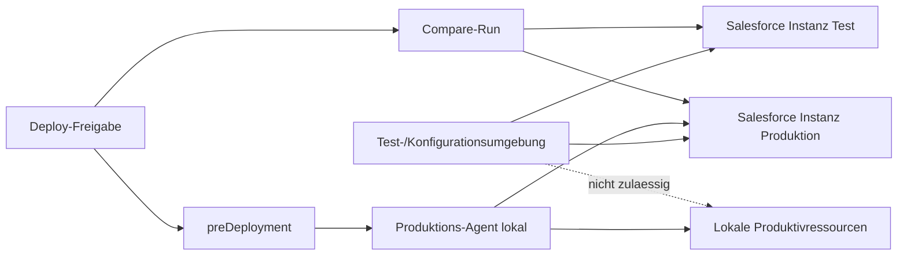
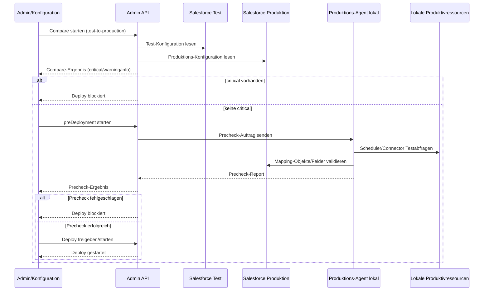

# Projekt-Ebene ueber bestehenden Salesforce-Instanzen

- Spec-ID: 2026-05-13-projekt-ebene-ueber-bestehenden-salesforce-instanzen
- Status: ready
- Owner: Projektteam SF OnPrem Integration Agent
- Reviewers: Produktverantwortung, Betrieb
- Verknuepfte Tickets: 

## Kontext

Im System koennen bereits mehrere Salesforce-Instanzen verwaltet werden.
Fachlich fehlt jedoch eine uebergeordnete Gliederungsebene, um Instanzen logisch in Projekten zu organisieren.

Dadurch werden Konfiguration, Berechtigungen, Monitoring und Betriebsverantwortung unuebersichtlich, sobald mehrere Kunden, Umgebungen oder Integrationsvorhaben parallel laufen.

Wichtige Rahmenbedingung fuer diese Spec:

- Testumgebung und Konfigurationsumgebung haben keinen direkten Zugriff auf lokale Ressourcen der Produktivumgebung.
- Die gemeinsame technische Ebene zwischen den Umgebungen sind die Salesforce-Instanzen.

## Problem

Ohne Projekt-Ebene sind Instanzen nur als flache Liste abgebildet.
Das erzeugt folgende Probleme:

- Keine klare fachliche Gruppierung (z. B. pro Kunde, Bereich oder Integrationspaket)
- Schwierige Navigation im Web UI bei vielen Instanzen
- Erhoehte Fehlerrisiken bei Zuordnung von Schedules und Migrationen zur falschen Instanz
- Keine saubere Grundlage fuer projektbezogene Auswertungen und Governance

## Zielbild

1. Es gibt eine neue Entitaet `Projekt` als Ebene oberhalb bestehender Salesforce-Instanzen.
2. Jede Salesforce-Instanz ist genau einem Projekt zugeordnet.
3. Das Web UI zeigt Instanzen gruppiert nach Projekt und ermoeglicht projektspezifische Filter.
4. Bei Anlage/Bearbeitung von Instanzen ist die Projektzuordnung verpflichtend (mit Rueckwaertskompatibilitaet fuer Altbestand).
5. Schedules und Migrationen koennen projektbezogen validiert werden, damit Instanzverwechslungen reduziert werden.
6. Betriebs- und Monitoringansichten koennen mindestens nach Projekt aggregiert werden.
7. Es gibt ein separates Admin-Modul mit eigener Berechtigung fuer Benutzer-, Projekt-, Instanz-, Deployment- und Dokumentationsverwaltung.
8. Deployments enthalten einen pruefbaren Test/Produktion-Abgleich in beide Richtungen (Test -> Produktion und Produktion -> Test als Vergleichslauf).
9. Vor jedem Deployment wird ein lokales `preDeployment` durch den Kunden-Agenten ausgefuehrt, das Erreichbarkeit und technische Konsistenz validiert.
10. Das Migrationsmodul ist dem Projektkontext untergeordnet; Migrationen nutzen die im Projekt zugeordneten Salesforce-Instanzen und pflegen keine eigenstaendige Salesforce-Verbindungsverwaltung.
11. Projekte werden in einer eigenen Projektdatenbank persistiert (Startpunkt: SQLite), damit Projektstammdaten von einzelnen Salesforce-Instanzen entkoppelt sind.

## Nicht-Ziele

- Keine Umstellung auf ein komplett neues Mandantenkonzept.
- Keine sofortige Aenderung aller bestehenden API-Vertraege ohne Migrationspfad.
- Keine automatische inhaltliche Neuordnung historischer Runs ausser Zuordnung zum Projektkontext.
- Keine Aenderung an Salesforce-Zielobjekten oder SQL-Logik nur wegen der neuen Ebene.
- Kein zentraler Remote-Precheck ohne lokalen Agenten fuer kundeninterne Ressourcen.

## Akzeptanzkriterien

- [ ] Verhalten ist fuer den Nutzer oder Operator eindeutig beobachtbar.
- [ ] Erfolgs- und Fehlerfall sind beschrieben.
- [ ] Konfiguration, Migration oder Deployment-Folgen sind dokumentiert.
- [ ] Es gibt persistente Projektobjekte und eine eindeutige Zuordnung Instanz -> Projekt.
- [ ] Im UI sind Projekte sichtbar und Instanzen projektweise gruppiert oder filterbar.
- [ ] Bestehende Instanzen ohne Projektzuordnung erhalten einen definierten Fallback (z. B. `Default-Projekt`) und bleiben funktionsfaehig.
- [ ] Fehlkonfigurationen (ungueltiges Projekt, geloeschte Zuordnung) liefern klare Validierungsfehler.
- [ ] Es gibt ein eigenstaendiges Admin-Modul mit eigener Zugriffspruefung (nur berechtigte Rollen).
- [ ] Benutzer koennen projektspezifisch zugeordnet und verwaltet werden (lesen, zuordnen, entziehen).
- [ ] Deployment-Workflow enthaelt einen technischen Abgleich Test/Produktion und Produktion/Test mit klarer Ergebnisdarstellung.
- [ ] Vor Deployment wird ein lokales `preDeployment` durchgefuehrt und bei Fehlern als harter Blocker behandelt.
- [ ] Das `preDeployment` prueft Erreichbarkeit aller in Schedulern/Connectoren genutzten Ressourcen per Testabfrage.
- [ ] Das `preDeployment` prueft Erreichbarkeit und Verfuegbarkeit der referenzierten Salesforce-Objekte/Felder aus den Mappings.
- [ ] Migrationen sind ausschliesslich ueber Projekte steuerbar; eine separate Salesforce-Anbindung nur fuer Migrationen existiert nicht.
- [ ] Projektstammdaten (Projekt, Zuordnungen, Status) liegen in einer eigenen Datenbank (SQLite) und bleiben bei Wechsel der Salesforce-Instanzzuordnung stabil.

## Umsetzungsskizze

Betroffene Bereiche im Repo:

- `src/server/admin-data-service.ts` (Persistenzmodell fuer Projekte und Zuordnung)
- `src/server/app.ts` (API-Endpunkte, UI-Datenbereitstellung)
- `src/server/*-ui-module.ts` (Darstellung, Filter, Auswahl)
- `src/server/migration-*.ts` (Migrationen im Projektkontext ohne eigene Salesforce-Verbindungsdefinition)
- `src/server/admin-ui-script.ts` (Admin-Modul fuer Benutzer, Projekte, Deployments)
- `src/server/audit-history-service.ts` (Nachvollziehbarkeit von Rollen-, Zuordnungs- und Deployment-Entscheidungen)
- `artifacts/sf-instances.json` (Datenmigration fuer bestehende Instanzen)
- `data/projects.sqlite` (persistente Projektstammdaten, bevorzugtes Zielmodell)
- optional: `artifacts/admin-users.json` (Benutzer-/Rollen-/Projektzuordnungen)

Technische Leitplanken:

- Rueckwaertskompatibilitaet fuer bestehende Instanzstruktur ist Pflicht.
- Datenmigration muss idempotent sein (mehrfach ausfuehrbar ohne Seiteneffekte).
- API-Antworten sollen Projektkontext enthalten, ohne alte Consumer sofort zu brechen.
- Logging und Audit sollen Projekt-ID/-Name in relevanten Operationen mitfuehren.
- Das Admin-Modul ist logisch getrennt und per Berechtigungspruefung abgesichert.
- `preDeployment` laeuft agentennah (lokal beim Kunden), damit netzwerknahe Ressourcen realistisch geprueft werden.
- Deployment ist nur zulaessig, wenn `preDeployment` und Umgebungsabgleich erfolgreich sind.
- Test-/Konfigurationsumgebung duerfen keine lokalen Produktivressourcen direkt adressieren; Pruefungen produktiver lokaler Ressourcen erfolgen ausschliesslich ueber den lokalen Produktions-Agenten.
- Umgebungsuebergreifende Abstimmung und Abgleich erfolgen ueber die Salesforce-Ebene, nicht ueber direkte lokale Netzverbindungen zwischen Test und Produktion.
- Migrationen referenzieren immer ein Projekt und dessen Instanzzuordnung; eigenstaendige Salesforce-Credentials im Migrationsmodul sind nicht zulaessig.
- Projektpersistenz erfolgt in eigener Datenbank (SQLite als Start), nicht in Salesforce-Metadaten.
- Mindest-Runtime fuer Agent und Web-UI ist Node.js 22 oder hoeher.

Annahme fuer diese Spec:

- Mit "zusaetzliche Ebene" ist eine organisatorische Projekt-Ebene ueber den bestehenden Salesforce-Instanzen gemeint.

## Aufgaben

- [ ] Datenmodell fuer Projekt und Instanzzuordnung finalisieren.
- [ ] Migrationsstrategie fuer Bestandsinstanzen festlegen (Default-Projekt).
- [ ] API und UI fuer projektbezogene Anzeige/Filter spezifizieren.
- [ ] Validierungs- und Fehlerfaelle definieren.
- [ ] Technische Umsetzung in kleinen Schritten planen.
- [ ] Eigenstaendiges Admin-Modul mit Rollen- und Rechtekonzept spezifizieren.
- [ ] Benutzerverwaltung inkl. Projektzuordnung (many-to-many) fachlich und technisch definieren.
- [ ] Admin-Konfiguration fuer Benutzer, Projekte, Instanzen, Deployment und Dokumentation vollstaendig spezifizieren.
- [ ] Änderungshistorie im Admin-Kontext per Klick erreichbar machen.
- [ ] Deployment-Workflow mit Abgleich Test/Produktion und Produktion/Test fachlich festlegen.
- [ ] `preDeployment`-Spezifikation erstellen (Connector-/Scheduler-Testabfragen, Mapping-Objektpruefungen).
- [ ] Blocker- und Freigaberegeln fuer Deployment auf Basis `preDeployment` und Abgleichsergebnissen definieren.
- [ ] Migrationsmodul auf projektgebundenes Modell umstellen (ohne separate Salesforce-Anbindung).
- [ ] Projektpersistenz in eigener Datenbank (SQLite) fachlich und technisch spezifizieren.

## Verifikation

- Build oder schmaler Smoke-Test: `npm run build`
- Manuelle Checks in Web UI oder Agent:
	- Neues Projekt anlegen
	- Benutzer anlegen/zuweisen und Projektberechtigungen pruefen
	- Instanz Projekt zuordnen
	- Instanzen pro Projekt filtern
	- `preDeployment` lokal starten und Fehler/Erfolg pruefen
	- Abgleich Test/Produktion sowie Produktion/Test ausfuehren und Ergebnis validieren
	- Schedule-/Migrationszuordnung gegen Projekt pruefen
- Betriebsrelevante Beobachtung nach Deploy:
	- Bestehende Instanzen sind weiterhin nutzbar
	- Monitoring kann projektweise ausgewertet werden
	- Deployment wird bei fehlgeschlagenem `preDeployment` blockiert
	- Audit zeigt Benutzer-/Projektzuordnungen und Deployment-Freigaben nachvollziehbar

## Status

- Status: ready
- Letzte Entscheidung: Beschlussvorschlag v1 ist bestaetigt.
	- Instanzmodell pro Projekt: Test 1..n, Produktion genau 1
	- Produktionssperre: standardmaessig aktiv
	- Deploy-Freigaberolle: Projekt-Owner und Release-Manager
	- Confluence-Integration: API-Token als MVP, OAuth 2.0 als Ausbau
	- Migrationen sind projektgebunden; keine separate Salesforce-Anbindung fuer Migrationen
	- Projektpersistenz in eigener DB (SQLite als Startmodell)
	- Mindest-Runtime: Node.js 22+
	- Setup-Versionierung: Metadaten plus Artefakt-Referenz (Deploy-Paket-ID)
- Naechster Schritt: Umsetzungsplanung in konkrete Arbeitspakete (Datenmodell, Migration, API/UI, Validierung, Audit) ueberfuehren.

## Umwandlung in konkrete Spec Anforderung

Die folgende Konkretisierung leitet aus den obigen Stichpunkten umsetzbare Anforderungen ab.

### A. Projektmodell mit Test- und Produktionsinstanz

- Ein Projekt kann mindestens zwei Instanzrollen aufnehmen: `test` und `production`.
- Beide Rollen muessen im Datenmodell eindeutig markiert sein.
- Eine Instanz darf innerhalb eines Projekts nur eine Rolle haben.

Akzeptanzkriterien:

- [ ] Ein Projekt kann mit genau einer Test- und einer Produktionsinstanz angelegt werden.
- [ ] Die Rollen sind in API und UI konsistent sichtbar.

### B. Klare Umgebungskennzeichnung im UI

- In allen projektrelevanten Oberflaechen (Instanzliste, Scheduler, Migration, Deploy) ist klar sichtbar, ob der Kontext `test` oder `production` ist.
- Produktion erhaelt eine deutlichere visuelle Kennzeichnung als Test.

Akzeptanzkriterien:

- [ ] Jeder Screen mit Instanzbezug zeigt den Umgebungstyp ohne Zusatzklick.
- [ ] Verwechslungsrisiko zwischen Test und Produktion wird durch eindeutige Label/Farbkodierung reduziert.

### C. Konfigurierbare Schreibsperre fuer Produktion

- Pro Projekt gibt es eine Option `productionWriteProtection`.
- Bei aktiver Sperre sind direkte schreibende Aenderungen gegen Produktionsinstanzen blockiert.
- Ausnahmen (z. B. expliziter Deploy-Freigabeflow) sind kontrolliert und auditierbar.

Akzeptanzkriterien:

- [ ] Schreibende Aktionen auf Produktionsinstanz schlagen mit klarer Fehlermeldung fehl, wenn Sperre aktiv ist.
- [ ] Erlaubte Ausnahmen werden mit Zeitpunkt und Benutzer protokolliert.

### D. Testsystem fuer Setup-Aufbau (Objekte und Felder)

- Neue oder geaenderte Setup-Bausteine (insbesondere Custom Objects und Custom Fields) werden zuerst gegen die Testinstanz ausgefuehrt.
- Der Testlauf erzeugt ein verwertbares Ergebnis fuer die spaetere Produktionsuebernahme.

Akzeptanzkriterien:

- [ ] Setup-Aenderungen lassen sich vollstaendig in Test anwenden.
- [ ] Ergebnisstatus ist fuer das Projekt einsehbar (erfolgreich/fehlgeschlagen mit Details).

### E. Projektgesteuerter Deploy von Test nach Produktion

- Aus der Projektverwaltung kann ein gesteuerter Deploy von freigegebenem Setup in die Produktionsinstanz gestartet werden.
- Der Deploy umfasst mindestens Custom Objects und Custom Fields.
- Der Deploy ist nur moeglich, wenn Vorbedingungen erfuellt sind (z. B. erfolgreicher Testlauf, Freigabe).

Akzeptanzkriterien:

- [ ] Produktionsdeploy startet aus dem Projektkontext und nutzt die dem Projekt zugeordnete Produktionsinstanz.
- [ ] Fehlende Vorbedingungen verhindern den Deploy mit eindeutiger Rueckmeldung.

### F. Setup-Versionierung pro Projekt

- Projekte erhalten eine Versionierung des Setups (z. B. Versionsnummer, Zeitstempel, Autor, Aenderungsumfang).
- Jede Deployment-Einheit ist einer Setup-Version zuordenbar.

Akzeptanzkriterien:

- [ ] Mindestens die letzten Setup-Versionen sind pro Projekt nachvollziehbar.
- [ ] Deploys referenzieren die verwendete Setup-Version.

### G. Projektdokumentation und Export

- Das Projekt kann eine technische Dokumentation des aktuellen Setups erzeugen.
- Inhalt mindestens: Connectoren, Scheduler, Mapping, Quelle, Ziel, Outbound-Konfiguration.
- Fuer den kundennahen Testaufbau enthaelt die Dokumentation zusaetzlich die abgestimmten Mapping-Details und die relevanten lokalen Ressourcen/Erreichbarkeitsannahmen.
- Exportoptionen:
	- Markdown-Datei
	- One-Click-Publikation nach Confluence bei konfigurierter Confluence-URL

Akzeptanzkriterien:

- [ ] Dokument kann als Markdown erzeugt und gespeichert werden.
- [ ] Bei konfigurierter Confluence-URL kann die Doku alternativ veroeffentlicht werden.
- [ ] Die Confluence-Publikation ist per einem expliziten UI-Click aus dem Projektkontext ausloesbar und erstellt/aktualisiert die Seite mit Mapping- und lokalen Ressourceninformationen.

### H. Eigenstaendiges Admin-Modul mit Berechtigung

- Es gibt ein separates Admin-Modul als eigene Oberflaeche/Funktionsgruppe.
- Zugriff ist nur mit expliziter Admin-Berechtigung moeglich.
- Das Modul umfasst mindestens: Benutzerverwaltung, Projektverwaltung, Instanzverwaltung, Deployment-Steuerung, Dokumentationskonfiguration sowie Abgleich- und Pre-Deployment-Ergebnisse.
- Die Änderungshistorie ist direkt aus dem Admin-Bereich per Klick oeffnbar.

Akzeptanzkriterien:

- [ ] Nicht berechtigte Benutzer erhalten keinen Zugriff auf Admin-Funktionen.
- [ ] Berechtigte Benutzer koennen Benutzer, Projekte, Instanzen, Deployment-Freigaben und Dokumentation zentral verwalten.
- [ ] Die Änderungshistorie kann aus dem Admin-Kontext ohne Umweg geoeffnet werden.

### I. Benutzerverwaltung mit Projektzuordnung

- Benutzer koennen erstellt, deaktiviert und Projekten zugeordnet werden.
- Ein Benutzer kann mehreren Projekten zugeordnet sein; ein Projekt kann mehrere Benutzer haben.
- Rollensteuerung unterscheidet mindestens: Viewer, Operator, Admin, Release-Manager.

Akzeptanzkriterien:

- [ ] Projektzuordnungen wirken sofort auf Sichtbarkeit und erlaubte Aktionen.
- [ ] Entzogene Berechtigungen verhindern weitere projektbezogene Schreibaktionen.

### J. Deployment mit bidirektionalem Umgebungsabgleich

- Vor Freigabe eines Deployments wird ein strukturierter Abgleich zwischen Test und Produktion ausgefuehrt.
- Der Abgleich ist in beide Richtungen verfuegbar:
	- Test -> Produktion (go-live-orientiert)
	- Produktion -> Test (Rueckvergleich/Drift-Erkennung)
- Unterschiede werden kategorisiert (kritisch, warnung, info) und beeinflussen die Deploy-Freigabe.

Akzeptanzkriterien:

- [ ] Kritische Abweichungen blockieren den Deployment-Start.
- [ ] Ergebnisbericht listet alle relevanten Differenzen nachvollziehbar auf.

### K. Lokales `preDeployment` durch Kunden-Agenten

- Vor jedem Deployment wird verpflichtend ein lokales `preDeployment` auf dem Kunden-Agenten ausgefuehrt.
- Zweck: reale Erreichbarkeit lokaler Ressourcen pruefen, da Test- und Produktionsnetze variieren koennen.
- Hintergrund: Da Test/Konfiguration keinen Zugriff auf produktive lokale Ressourcen haben, muss die produktive Erreichbarkeitspruefung im Produktionskontext durch den lokalen Agenten stattfinden.
- Der Check umfasst mindestens:
	- Erreichbarkeit aller in Schedulern und Connectoren referenzierten lokalen Ressourcen (inkl. Testabfragen)
	- Erreichbarkeit der Salesforce-Instanz(en) im Zielkontext
	- Validierung der im Mapping genutzten Salesforce-Objekte/Felder gegen die Zielumgebung

Akzeptanzkriterien:

- [ ] `preDeployment` laeuft lokal und liefert einen strukturierten Ergebnisreport.
- [ ] Bei fehlgeschlagenen Verbindungs- oder Mapping-Pruefungen ist das Deployment blockiert.
- [ ] Erfolgreiches `preDeployment` ist mit Zeitstempel, Agent-ID und Zielprojekt auditiert.
- [ ] Es gibt keine direkte technische Pruefroutine aus Test/Konfiguration gegen lokale Produktivressourcen; diese Pruefung ist ausschliesslich ueber den lokalen Produktions-Agenten zulaessig.

### L. Architektur-Skizze (Netz- und Prueffluss)

Logischer Kommunikationspfad:

1. Admin-/Konfigurationskontext (Test/Konfiguration) startet Deploy- und Pruefprozesse.
2. Vergleich und Freigabelogik laufen ueber Projektkontext und Salesforce-Ebene.
3. Produktive lokale Ressourcen werden ausschliesslich durch den lokalen Produktions-Agenten geprueft.

Schematischer Fluss:

- Test/Konfigurationsumgebung -> Salesforce-Instanz (Test)
- Test/Konfigurationsumgebung -> Salesforce-Instanz (Produktion)
- Test/Konfigurationsumgebung -/-> Lokale Produktivressourcen (nicht zulaessig)
- Produktions-Agent (lokal) -> Lokale Produktivressourcen (zulaessig, fuer `preDeployment`)
- Produktions-Agent (lokal) -> Salesforce-Instanz (Produktion)

Referenzablauf vor Deployment:

1. Compare-Run `test-to-production` und optional `production-to-test` ausloesen.
2. `preDeployment` auf lokalem Produktions-Agenten starten.
3. Produktions-Agent prueft lokale Ressourcen (Connector/Scheduler) per Testabfragen.
4. Produktions-Agent validiert Mapping-Referenzen gegen Salesforce-Produktion.
5. Deployment nur freigeben, wenn Compare ohne kritische Abweichungen und `preDeployment` erfolgreich.

Akzeptanzkriterien:

- [ ] Die Architekturgrenze (kein direkter Zugriff Test/Konfiguration auf lokale Produktivressourcen) ist im Betrieb technisch erzwungen.
- [ ] Der dokumentierte Referenzablauf ist in UI, API und Audit nachvollziehbar abbildbar.

### M. Projektgebundenes Migrationsmodul und Projektpersistenz

- Das Migrationsmodul ist fachlich und technisch ein Untermodul des Projekts.
- Migrationen verwenden die Projekt-Instanzzuordnung (`test`/`production`) und keine eigene Salesforce-Verbindungsdefinition.
- Projektstammdaten werden in einer separaten Projektdatenbank persistiert (SQLite als initiale Implementierung).
- Die Projektidentitaet bleibt stabil, auch wenn sich zugeordnete Salesforce-Instanzen aendern.

Akzeptanzkriterien:

- [ ] Migration kann nur mit gueltigem `projectId` angelegt/gestartet werden.
- [ ] Migration-Endpunkte akzeptieren keine separaten Salesforce-Credentials im Payload.
- [ ] Projektdaten sind nach Neustart aus SQLite wiederherstellbar und konsistent.
- [ ] Wechsel einer Salesforce-Instanzzuordnung loescht keine Projektstammdaten.

### Priorisierungsvorschlag

1. Muss: A, B, D, E, H, I, J, K, M
2. Soll: C, F
3. Kann: G (Confluence-Publikation optional)

### Umsetzungsboard (Sprints, API, Datenmodell)

#### Sprint 1 - RBAC + Admin-Modul-Grundlage

Ziel:

- Separates Admin-Modul absichern und projektbezogene Benutzerverwaltung einziehen.

Arbeitspakete:

- Admin-Navigation und Modulzugriff nur fuer Rollen `admin` und `release-manager`.
- Benutzerverwaltung (Liste, Anlegen, Deaktivieren, Rollen aendern).
- Projektzuordnung Benutzer <-> Projekte (many-to-many).
- Audit-Events fuer Rollen- und Zuordnungsaenderungen.

API-Schnitte (neu):

- `GET /api/admin/users`
- `POST /api/admin/users`
- `PATCH /api/admin/users/:id`
- `GET /api/admin/projects/:projectId/members`
- `PUT /api/admin/projects/:projectId/members/:userId`
- `DELETE /api/admin/projects/:projectId/members/:userId`

Datenmodell-Aenderungen:

- `admin-users.json`: Benutzerstamm (id, displayName, active, roles, createdAt, updatedAt)
- `project-memberships.json`: Zuordnung (projectId, userId, roleInProject, assignedAt, assignedBy)
- Erweiterung Audit-Modell um Eventtypen:
	- `user.created`
	- `user.updated`
	- `project.membership.assigned`
	- `project.membership.revoked`

Definition of Done:

- Unberechtigte erhalten 403 auf allen `/api/admin/*` Endpunkten.
- Projektzuordnung steuert Sichtbarkeit und Schreibrechte wirksam.

#### Sprint 2 - Projekt-/Instanzmodell konsolidieren

Ziel:

- Projektstruktur und Instanzrollen robust und rueckwaertskompatibel machen.

Arbeitspakete:

- Projektdatenmodell finalisieren (`productionWriteProtection`, `archived`, Metadaten).
- Projektpersistenz auf eigene SQLite-Datenbank umstellen.
- Instanzpflichtfeld `projectId` inklusive Fallback-Migration auf `default-project`.
- Rollenfeld pro Instanz (`test`/`production`) in API und UI sichtbar machen.
- Validierungen gegen inkonsistente Zuordnungen (fehlendes Projekt, ungultige Rolle, mehrere Produktion pro Projekt).
- Migrationsmodul auf projektgebundene Instanznutzung umstellen (ohne separate Salesforce-Connection-Config).

API-Schnitte (neu/erweitert):

- `GET /api/admin/projects`
- `POST /api/admin/projects`
- `PATCH /api/admin/projects/:id`
- `GET /api/admin/sf-instances` (inkl. `projectId`, `role`)
- `POST /api/admin/sf-instances`
- `PATCH /api/admin/sf-instances/:id`
- `GET /api/admin/projects/:projectId/migrations`
- `POST /api/admin/projects/:projectId/migrations`
- `POST /api/admin/projects/:projectId/migrations/:migrationId/run`

Datenmodell-Aenderungen:

- `projects` (SQLite-Tabelle): (id, name, description, archived, productionWriteProtection, createdAt, updatedAt)
- `project_instance_bindings` (SQLite-Tabelle): (projectId, instanceId, role, updatedAt)
- `sf-instances.json`: Pflichtfelder `projectId`, `role`
- Migrationslogik idempotent fuer Altbestaende

Definition of Done:

- Alle Instanzen haben gueltige Projektzuordnung.
- UI kennzeichnet Test/Produktion eindeutig in allen instanzbezogenen Listen.
- Migrationen koennen nur im Projektkontext gestartet werden und besitzen keine separate Salesforce-Verbindungsmaske.

#### Sprint 3 - Deployment-Abgleich in beide Richtungen

Ziel:

- Vergleichslauf zwischen Test und Produktion standardisieren und als Gate einsetzen.

Arbeitspakete:

- Vergleichsengine fuer Konfigurationsdrift (Connectoren, Scheduler, Mappings, relevante Setup-Metadaten).
- Richtungen unterstuetzen: `test-to-production` und `production-to-test`.
- Klassifikation der Abweichungen (`critical`, `warning`, `info`).
- Freigaberegel: Deployment-Start nur ohne `critical`.

API-Schnitte (neu):

- `POST /api/admin/projects/:projectId/deploy/compare`
- `GET /api/admin/projects/:projectId/deploy/compare/:compareRunId`
- `POST /api/admin/projects/:projectId/deploy/start`

Datenmodell-Aenderungen:

- `deployment-compare-runs.json`: (id, projectId, direction, status, summary, diffs, startedAt, finishedAt, initiatedBy)
- Audit-Events:
	- `deploy.compare.started`
	- `deploy.compare.finished`
	- `deploy.blocked.critical-diff`

Definition of Done:

- Kritische Unterschiede blockieren Deploy technisch (nicht nur visuell).
- Vergleichsreport ist pro Projekt historisiert einsehbar.

#### Sprint 4 - Lokales `preDeployment` durch Kunden-Agenten

Ziel:

- Reale Erreichbarkeit im Kundennetz verifizieren, bevor deployt wird.

Arbeitspakete:

- Agent-seitiger Precheck-Runner fuer lokale Ressourcen.
- Ausfuehrung von Testabfragen je referenziertem Scheduler/Connector.
- Salesforce-Pruefung: Existenz und Zugriff auf im Mapping verwendete Objekte/Felder.
- Harte Deployment-Sperre bei fehlerhaftem Precheck.

API-Schnitte (neu):

- `POST /api/admin/projects/:projectId/deploy/precheck`
- `GET /api/admin/projects/:projectId/deploy/precheck/:precheckRunId`

Datenmodell-Aenderungen:

- `deployment-prechecks.json`: (id, projectId, targetEnv, agentId, status, checks, startedAt, finishedAt, initiatedBy)
- Checkgruppen im Ergebnis:
	- `localResourceConnectivity`
	- `schedulerConnectorQueries`
	- `salesforceObjectFieldValidation`
- Audit-Events:
	- `deploy.precheck.started`
	- `deploy.precheck.failed`
	- `deploy.precheck.passed`

Definition of Done:

- Deployment ist nur moeglich, wenn letzter Precheck fuer Zielumgebung erfolgreich ist.
- Report zeigt pro Check Ursache, technische Details und konkrete Handlungsempfehlung.

#### Sprint 5 - Setup-Versionierung + End-to-End Governance

Ziel:

- Versionierte, auditierbare Deployment-Kette pro Projekt abschliessen.

Arbeitspakete:

- Setup-Versionen mit Artefakt-Referenz (Deploy-Paket-ID) persistieren.
- Verknuepfung: Deployment verweist auf Compare-Run + Precheck-Run + Setup-Version.
- Admin-Dashboard fuer Governance-Sicht (wer, wann, was, mit welchem Ergebnis).
- One-Click-Dokumentationspublikation nach Confluence aus dem Projektkontext (inkl. Mapping- und lokalen Ressourcenabschnitt).

API-Schnitte (neu):

- `GET /api/admin/projects/:projectId/setup/versions`
- `POST /api/admin/projects/:projectId/setup/versions`
- `GET /api/admin/projects/:projectId/deploy/runs`
- `POST /api/admin/projects/:projectId/documentation/publish-confluence`

Datenmodell-Aenderungen:

- `project-setup-versions.json`: (id, projectId, version, artifactRef, author, note, createdAt)
- `deployment-runs.json`: (id, projectId, sourceVersionId, compareRunId, precheckRunId, status, approvedBy, startedAt, finishedAt)
- Audit-Event `deploy.executed`

Definition of Done:

- Jeder Deploy ist vollstaendig rueckverfolgbar (Version, Freigabe, Vorpruefungen, Ergebnis).
- Betriebs- und Audit-Sicht kann projektbezogen exportiert werden.

### Ticket-Zerlegung (Epic -> Story -> Akzeptanztests)

#### EPIC-01 Admin-Modul und Berechtigung

STORY-01.1 Admin-Modul-Zugriff absichern

- Beschreibung:
	- Zugriff auf Admin-Funktionen nur fuer berechtigte Rollen (`admin`, `release-manager`).
- Akzeptanztests:
	- Benutzer ohne Rolle `admin` oder `release-manager` erhalten bei `GET /api/admin/users` HTTP 403.
	- Berechtigter Benutzer erhaelt HTTP 200 und Nutzdaten.

STORY-01.2 Benutzerverwaltung bereitstellen

- Beschreibung:
	- Benutzer koennen angelegt, deaktiviert und in Rollen geaendert werden.
- Akzeptanztests:
	- `POST /api/admin/users` legt Benutzer mit gueltigen Pflichtfeldern an.
	- Deaktivierte Benutzer koennen keine Schreibaktionen in Projektkontexten mehr ausfuehren.

STORY-01.3 Projektzuordnung fuer Benutzer

- Beschreibung:
	- Benutzer/Projekte many-to-many verknuepfen, entziehen und auditieren.
- Akzeptanztests:
	- Zugeordneter Benutzer sieht nur zugewiesene Projekte.
	- Nach Entzug der Zuordnung sind projektbezogene Schreibendpunkte blockiert.

#### EPIC-02 Projekt- und Instanzmodell

STORY-02.1 Projekt-CRUD finalisieren

- Beschreibung:
	- Projekte anlegen, bearbeiten, archivieren inkl. `productionWriteProtection`.
- Akzeptanztests:
	- `POST /api/admin/projects` legt Projekt mit Standardwerten an.
	- Archiviertes Projekt ist in operativen Auswahllisten standardmaessig ausgeblendet.

STORY-02.2 Instanzrollen und Zuordnung validieren

- Beschreibung:
	- Instanzen tragen `projectId` und `role` (`test`/`production`) verpflichtend.
- Akzeptanztests:
	- Instanz ohne `projectId` wird bei Mutation mit 400 abgelehnt.
	- Zweite `production`-Instanz im selben Projekt wird mit klarer Fehlermeldung abgelehnt.

STORY-02.3 Bestandsmigration idempotent machen

- Beschreibung:
	- Altinstanzen werden einmalig und wiederholbar auf `default-project` migriert.
- Akzeptanztests:
	- Mehrfaches Starten der Migration erzeugt keine Duplikate.
	- Alle migrierten Datensaetze enthalten gueltige Pflichtfelder.

STORY-02.4 Migrationsmodul projektgebunden umstellen

- Beschreibung:
	- Migrationen werden einem Projekt untergeordnet und nutzen dessen Instanzzuordnung statt eigener Salesforce-Verbindungsdaten.
- Akzeptanztests:
	- Migration ohne `projectId` wird mit 400 abgelehnt.
	- API akzeptiert keine separate Salesforce-Credential-Payload fuer Migrationen.

STORY-02.5 Projektpersistenz in SQLite einfuehren

- Beschreibung:
	- Projektstammdaten werden aus Dateiablagen in eine eigene SQLite-Datenbank ueberfuehrt.
- Akzeptanztests:
	- Projekte bleiben nach Neustart konsistent erhalten.
	- Aenderung der zugeordneten Salesforce-Instanz beeinflusst nicht die Projektidentitaet.

#### EPIC-03 Deployment-Abgleich (Test/Produktion bidirektional)

STORY-03.1 Compare-Run Test -> Produktion

- Beschreibung:
	- Vergleich der relevanten Konfigurationen vor go-live.
- Akzeptanztests:
	- `POST /api/admin/projects/:projectId/deploy/compare` mit Richtung `test-to-production` liefert strukturierten Diff-Report.
	- Report enthaelt Klassen `critical`, `warning`, `info`.

STORY-03.2 Compare-Run Produktion -> Test (Drift)

- Beschreibung:
	- Rueckvergleich gegen Konfigurationsdrift in Produktion.
- Akzeptanztests:
	- Richtung `production-to-test` ist ueber API und UI ausloesbar.
	- Ergebnis wird historisiert und ist projektbezogen abrufbar.

STORY-03.3 Deploy-Gate aus Compare-Ergebnis

- Beschreibung:
	- Deployment ist bei `critical` automatisch blockiert.
- Akzeptanztests:
	- Deploy-Start liefert bei kritischem Diff einen Blocker-Status mit Begruendung.
	- Ohne kritischen Diff kann Deploy fortgesetzt werden.

#### EPIC-04 Lokales Pre-Deployment durch Kunden-Agent

STORY-04.1 Precheck fuer lokale Ressourcen

- Beschreibung:
	- Agent prueft Erreichbarkeit aller in Schedulern/Connectoren referenzierten Ressourcen inkl. Testabfragen.
- Akzeptanztests:
	- Nicht erreichbare Ressource wird mit technischer Ursache im Precheck-Report markiert.
	- Erfolgreiche Ressourcenpruefungen werden einzeln mit Laufzeit und Status protokolliert.

STORY-04.2 Salesforce-Mapping-Pruefung

- Beschreibung:
	- Objekt-/Feld-Referenzen aus Mappings gegen Zielumgebung validieren.
- Akzeptanztests:
	- Fehlendes Salesforce-Objekt fuehrt zu Precheck-Fehler.
	- Fehlendes oder nicht zugreifbares Feld fuehrt zu Precheck-Fehler mit Referenz auf Mapping-Pfad.

STORY-04.3 Deployment-Blocker an Precheck koppeln

- Beschreibung:
	- Deploy nur bei erfolgreichem letztem Precheck fuer Zielumgebung.
- Akzeptanztests:
	- `POST /api/admin/projects/:projectId/deploy/start` wird bei fehlendem/fehlgeschlagenem Precheck blockiert.
	- Erfolgreicher Precheck ist mit Zeitstempel, Agent-ID und Projekt-ID auditiert.

#### EPIC-05 Setup-Versionierung und Auditierbarkeit

STORY-05.1 Setup-Versionen persistieren

- Beschreibung:
	- Versionen mit Artefakt-Referenz, Autor und Zeitstempel je Projekt speichern.
- Akzeptanztests:
	- Neue Setup-Version ist ueber `GET /api/admin/projects/:projectId/setup/versions` abrufbar.
	- Versionseintrag enthaelt `artifactRef` und Ersteller.

STORY-05.2 Deploy-Run vollstaendig verknuepfen

- Beschreibung:
	- Deploy-Run verweist auf Compare-Run, Precheck-Run und Setup-Version.
- Akzeptanztests:
	- Deploy-Historie enthaelt alle Referenzen konsistent.
	- Fehlende Referenz verhindert Abschluss des Deploy-Runs.

STORY-05.3 Governance-Sicht im Admin-Modul

- Beschreibung:
	- Projektbezogene Sicht auf Freigaben, Deploys, Ergebnisse und Audit-Events.
- Akzeptanztests:
	- Admin kann je Projekt die letzten Deploys mit Freigabe und Ergebnis einsehen.
	- Export zeigt mindestens Version, Freigabe, Precheck- und Compare-Ergebnis.

STORY-05.4 One-Click Confluence-Dokumentation fuer Testaufbau

- Beschreibung:
	- Aus dem Projektkontext kann per Klick eine Confluence-Dokumentation erzeugt oder aktualisiert werden, inklusive kundenrelevanter Mapping-Details und lokaler Ressourcenbeschreibung.
- Akzeptanztests:
	- UI-Aktion publiziert bei gueltiger Confluence-Konfiguration eine Seite ohne manuellen Zwischenschritt.
	- Ergebnis enthaelt mindestens Connectoren, Scheduler, Mapping-Abschnitte und lokale Ressourcen/Erreichbarkeitsannahmen.
	- Bei fehlender Confluence-Konfiguration wird ein klarer, nicht-technischer Validierungsfehler angezeigt.

#### Uebergreifende NFR-Tickets

STORY-NFR-01 Performance

- Akzeptanztests:
	- Listen-APIs (`users`, `projects`, `deploy-runs`) antworten bei 500 Projekten und 5000 Nutzern innerhalb definierter SLA.

STORY-NFR-02 Sicherheit und Audit

- Akzeptanztests:
	- Jede Rollen- oder Freigabeaenderung erzeugt ein Audit-Event.
	- Audit-Eintraege sind gegenueber normalen Operatoren nur lesbar oder verborgen gemaess Berechtigung.

STORY-NFR-03 Fehlertoleranz

- Akzeptanztests:
	- Abbruch eines Compare- oder Precheck-Runs hinterlaesst konsistenten Status (`failed` oder `aborted`) ohne Folgedatenfehler.
	- Wiederholtes Starten eines Runs ist moeglich und erzeugt neue, eindeutige Run-IDs.

### Offene Entscheidungen fuer Stakeholder

- Soll ein Projekt mehr als eine Testinstanz oder Produktionsinstanz erlauben?
- Ist die Produktionssperre standardmaessig aktiv oder deaktiviert?
- Welche Freigaberolle darf Produktionsdeploys ausloesen?
- Welche Confluence-Auth-Methode wird verwendet (Token, OAuth, Basic via Proxy)?

### Entscheidungsmatrix

#### 1) Anzahl Instanzen pro Rolle

Optionen:

- Option A: Genau 1 Test + genau 1 Produktion pro Projekt
- Option B: 1..n Test + genau 1 Produktion pro Projekt
- Option C: 1..n Test + 1..n Produktion pro Projekt

Empfehlung:

- Option B

Auswirkung:

- Bietet Flexibilitaet fuer mehrere Teststufen (z. B. Dev/QA/UAT), haelt Produktion aber eindeutig.
- Reduziert Governance-Risiko gegenueber Option C.

#### 2) Standard fuer Produktionssperre

Optionen:

- Option A: Standard `aktiv` (secure by default)
- Option B: Standard `deaktiviert` (schneller Start)

Empfehlung:

- Option A

Auswirkung:

- Senkt Risiko unbeabsichtigter Produktivaenderungen.
- Erfordert bewusste Freigabe fuer produktive Schreibvorgaenge.

#### 3) Freigaberolle fuer Produktionsdeploy

Optionen:

- Option A: Nur Projekt-Owner
- Option B: Projekt-Owner + Release-Manager
- Option C: Jeder mit Admin-Zugriff

Empfehlung:

- Option B

Auswirkung:

- Ermoeglicht Vertretung und Betriebsfaehigkeit, ohne Freigaben zu stark zu oeffnen.
- Passt zu Audit- und Vier-Augen-Anforderungen.

#### 4) Confluence-Authentifizierung

Optionen:

- Option A: API-Token (Service Account)
- Option B: OAuth 2.0
- Option C: Basic Auth via Proxy

Empfehlung:

- Option A als MVP, Option B als Zielausbau

Auswirkung:

- Schnelle Implementierung mit stabiler Betriebsfuehrung.
- OAuth kann spaeter fuer feinere Rechte und SSO nachgezogen werden.

#### 5) Versionsierungstiefe des Setups

Optionen:

- Option A: Metadaten-only (Version, Zeit, Autor, Notiz)
- Option B: Metadaten + Artefakt-Referenz (Deploy-Paket-ID)
- Option C: Vollstaendige Snapshot-Version je Projekt

Empfehlung:

- Option B

Auswirkung:

- Gute Nachvollziehbarkeit bei moderatem Speicherbedarf.
- Ermöglicht reproduzierbare Deploy-Historie ohne Vollsnapshot-Overhead.

### Entscheidungs-Output (fuers Review)

Pro Punkt ist im Review festzuhalten:

- Gewaehlte Option
- Begruendung
- Verantwortlich
- Wirksam ab Version

### Beschlussvorschlag v1

Vorgeschlagene Startkonfiguration fuer die erste Umsetzung:

1. Instanzmodell pro Projekt:
	- Test: 1..n
	- Produktion: genau 1
2. Produktionssperre:
	- Standard aktiv
	- Freigabe fuer produktive Schreibvorgaenge nur explizit
3. Deploy-Freigaberolle:
	- Projekt-Owner und Release-Manager
4. Confluence-Integration:
	- MVP mit API-Token (Service Account)
	- OAuth 2.0 als geplanter Ausbau
5. Setup-Versionierung:
	- Metadaten plus Artefakt-Referenz (Deploy-Paket-ID)

Begruendung:

- Minimiert Produktionsrisiko bei gleichzeitig praktikabler Einfuehrung.
- Erlaubt eine iterative Umsetzung ohne Blockade durch spaetere Ausbaupunkte.
- Schafft frueh auditierbare und reproduzierbare Deployablaeufe.

Abnahmekriterien fuer den Beschluss:

- Produkt, Betrieb und Delivery stimmen den fünf Punkten zu.
- Abweichungen werden mit Alternative und Grund dokumentiert.
- Beschluss wird in dieser Spec unter Status als verbindliche Entscheidung nachgezogen.